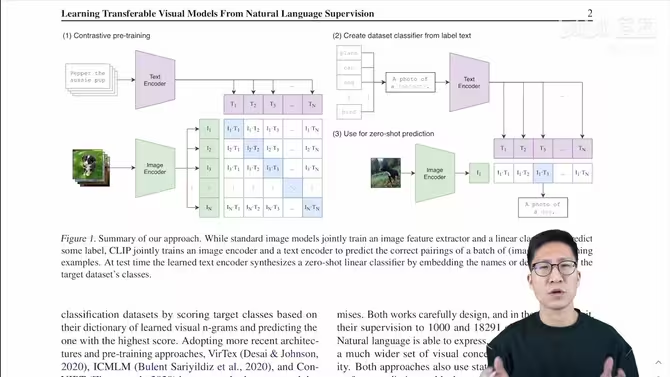
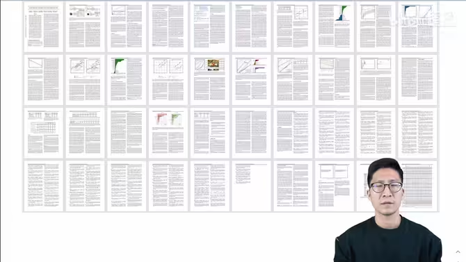
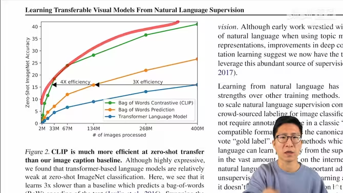
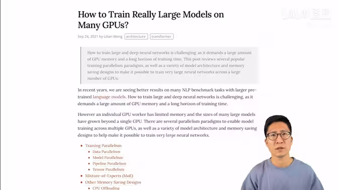
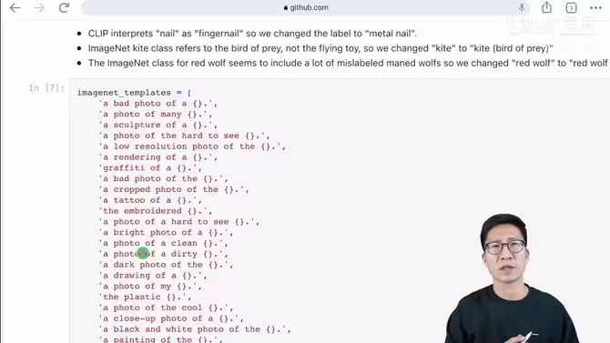
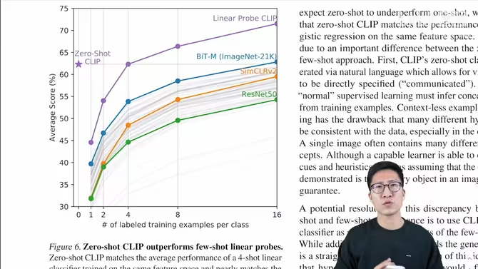
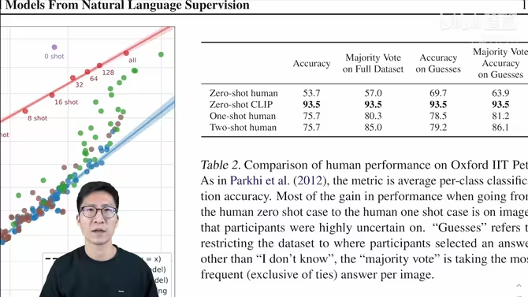
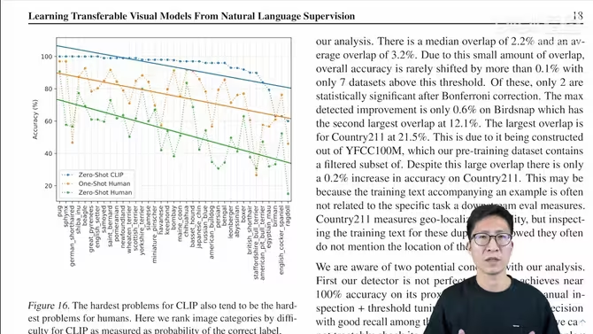
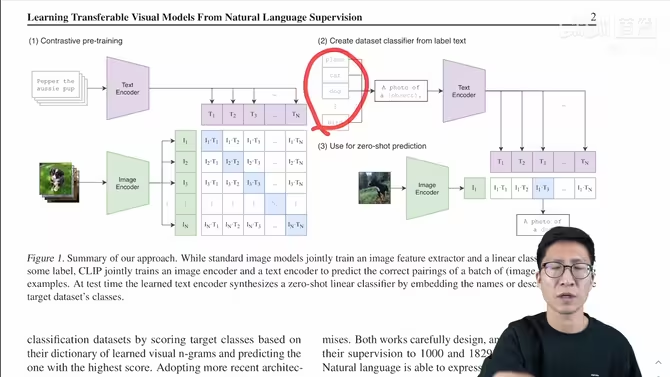

# CLIP
2021年2月底提出，方法很简单，效果非常好

Zero-shot

Clip如何进行预训练：
1. 输入：图片+文字的配对
2. 进入Encoder，生成特征
3. 在特征上作对比学习
4. 特征矩阵里获得正样本和负样本

训练集：4亿个图片和文本的配对，数据集清理的非常好。

Prompt template

Clip这篇论文后面提出了prompt engineering和prompt ensemble两种方式来提高模型的准确率。

识别图片的机制，是用图片给到图片编码器，再去和ImageNet的1000个分类词做相关性匹配，把相关性最大的词挑出来，即完成分类。

Clip的有趣应用:
- 生成图
- 物体分割和检测
- 视频检索（可以做OCR了）

因为迁移性好，就可以摆脱基础类的限制

论文48页

论文标题：利用自然语言的监督信号，训练迁移性好的视觉网络

12个作者全部来自OpenAI

不需要特定领域的数据（或者少量数据）就可以实现很好的效果

大规模的没有标注的数据就可以拿来训练。

CONVIRT和CLIP非常像了，但只在医疗图像上做。

之前的那些方法没有这么大的数据集，没有这么多的算力， 没有这么大的模型，没有这么好的自监督训练的方式， 所以大家的效果都不好（特别是zero-shot）

Mahajan et al.(2018)搜集了Ins的图片+标签来作为数据集。【给了CLIP启发】

之前的这些方法，和借助NLP去学习图像表征的方法，最大的区别在规模（数据的规模和模型的规模）

有弹幕：大力出奇迹

`accelerator year：`加速器年，一种衡量算力的计算逻辑，方便做训练量对比。

CLIP论文里，把借助NLP去学习图像表征的方法们(Mahajan et al.(2018)、CONVIRT这些)，规模给搞上去！

CLIP这个模型，想法简单，实现高效，性能在各个数据集上又好，泛化性也不错。

## CLIP如何预训练：

`transformer`出来后，NLP那边彻底革命了，出现了`Deep contextual representation learning`，就是具备上下文语义环境的学习方式。在这种自监督学习的范式下，NLP可以使用上取之不尽用之不竭的文本监督信号了。为多模态的训练铺平了道路。

用自然语言信号来训练视觉模型，好处非常多
你不需要再去标注这些数据了（这个过程很复杂），现在只需要去网上下载图片文字的配对，别的都不需要做，数据的规模很容易就变大。而且，因为监督信号是文本，比起N选1的标签，模型输入输出的自由度会大很多。

由于训练的时候把图片和文字绑到了一起，所以学到的是一个多模态的特征，而不只是一个视觉特征。和语言联系在一起后，就很容易做zero-shot的迁移学习了。但如果只是做一种单模态的自监督学习的话，你都只能学到视觉的特征，而无法和自然语言联系到一起，这样还是很难去做zero-shot的迁移。

由于没有符合OpenAI要求的大数据集，选择自己做一个，这个新的大数据集不光带来了CLIP，还有DallE

4亿的数据集名称：WIT（WebImageText）

由于训练量太大，所以训练效率至关重要,把训练任务变成对比任务，训练效率提高了4倍

如何在很多的GPU上去训练超级大的模型

为什么要做Zero-shot Transfer，训练一个又大又好的模型，就可以不再训练或者不再微调。

## Prompt engineering

为什么要做：

### Prompt的多义性
预训练时基本都是一个句子，很少是一个单词，可如果做推理的时候，输入只是单词，抽取出来的特征可能就不好

CLIP的解决方案：Prompt template：“A photo of a {label}”

使用了这个template后，准确度提升了1.3%

如果提前知道一些信息，对于zero-shot推理非常有帮助，比如：对于食物的训练集，"a type of food"
### Distribution difference
训练的时候用的是句子，识别的时候如果用的只是单词就会导致特征对不上

## Prompt emsemble
使用多个Prompt，综合所有结果进行判断。

用了80个提示词模板，最后emsemble起来，

`Linear Probe`，冻住主体，抽特征，只微调分类头

对于难的任务，需要做few-shot迁移学习

fine-tune 微调

CLIP和人类的对比

37类狗的数据集，人类还是打不过CLIP

37类狗的种类数据单独拉出来

可以发现，人类觉得容易的，CLIP表现也好。人类觉得难的，CLIP也觉得难

## 人工智能就是模仿人

CLIP强，但没有那么强。如果想要在ImageNet上面达到头部算法的效果，还需要扩大1000倍的训练量，这是OpenAI都无法支撑的。

在有些数据集上Zero-shot也不行

对于抽象和难的任务效果也不好

CLIP的效果还是依赖于4亿的图片集，MNIST是几十年前提出的小数据集，CLIP的表现就很差，原因是训练数据内并没包含MNIST的图片。

第七个局限性：爬下来的4亿个图片文字集，没有经过清洗和过滤过，导致CLIP模型会带有社会的偏见。

Clip的研究动机，就是因为在NLP领域，利用大规模数据去预训练模型，而且用跟下游任务无关的训练方式（比如完形填空），在这两种工具的加持下，NLP获得了革命性的成功，比如GPT-3。

所以希望把NLP方面的成功复制到其他领域内，比如说视觉。应用了之后，发现效果确实不错。

CLIP工作最大的贡献，在于打破了固定种类标签的范式。

