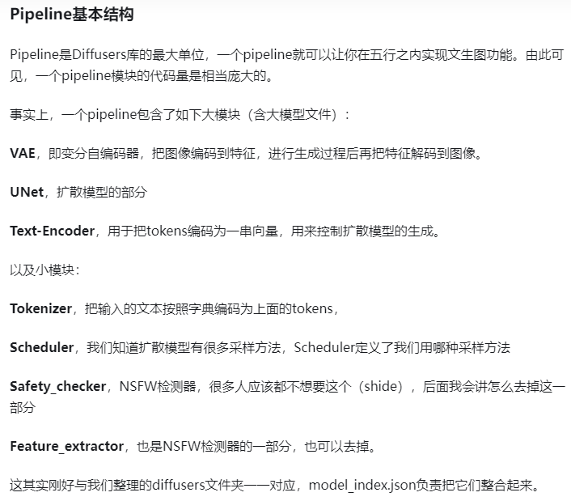

# [什么是扩散模型？](https://lilianweng.github.io/posts/2021-07-11-diffusion-models/#forward-diffusion-process)
到目前为止，我已经写了三种类型的生成模型：[GAN](https://lilianweng.github.io/posts/2017-08-20-gan/)、[VAE](https://lilianweng.github.io/posts/2018-08-12-vae/)和[Flow-based](https://lilianweng.github.io/posts/2018-10-13-flow-models/)的模型。他们在生成高质量样本方面取得了巨大成功，但每种方法都有其自身的局限性。`GAN` 模型因其对抗性训练性质而存在潜在的不稳定训练和生成多样性较少的问题。`VAE` 依赖于替代损失。`Flow`模型必须使用专门的架构来构建可逆变换。

扩散模型的灵感来自非平衡热力学。它们定义了一个马尔可夫链扩散步骤，以缓慢地向数据添加随机噪声，然后学习逆转扩散过程以从噪声中构建所需的数据样本。与 VAE 或流模型不同，扩散模型是通过固定程序学习的，并且潜在变量具有高维度（与原始数据相同）。

人们提出了几种基于扩散的生成模型，其思想相似，包括[扩散概率模型](https://arxiv.org/abs/1503.03585)、[噪声条件评分网络（NCSN ; Yang & Ermon, 2019）](https://arxiv.org/abs/1907.05600)和[去噪扩散概率模型（DDPM；2020）](https://arxiv.org/abs/2006.11239)。

## GAN和扩散模型部分笔记

### GAN-VAE-VQVAE-DALLE
#### GAN

- 训练：两个网络互相较量 生成器和判别器
- 优点：
  1. 生成的图片真实：目标函数是用来以假乱真的，生成的图片保真度很高（人眼都未必分得清）--deepfakes
  2. 好用：训练所需数据不算多；适用于各个场景
- 缺点：
  1. 由于是两个网络同时训练，涉及到平衡的问题，所以GAN训练不稳定（模式坍塌）
  2. 由于训练目标是生成更真实的图片，因此生成的图片创造性（多样性）不够。（多样性主要源于G网络的输入随机噪声）
  3. GAN不是一个概率模型，生成图片的中间过程（分布）是隐式的，从这个角度来说不如VAE、扩散模型优美

**AE** 编码-解码 压缩+重构

**DAE** **MAE** 有效性源于图像像素的高冗余性

**VAE**

- 动机：AE主要用于分类、检测、分割 而不是数据生成（因为潜码不是在学分布 而是特征），因此为了用En-De的结构来做图像生成，有了VAE（用bottleneck学分布）
- VAE的结构：前面encoder从x到z表示后验概率q(z|x)，由x~p(x)采样后学出的z是参数先验分布p(z)（一般取高斯）；后面decoder由z生成x'表示似然p(x|z) 
- 优点：生成图片的多样性高于GAN（因为VAE学的是分布，生成时是从分布中取样）
- 后续改进：VQ-VAE--DALL·E1

**VQVAE**

- 改进：VQ（vector quantised）将VAE做量化，亦即 分布->k*D（聚类中心个数*特征图维数）大小的codebook
- 动机：实际需要处理的数据样本（信号、声音、图像）是连续的，大部分任务都是回归任务，但是实际解决问题时都将其离散化了（图像->像素；语音->抽样；回归->分类）；VAE难以将模型做大，分布也不易学，因此在VQVAE中将中间的分布变为了固定的可控的codebook（可理解为聚类中心）也就相当于将z~p(z)这个变量就近离散化为k个固定特征图
- 优点：容易训练，训练可控
- 缺点：失去了VAE的随机性（更像AE而不是VAE，用codebook和特征做high-level任务：分类、检测）
- 若用于做生成，则需再训练一个prior网络(pixel CNN-自回归)，即两阶段生成：图像输入经VQVAE训练得到特征图，特征图再通过prior网络得到生成图像

DALL-E1相当于 VQVAE2+GPT（把pixel CNN换成了GPT）

#### 扩散模型diffusion model

原理：

前向扩散过程逐步加噪 把图片变成各向同性的噪声，这一过程帮助反向过程的训练，相当于给反向过程的训练提供了每个阶段的模板；

反向过程训练一个去噪（也就是生成）模型，每一步去噪都是用同一个（单步）模型（共享权值），这使得采样成本极高（每一小步都需要足够的采样来训练模型），推理也同样慢（最慢的，T一般取1k，这意味着每次生成需要采随机噪声以后将其通过去噪模型1k次）

reverse diffusion过程的模型选取：（大部分用的）U-Net

#### 发展史

15年想法有 实际操作做不到

**DDPM（2020.06）**

- 简化优化目标，预测噪声（由xt预测eps_t，其中eps_t=xt - xt-1）而非预测每步含噪图像分布（由xt预测xt-1）（有点像resnet预测残差）
- 引入time embedding（正弦位置编码or傅里叶特征）目的是在不同阶段生成重点不同（前期先生成一些粗糙轮廓-低频信息特征，后期慢慢写实逼真-高频）
- 再次简化优化：方差固定，只学均值
- 和VAE的比较：比较相似，前向过程类比编码，逆向过程类比解码；只不过扩散模型的前向过程是固定的加噪，VAE的编码是需要学习的，而且VAE有bottleneck而扩散模型每一步的维数不变，并且扩散模型有步数的概念并且每一步的UNet共享参数

**Improved DDPM (2020年底)**

- 把方差也学了，提高了采样生成效果
- 添加噪声的schedule从线性改为余弦
- 模型越大，图像生成效果越好

**Diffusion model beats GAN (21年)**

大力出奇迹

- 模型加大加宽：增加自注意力头的数量并采用多头自注意；
- 新归一化方式：adaptive group normalization（根据步数做自适应）；
- classifier guidance （y）引导模型做采样和生成，提高生成图像的逼真程度，加速反向采样速度--可以只做25次采样就能生成很好的图片
**guidance**的动机：在beats GAN这篇文章之前，扩散模型生成的图片已经非常逼真了，但是inception score（IS FID等）不如GAN，如何提供一些人为指导来帮助模型采样和学习，提高分数和采样速度？

- classifier guided diffusion指导方式y有很多种方式可选：
  1. 简单的图像分类器（下图，图中所示为反向过程，f是UNet表示的函数；反向过程中，训练UNet的同时，再训练一个简单的图像分类器classifier（通常在加噪处理后的ImageNet上训练，训练采用交叉熵目标函数g），使用g的梯度（大致表示图像中有没有物体或者物体属不属于某一类？？？）来指导UNet采样和生成（相当于牺牲了一些多样性来换取生成图片的写实性，但是多样性仍然比GAN好）----这种机制帮助扩散模型在各类分数上beat了GAN）
  2. CLIP代替分类器，将文本和图像联系起来，借用文本信息指导UNet
  3. 基于重构做像素级引导；特征引导；风格引导等等等等。。。

classifier guided diffusion 缺点在于引入了一个新的需要训练的模型，训练过程不可控且需要额外耗时
- `classifier free guidance`上图紫色部分  计算有无条件得到的生成差距

广泛用于GLIDE DALLE2 Imagen 从此DALLE2不再用1的VQVAE了，而是换用了扩散模型

从GLIDE到DALLE2还增加了很多技巧，如prior网络、层级式生成等