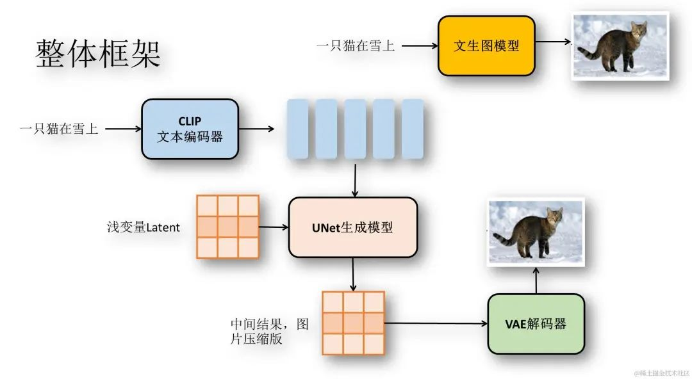
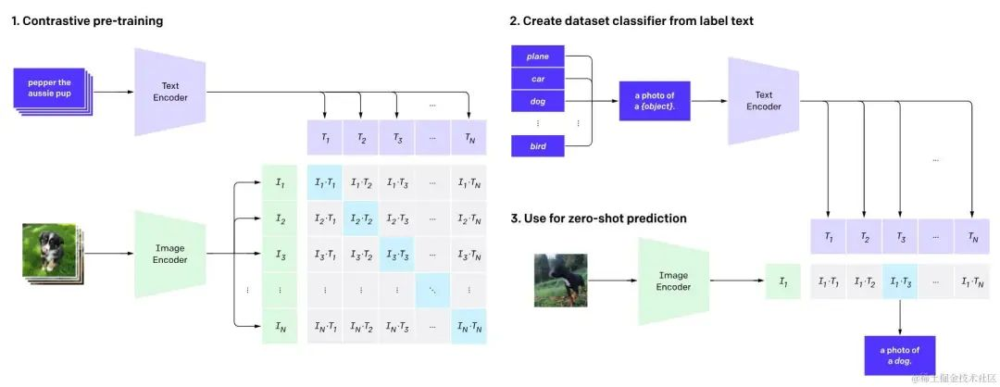
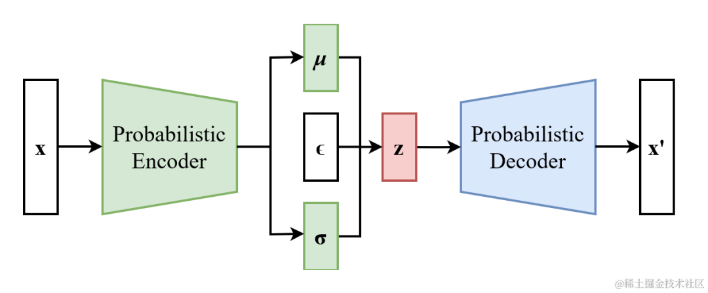
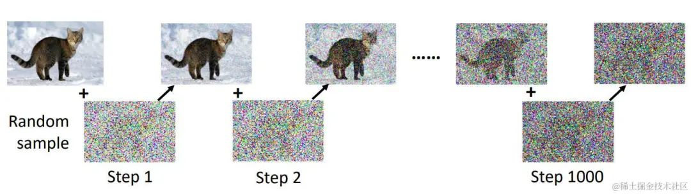
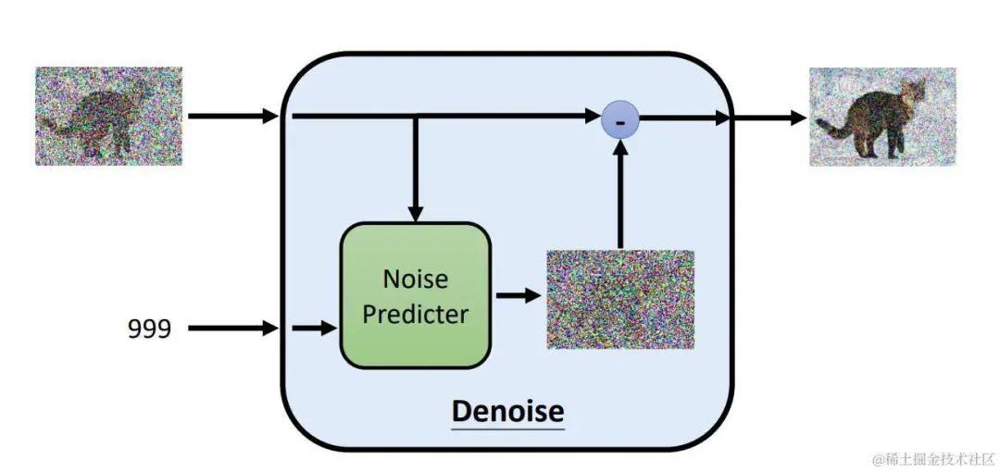
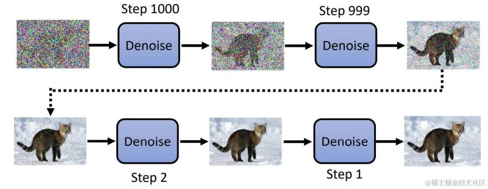
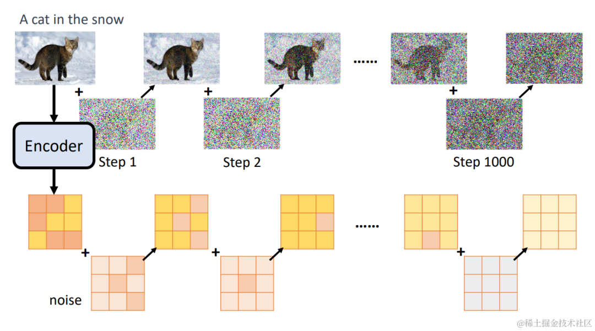

# Stable Diffusion
## 网络结构
Stable Diffusion由多个子网络组成，包括文本编码器、UNet和VAE三大部分。组合在一起可以看做一个接收文本输入，输出图像的模型。下面我们将从整体出发，而后拆分每个部件。
### 整体架构


整体上看是一个接收文本输入，并输出图像的模型。Stable Diffusion处理的过程如下：
1. 输入文本，使用CLIP模型对文本进行编码，获得文本Embedding
1. 从潜空间生成噪声Latent
1. 将文本Embedding和Latent输入UNet模型，预测Latent中的噪声
1. 将去除Latent中的噪声，去除噪声后的结果重新赋值为Latent
1. 重复步骤3、4
1. 将Latent传入VAE解码器，得到最终图片

模型的核心是一个UNet噪声预测网络。不同于GAN直接从噪声中生成图片，Stable Diffusion会进行多次预测噪声并降噪，最终生成图片。

### 文本编码器
Stable Diffusion是一种带条件的图像生成模型，可以根据输入的文本生成与文本相符的图片。我们可以直接使用训练良好的Bert模型作为文本编码器，但是这样生成的文本向量和图像的关系不太密切，为了图像生成能更遵循文本条件，Stable Diffusion使用了CLIP模型。

CLIP模型的提出是为了更好的解决视觉任务，CLIP可以在zero-shot的情况下在ImageNet上与ResNet50有同等的表现。

下面是OpenAI提供的CLIP工作图：



从结构上来看，CLIP模型由两个Encoder构成，分别是用来编码文本的TextEncoder和用来编码图片的ImageEncoder。CLIP的训练数据是一堆“图片-文本”对形式，其工作模式如下：
1. 训练TextEncoder和ImageEncoder，最大化$I_t·T_t$（图片向量与响应的文本向量相似度）
1. 利用分类标签生成句子，“a photo of a {object}”
1. 输入图片获得$I_t$，找到最相似的句子向量$T_k$，改句子对应的标签就是图片标签 在完成训练后就可以得到比较出色的文本编码器，而后两步则是为图像分类做准备。

### VAE模型
VAE模型在Diffusion Model里面并非必要的，VAE在Stable Diffusion中作为一种有效利用资源的方法，减少了图片生成的资源需求。下图是VAE的结构，其中c是一个可选的条件。



VAE由Encoder和Decoder两个部分组成，首先需要输入x，经过Encoder编码后，得到（μ，σ），分别表示均值和方差，这两个变量可以确定一个分布，然后在当前分布中采样出样本z。z通常是一个比x维度更低的向量。

采样出来的z输入Decoder，我们希望Decoder的输出与输入的x越接近越好。这样我们就达到了图像压缩的效果。

在训练Stable Diffusion时，我们会把图片输入VAE的Encoder，然后再拿来训练UNet，这样我们就可以在更低的维度空间训练图像生成模型，这样就可以减少资源的消耗。
### UNet模型
UNet模型结构与VAE非常相似，也是Encoder-Decoder架构。在Stable Diffusion中，UNet作为一个噪声预测网络，在绘画过程中需要多次推理。我们先不考虑VAE的介入，来看看UNet在Stable Diffusion中的作用。

实际上UNet在Stable Diffusion中充当噪声预测的功能。UNet接收一张带有噪声的图片，输出图片中的噪声，根据带噪声的图片和噪声我们可以得到加噪前的图片。这个降噪的过程通常会重复数十遍。

知道UNet的作用后，我们就需要创建数据集了。我们只需要图片即可，拿到图片对该图片进行n次加噪，直到原图变成完全噪声。而加噪前的图片可以作为输入，加噪后的数据可以作为输出。如图所示：


在加噪的过程中，噪声逐步增大。因此在降噪的过程中，我们需要有噪声图片，以及当前加噪的step。下图是噪声预测部分的结构：


最后图像生成的步骤就是不停降噪的步骤：


最后，我们再加入VAE。我们加噪和预测噪声的步骤不再是作用在原图上，而是作用在VAE Encoder的输出上面，这样我们就可以在较小的图像上完成UNet的训练，极大减少资源的消耗。


现在只需要在UNet的输入中再加入文本变量就是完整的Stable Diffusion了。
## Diffusers模块
现在我们已经知道Stable Diffusion的原理，为了加深理解，下面使用Diffusers模块实现Stable Diffusion的全过程。下面的代码需要使用到pytorch、transformers和diffusers模块。
代码如下
```python
from tqdm.auto import tqdm
from PIL import Image  
import torch  
from transformers import CLIPTextModel, CLIPTokenizer  
from diffusers import AutoencoderKL, UNet2DConditionModel, DDPMScheduler  
  
# 加载模型  
model_path = "pretrained_model/diffusers"  
vae = AutoencoderKL.from_pretrained(model_path, subfolder="vae")  
tokenizer = CLIPTokenizer.from_pretrained(model_path, subfolder="tokenizer")  
text_encoder = CLIPTextModel.from_pretrained(  
 model_path, subfolder="text_encoder"  
)  
unet = UNet2DConditionModel.from_pretrained(  
 model_path, subfolder="unet"  
)  
scheduler = DDPMScheduler.from_pretrained(model_path, subfolder="scheduler")
# 使用gpu加速  
torch_device = "cuda"  
vae.to(torch_device)  
text_encoder.to(torch_device)  
unet.to(torch_device)

# 对文本进行编码  
prompt = ["a photograph of an astronaut riding a horse"]  
height = 512 # default height of Stable Diffusion  
width = 512 # default width of Stable Diffusion  
num_inference_steps = 25 # Number of denoising steps  
guidance_scale = 7.5 # Scale for classifier-free guidance  
batch_size = len(prompt)  
text_input = tokenizer(  
 prompt, padding="max_length", max_length=tokenizer.model_max_length, truncation=True, return_tensors="pt"  
)  
with torch.no_grad():  
 text_embeddings = text_encoder(text_input.input_ids.to(torch_device))[0]


# 获取latent  
latents = torch.randn(  
 (batch_size, unet.config.in_channels, height // 8, width // 8),  
 device=torch_device,  
)  
latents = latents * scheduler.init_noise_sigma


# 降噪  
scheduler.set_timesteps(num_inference_steps)  
for t in tqdm(scheduler.timesteps):  
 latent_model_input = latents  
 latent_model_input = scheduler.scale_model_input(latent_model_input, timestep=t)  
 with torch.no_grad():  
  # 预测噪声
  noise_pred = unet(
   latent_model_input, 
   t, 
   encoder_hidden_states=text_embeddings
  ).sample 
 # 降噪 
 latents = scheduler.step(noise_pred, t, latents).prev_sample


# 使用vae解码  
latents = 1 / 0.18215 * latents  
with torch.no_grad():  
 image = vae.decode(latents).sample  
 image = (image / 2 + 0.5).clamp(0, 1).squeeze()  
 image = (image.permute(1, 2, 0) * 255).to(torch.uint8).cpu().numpy()  
 images = (image * 255).round().astype("uint8")  
 image = Image.fromarray(image)  
 image.save("output.jpg")
```
