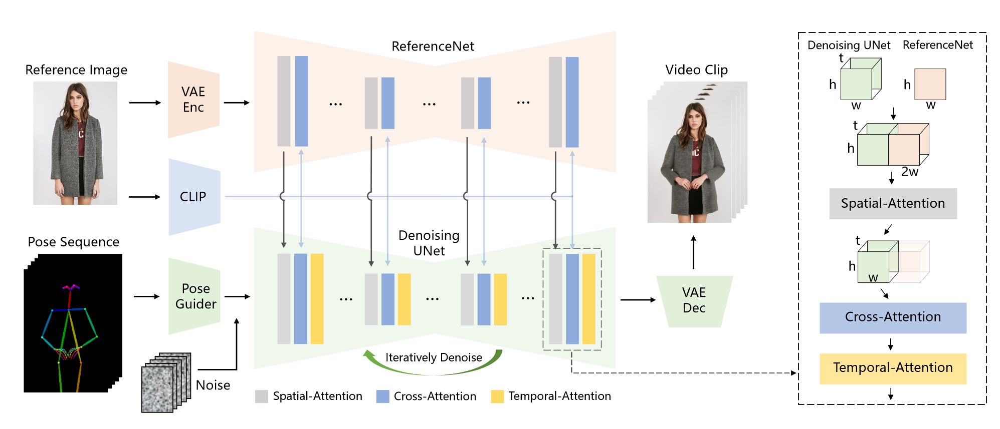

# Animate Anyone

## 方法
我们的目标是基于姿态引导的图像到视频的角色动画合成。给定一个描述角色外观和姿态序列的参考图像，我们的模型生成角色的动画视频。我们方法的流程如图2所示。在这一部分中，我们首先对Sec 3.1中的稳定扩散进行了简要的介绍，为我们的方法奠定了基础框架和网络结构。然后对第3.1节中的设计细节进行详细说明。最后，我们给出了Sec 3.3中的训练过程。
### Preliminariy: Stable Diffusion
我们的方法是稳定扩散模型( Stable Diffusion，SD )的扩展，它是由潜在扩散模型( Latent Diffusion Model，LDM )发展而来的。为了降低模型的计算复杂度，引入对潜在空间中的特征分布进行建模。SD开发了一个自动编码器[ 22、43]来建立图像的隐式表示，它由编码器$\varepsilon$和解码器$\mathcal{D}$组成。给定一个图片$x$，编码器首先将它映射到一个潜在表示：$z=\varepsilon(x)$，然后解码器再重建图片：$x_{recon}=\mathcal{D}(z)$。

SD学习将一个正态分布的噪声$\epsilon$去噪到真实的隐层$z$。在训练过程中，图像隐层$z$以$t$个时间步长进行扩散，产生噪声隐层$z_t$。并训练一个去噪UNet来预测施加的噪声。优化过程定义为如下目标：
$$\mathbf{L}=\mathbb{E}_{\mathbf{z}_{t}, c, \epsilon, t}\left(\left\|\epsilon-\epsilon_{\theta}\left(\mathbf{z}_{t}, c, t\right)\right\|_{2}^{2}\right)$$
其中$\epsilon_{\theta}$代表去噪UNet的功能，$c$表示条件信息的嵌入。在原始SD中，使用CLIP ViT-L/14[8]文本编码器将文本提示表示为令牌嵌入，用于生成文本到图像。去噪UNet由4个下采样层、1个中间层和4个上采样层组成。一个典型的层内块包含3种类型的计算：2D卷积、自注意力[ 44 ]和交叉注意力(项为Res - Trans块)。在文本嵌入和相应的网络特征之间进行交叉注意力。
在推断时，$z_T$从初始时间步长为$T$的随机高斯分布中采样，并通过确定性采样过程(e.g. DDPM 、DDIM )逐步去噪并恢复到$z_0$。在每次迭代中，去噪UNet预测每个时间步$t$对应的潜在特征上的噪声。最后，$z_0$将通过解码器$D$进行重建，得到生成图像。
### Network Architecture

我们方法的概述。使用Pose Guider对姿态序列进行初步编码，并与多帧噪声进行融合，随后使用Denoising UNet进行去噪处理，用于视频生成。去噪UNet的计算块由空间注意力( Spatial-Attention )、交叉注意力( Cross-Attention )和时间注意力( Temporal-Attention )组成，如右边的虚框所示。参考图像的融合涉及两个方面。首先，通过ReferenceNet提取细节特征，并将其用于Spatial - Attention。其次，通过CLIP图像编码器提取语义特征进行交叉注意力。时间-注意在时间维度上运作。最后，VAE解码器将结果解码为视频片段。

概述。图2给出了本文方法的概况。网络的初始输入由多帧噪声组成。去噪UNet基于SD的设计进行配置，采用相同的框架和分块单元，并继承了SD的训练权重。此外，我们的方法包含三个关键部分：1) Reference Net，从参考图像中编码字符的外观特征；2)Pose Guider，对运动控制信号进行编码，实现可控的字符运动；3)Temporal Layer，对时间关系进行编码，保证字符运动的连续性。

**ReferenceNet**。在文像转换任务中，文本提示表达了高级语义，只要求与生成的视觉内容具有语义相关性。然而，在图像到视频任务中，图像封装了更多低层次的细节特征，要求生成结果具有精确的一致性。在以往针对图形驱动生成的研究中，大多数方法[ 7、19、40、45、50、53]采用CLIP图像编码器作为交叉注意力中文本编码器的替代。然而，这种设计不足以解决与细节一致性相关的问题。造成这种限制的原因之一是CLIP图像编码器的输入包含低分辨率( 224 × 224 )图像，导致显著的细粒度细节信息丢失。另一个因素是，CLIP训练用于匹配文本的语义特征，强调高层特征匹配，从而导致特征编码中细节特征的缺失。

因此，我们设计了一个名为ReferenceNet的参考图像特征提取网络。我们对Reference Net采用与去噪UNet相同的框架，不包括时间层。与去噪UNet类似，ReferenceNet继承了原始SD的权重，并且权重更新是独立进行的。然后说明Reference Net中的特征融入去噪UNet的方法。具体来说，如图2所示，我们将自注意力层替换为空间注意力层。给定一个来自去噪UNet的特征映射$x_1\in\mathbb{R}^{t\times h\times w\times c}$和来自ReferenceNet的特征映射$x_2\in\mathbb{R}^{h\times w\times c}$，首先将$x_2$复制$t$次，然后将其与$x_1$沿$w$维拼接。然后进行自注意力，提取特征图的前半部分作为输出。该设计提供了两个优点：首先，ReferenceNet可以利用原始SD预训练的图像特征建模能力，从而得到一个初始化良好的特征。其次，由于ReferenceNet和去噪UNet具有本质上相同的网络结构和共享的初始化权重，因此去噪UNet可以选择性地从ReferenceNet中学习在同一特征空间中具有相关性的特征。此外，使用CLIP图像编码器使用交叉注意力。利用与文本编码器共享的特征空间，它提供参考图像的语义特征，作为一个有益的初始化，以加快整个网络的训练过程。

一个可比较的设计是ControlNet[ 56 ]，它在使用零卷积的去噪UNet中引入了额外的控制特征。然而，控制信息，如深度和边缘，与目标图像是空间对齐的，而参考图像和目标图像是空间相关但不对齐的。因此，ControlNet不适合直接应用。我们将在后续的实验部分对此进行验证。
虽然ReferenceNet引入了与去噪UNet相当数量的参数，但在基于扩散的视频生成中，所有视频帧都要经过多次去噪，而ReferenceNet在整个过程中只需要提取一次特征。因此，在推理过程中，并不会导致计算开销的大幅增加。

**Pose Guider**.ControlNet [ 56 ]展示了超越文本的高度鲁棒的条件生成能力。与这些方法不同的是，由于去噪UNet需要微调，我们选择不加入额外的控制网络，以防止计算复杂度的显著增加。相反，我们使用了一个轻量级的Pose Guider。该Pose Guider利用4个卷积层( 4 × 4核, 2 × 2步,使用16 , 32 , 64 , 128通道,类似于[ 56 ]中的条件编码器)对齐与噪声潜在分辨率相同的位姿图像。随后，将处理后的姿态图像在输入去噪UNet之前加入噪声潜在项。Pose Guider使用高斯权重初始化，在最后的投影层，我们使用零卷积。

**Temporal Layer**.大量研究提出在文本到图像( Text-to-image，T2I )模型中加入补充的时间层，以捕获视频帧之间的时间依赖关系。这种设计有利于从基础的T2I模型中转移预训练的图像生成能力。遵循这一原则，我们的时间层是在Res - Trans块内的空间注意力和交叉注意力成分之后进行整合的。时态层的设计受Animate Diff [ 11 ]的启发。具体来说，对于一个特征映射$x\in\mathbb{R}^{b \times t\times h\times w\times c}$，我们首先将其重塑为$x\in\mathbb{R}^{(b \times h\times w)\times t\times  c}$，然后执行时间注意力，即沿维度$t$的自注意力。时间层的特征通过残差连接融入到原始特征中。这一设计与我们将在下一小节中描述的两阶段训练方法是一致的。时间层专门应用于去噪UNet的Res - Trans块中。对于Reference Net，它对单个参考图像进行特征计算，不进行时间建模。由于Pose Guider实现了连续字符运动的可控性，实验证明时间层保证了外观细节的时间平滑性和连续性，避免了复杂运动建模的需要。

### Training Strategy
训练过程分为两个阶段。在第一阶段，使用单个视频帧进行训练。在去噪UNet中，我们暂时排除了时间层，模型以单帧噪声作为输入。在此阶段还训练了Reference Net和Pose Guider。参考图像是从整个视频片段中随机选取的。我们基于SD预训练的权重初始化去噪UNet和ReferenceNet的模型。Pose Guider使用高斯权重初始化，除了最终的投影层使用零卷积。VAE的Encoder和Decoder以及CLIP图像编码器的权重均保持固定。该阶段的优化目标是使模型能够在给定参考图像和目标位姿的条件下生成高质量的动画图像。在第二阶段，我们将时间层引入到之前训练好的模型中，并使用Animate Diff [ 11 ]的预训练权重进行初始化。模型的输入由24帧视频片段组成。在这个阶段中，我们只训练时间层，同时固定网络其余部分的权重。