# Adding Conditional Control to Text-to-Image Diffusion Models
## Method
ControlNet 是一种神经网络架构，可以通过空间局部化、特定于任务的图像条件增强大型预训练文本到图像扩散模型。我们首先在3.1节中介绍ControlNet的基本结构，然后在3.2节中描述如何将ControlNet应用于图像扩散模型Stable Diffusion [71]。我们在第 3.3 节中详细阐述了我们的训练，并详细介绍了推理过程中的几个额外注意事项，例如在第 3.4 节中组成多个 ControlNet。
### ControlNet

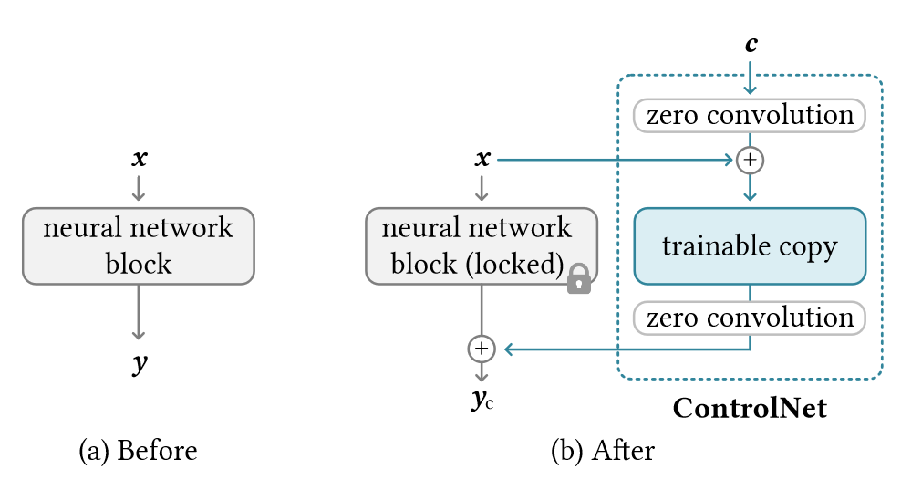
图 2：神经块将特征图 x 作为输入并输出另一个特征图 y，如 (a) 所示。为了将 ControlNet 添加到这样的块中，我们锁定原始块并创建可训练的副本，并使用零卷积层将它们连接在一起，即权重和偏差都初始化为零的 1 × 1 卷积。这里 c 是我们希望添加到网络中的条件向量，如 (b) 所示。

ControlNet 将附加条件注入神经网络的块中（图 2）。在这里，我们使用术语“网络块”来指代通常组合在一起形成神经网络的单个单元的一组神经层，例如 resnet 块、conv-bn-relu 块、多头注意力块、transformer块等。假设 $\mathcal{F}(\cdot ; \Theta)$ 是一个训练有素的神经块，参数为 $θ$，将输入特征图 $x$ 转换为另一个特征图 $y$，如下所示$$\boldsymbol{y}=\mathcal{F}(\boldsymbol{x} ; \Theta)$$
在我们的设置中，$x$和 $y$ 通常是 2D 特征图，即$x∈ \mathbb{R} ^{h×w×c}$，其中 ${h, w, c}$ 分别作为图中的高度、宽度和通道数（图 2a）。

为了将 ControlNet 添加到这样的预训练神经块中，我们锁定（冻结）原始块的参数 $θ$，同时将该块克隆到具有参数 $θ_c$ 的可训练副本（图 2b）。可训练副本采用外部条件向量 c 作为输入。当这种结构应用于稳定扩散等大型模型时，锁定的参数保留了用数十亿张图像训练的生产就绪模型，而可训练的副本重用此类大规模预训练模型来建立一个深度、稳健且强大的骨干来处理不同的输入状况。
可训练副本连接到具有零卷积层的锁定模型，表示为 $Z(·;·)$。具体来说，$Z(·;·)$ 是一个 1 × 1 卷积层，权重和偏差都初始化为零。为了构建 ControlNet，我们使用两个零卷积实例，参数分别为 $θ_{z1}$ 和 $θ_{z2}$。然后完整的 ControlNet 计算$$y_c = F (x; Θ) + Z(F (x + Z(c; θ_{z1}); Θ_c); θ_{z2})$$其中 $y_c$ 是 ControlNet 模块的输出。在第一个训练步骤中，由于零卷积层的权重和偏置参数都初始化为零，因此等式（2）中的 $Z(·;·)$ 项均计算为零，并且$$y_c = y$$
这样，当训练开始时，有害噪声就无法影响可训练副本中神经网络层的隐藏状态。此外，由于 $Z(c; θ_{z1}) = 0$ 并且可训练副本还接收输入图像 $x$，因此可训练副本功能齐全，并保留大型预训练模型的功能，使其能够作为进一步学习的强大骨干。零卷积通过消除初始训练步骤中作为梯度的随机噪声来保护该主干网。我们在补充材料中详细介绍了零卷积的梯度计算。
### 用于文本到图像扩散的 ControlNet
我们使用稳定扩散[71]作为示例来展示 ControlNet 如何向大型预训练扩散模型添加条件控制。稳定扩散本质上是一个 U-Net [72]，带有编码器、中间块和跳过连接的解码器。编码器和解码器都包含 12 个块，完整模型包含 25 个块，包括中间块。在 25 个块中，8 个块是下采样或上采样卷积层，而其他 17 个块是主块，每个块包含 4 个 resnet 层和 2 个视觉变换器 (ViT)。每个 ViT 都包含多个交叉注意力和自注意力机制。
例如，在图3a中，“SD编码器块A”包含4个resnet层和2个ViT，而“×3”表示该块重复3次。文本提示使用 CLIP 文本编码器 [65] 进行编码，扩散时间步长使用位置编码的时间编码器进行编码。

ControlNet 结构应用于 U 网的每个编码器级别（图 3b）。特别是，我们使用 ControlNet 创建 12 个编码块和 1 个稳定扩散中间块的可训练副本。 12个编码块有4种分辨率（64×64、32×32、16×16、8×8），每一个复制3次。输出被添加到 U 网的 12 个跳跃连接和 1 个中间块。由于稳定扩散是典型的 U 网结构，因此这种 ControlNet 架构可能适用于其他模型。

我们连接 ControlNet 的方式在计算上是高效的——由于锁定的副本参数被冻结，因此在最初锁定的编码器中不需要进行梯度计算来进行微调。这种方法可以加快训练速度并节省 GPU 内存。根据在单个 NVIDIA A100 PCIE 40GB 上的测试，与不使用 ControlNet 优化稳定扩散相比，使用 ControlNet 优化稳定扩散仅需要在每次训练迭代中增加约 23% 的 GPU 内存和 34% 的时间。

图像扩散模型学习逐步对图像进行去噪并从训练域生成样本。去噪过程可以发生在像素空间或从训练数据编码的潜在空间中。稳定扩散使用潜在图像作为训练域，因为在这个空间中工作已被证明可以稳定训练过程[71]。具体来说，Stable Diffusion 使用类似于 VQ-GAN [19] 的预处理方法将 512 × 512 像素空间图像转换为更小的 64 × 64 潜在图像。为了将 ControlNet 添加到稳定扩散中，我们首先将每个输入调节图像（例如边缘、姿态、深度等）从 512 × 512 输入大小转换为与稳定扩散大小匹配的 64 × 64 特征空间向量。特别地，我们使用一个由四个卷积层组成的微型网络 E(·)，具有 4 × 4 内核和 2 × 2 步长（由 ReLU 激活，分别使用 16、32、64、128 个通道，用高斯权重初始化并联合训练与完整模型）将图像空间条件 $c_i$ 编码为特征空间条件向量 $c_f$ as，$$c_f = {\LARGE  \varepsilon} (c_i)。$$
调节向量 $c_f$ 被传递到 ControlNet。

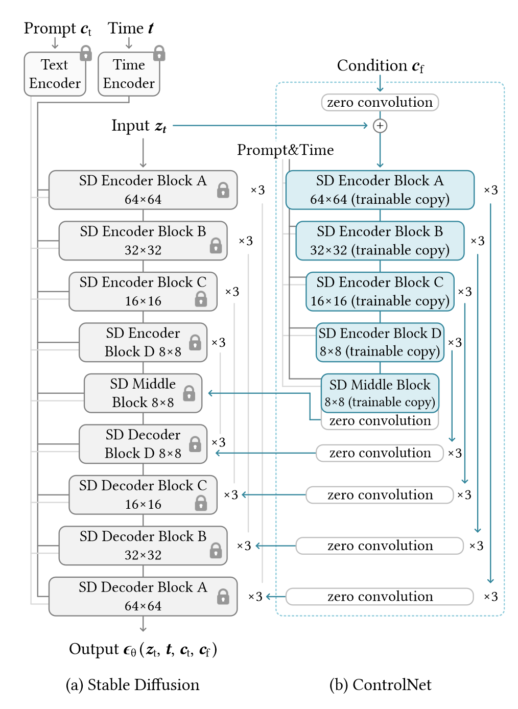
图 3：Stable Diffusion 的 U-net 架构与编码器块和中间块上的 ControlNet 连接。锁定的灰色块显示了 Stable Diffusion V1.5（或 V2.1，因为它们使用相同的 U-net 架构）的结构。添加可训练的蓝色块和白色零卷积层来构建 ControlNet。
### 训练
给定输入图像 $z_0$，图像扩散算法逐渐向图像添加噪声并生成噪声图像 $z_t$，其中 $t$ 表示添加噪声的次数。给定一组条件，包括时间步 $t$、文本提示 $c_t$ 以及特定于任务的条件 $c_f$，图像扩散算法学习网络 $ε_θ$ 来预测添加到噪声图像 $z_t$ 的噪声，其中 $$L = \mathbb{E}_{z_0,t,c_t,c_f,ε∼N (0,1)} [ ∥ε − ε_θ(z_t, t, c_t, c_f))∥_{2}^{2}]$$其中$L$是整个扩散模型的总体学习目标。该学习目标直接用于通过 ControlNet 微调扩散模型。

在训练过程中，我们随机将50%的文本提示$c_t$替换为空字符串。这种方法提高了 ControlNet 直接识别输入调节图像中的语义（例如边缘、姿势、深度等）的能力，以替代提示。

在训练过程中，由于零卷积不会给网络增加噪声，因此模型应该始终能够预测高质量的图像。我们观察到该模型并不是逐渐学习控制条件，而是突然成功地遵循输入条件图像；通常优化步骤少于 10K。如图4所示，我们称之为“突然收敛现象”。

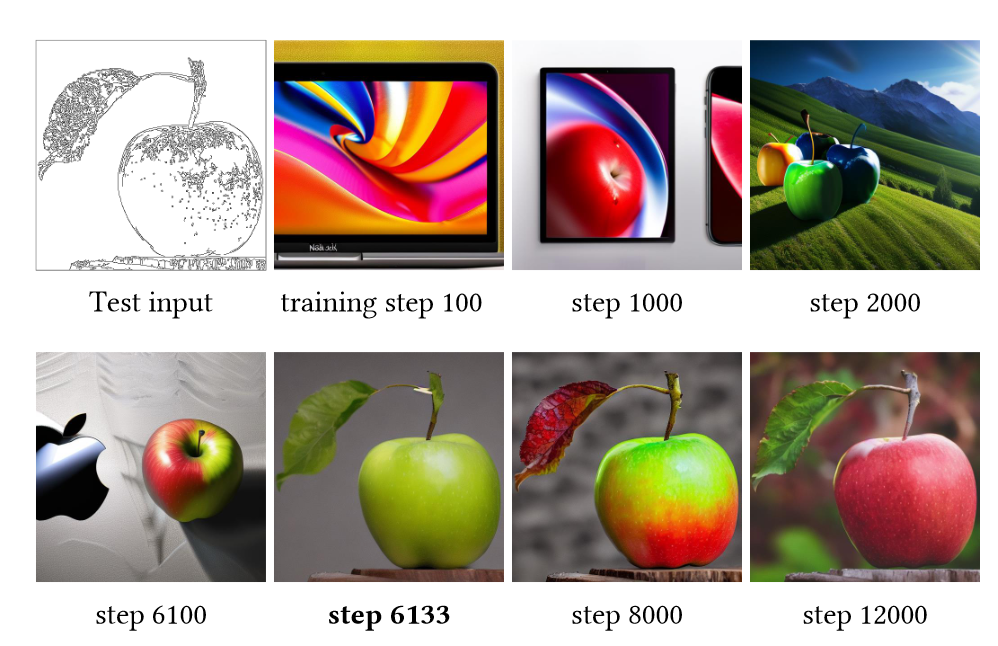
图4：突然收敛现象。由于零卷积，ControlNet 在整个训练过程中始终预测高质量的图像。在训练过程中的某个步骤（例如，以粗体标记的 6133 个步骤），模型突然学会遵循输入条件。

# U-Net
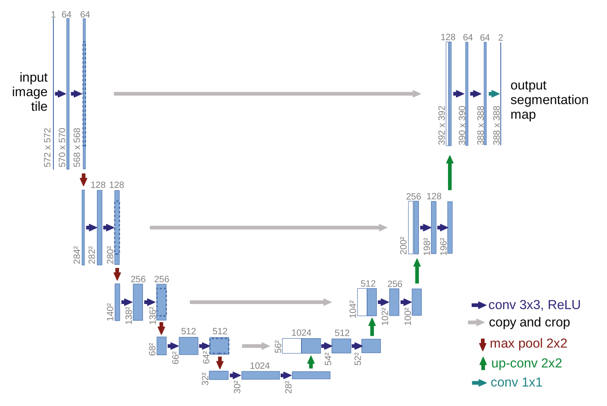
图 1. U-net 架构（最低分辨率下 32x32 像素的示例）。每个蓝色框对应一个多通道特征图。通道数显示在框的顶部。 x-y-尺寸位于框的左下边缘。白框代表复制的特征图。箭头表示不同的操作。

网络架构如图1所示。它由收缩路径（左侧）和扩展路径（右侧）组成。收缩路径遵循卷积网络的典型架构。它由两个 3x3 卷积（未填充卷积）的重复应用组成，每个卷积后跟一个修正线性单元 (ReLU) 和一个步长为 2 的 2x2 最大池化操作，用于下采样。在每个下采样步骤中，我们将特征通道的数量加倍。扩展路径中的每一步都包含对特征图进行上采样，然后进行 2x2 卷积（“上卷积”），将特征通道数量减半，与收缩路径中相应裁剪的特征图进行串联，以及两个 3x3卷积，每个卷积后跟一个 ReLU。由于每次卷积都会丢失边界像素，因此需要进行裁剪。在最后一层，使用 1x1 卷积将每个 64 分量特征向量映射到所需数量的类。该网络总共有 23 个卷积层。

为了实现输出分割图的无缝平铺（参见图 2），选择输入平铺大小非常重要，以便将所有 2x2 最大池操作应用于具有均匀 x 和 y 大小的层。


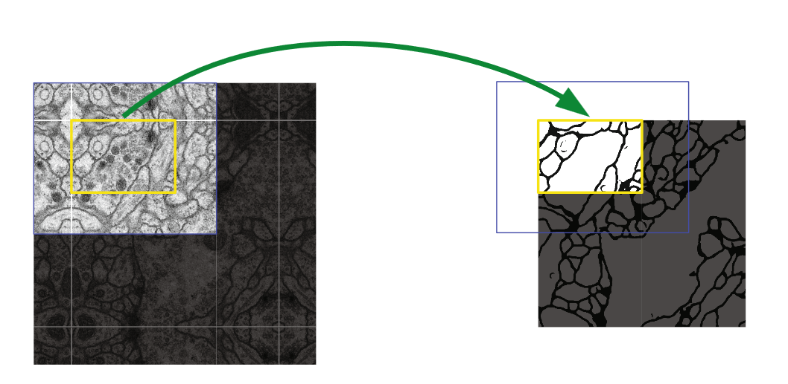
图 2. 用于任意大图像无缝分割的重叠平铺策略（此处分割 EM 堆栈中的神经元结构）。黄色区域分割的预测需要蓝色区域内的图像数据作为输入。通过镜像推断丢失的输入数据

# [变分自动编码器（Variational Autoencoder，VAE)](https://zhuanlan.zhihu.com/p/452743042)
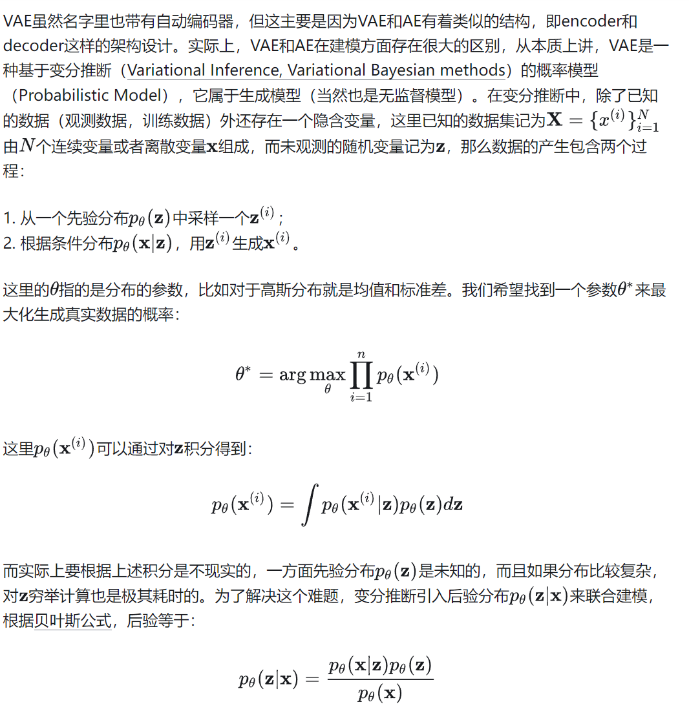
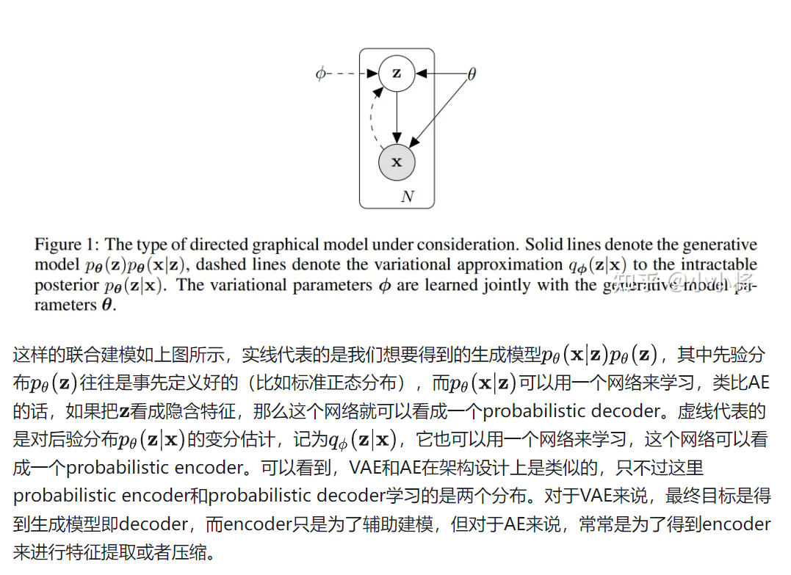
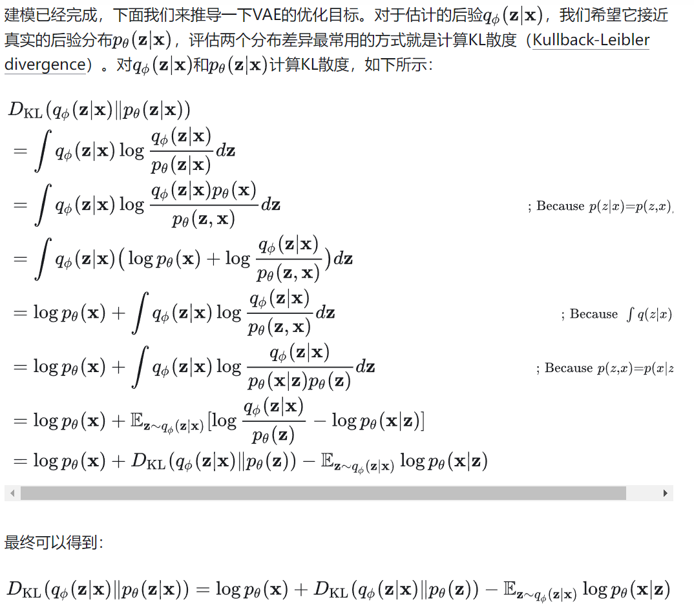
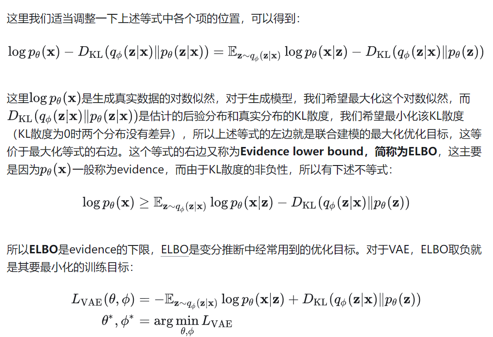
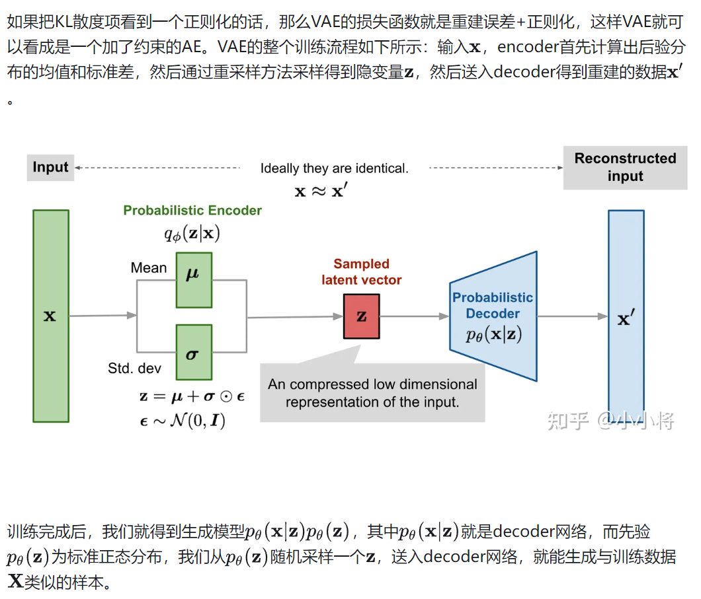
```python
#这里以MNIST数据集为例用PyTorch实现一个简单的VAE生成模型，由于MNIST数据集为灰度图，而且大部分像素点为0（黑色背景）或者白色（255，前景），所以这里可以将像素值除以255归一化到[0, 1]，并认为像素值属于伯努利分布，重建误差采用交叉熵。 
#首先是构建encoder，这里用简单的两层卷积和一个全连接层来实现，encoder给出隐变量的mu和log_var
class Encoder(nn.Module):
    """The encoder for VAE"""
    
    def __init__(self, image_size, input_dim, conv_dims, fc_dim, latent_dim):
        super().__init__()
        
        convs = []
        prev_dim = input_dim
        for conv_dim in conv_dims:
            convs.append(nn.Sequential(
                nn.Conv2d(prev_dim, conv_dim, kernel_size=3, stride=2, padding=1),
                nn.ReLU()
            ))
            prev_dim = conv_dim
        self.convs = nn.Sequential(*convs)
        
        prev_dim = (image_size // (2 ** len(conv_dims))) ** 2 * conv_dims[-1]
        self.fc = nn.Sequential(
            nn.Linear(prev_dim, fc_dim),
            nn.ReLU(),
        )
        self.fc_mu = nn.Linear(fc_dim, latent_dim)
        self.fc_log_var = nn.Linear(fc_dim, latent_dim)
                    
    def forward(self, x):
        x = self.convs(x)
        x = torch.flatten(x, start_dim=1)
        x = self.fc(x)
        mu = self.fc_mu(x)
        log_var = self.fc_log_var(x)
        return mu, log_var
#对于decoder，基本采用对称的结构，这里用反卷积来实现上采样，decoder根据隐变量重构样本或者生成样本：
class Decoder(nn.Module):
    """The decoder for VAE"""
    
    def __init__(self, latent_dim, image_size, conv_dims, output_dim):
        super().__init__()
        
        fc_dim = (image_size // (2 ** len(conv_dims))) ** 2 * conv_dims[-1]
        self.fc = nn.Sequential(
            nn.Linear(latent_dim, fc_dim),
            nn.ReLU()
        )
        self.conv_size = image_size // (2 ** len(conv_dims))
        
        de_convs = []
        prev_dim = conv_dims[-1]
        for conv_dim in conv_dims[::-1]:
            de_convs.append(nn.Sequential(
                nn.ConvTranspose2d(prev_dim, conv_dim, kernel_size=3, stride=2, padding=1, output_padding=1),
                nn.ReLU()
            ))
            prev_dim = conv_dim
        self.de_convs = nn.Sequential(*de_convs)
        self.pred_layer = nn.Sequential(
            nn.Conv2d(prev_dim, output_dim, kernel_size=3, stride=1, padding=1),
            nn.Sigmoid()
        )
        
    def forward(self, x):
        x = self.fc(x)
        x = x.reshape(x.size(0), -1, self.conv_size, self.conv_size)
        x = self.de_convs(x)
        x = self.pred_layer(x)
        return x
#有了encoder和decoder，然后就可以构建VAE模型了，这里的实现只对隐变量通过重采样方式采样一次，训练损失为KL散度和重建误差（交叉熵）之和：
class VAE(nn.Module):
    """VAE"""
    
    def __init__(self, image_size, input_dim, conv_dims, fc_dim, latent_dim):
        super().__init__()
        
        self.encoder = Encoder(image_size, input_dim, conv_dims, fc_dim, latent_dim)
        self.decoder = Decoder(latent_dim, image_size, conv_dims, input_dim)
        
    def sample_z(self, mu, log_var):
        """sample z by reparameterization trick"""
        std = torch.exp(0.5 * log_var)
        eps = torch.randn_like(std)
        return mu + eps * std
    
    def forward(self, x):
        mu, log_var = self.encoder(x)
        z = self.sample_z(mu, log_var)
        recon = self.decoder(z)
        return recon, mu, log_var
    
    def compute_loss(self, x, recon, mu, log_var):
        """compute loss of VAE"""
        
        # KL loss
        kl_loss = (0.5*(log_var.exp() + mu ** 2 - 1 - log_var)).sum(1).mean()
        
        # recon loss
        recon_loss = F.binary_cross_entropy(recon, x, reduction="none").sum([1, 2, 3]).mean()
        
        return kl_loss + recon_loss
```
# [扩散模型之DDPM](https://zhuanlan.zhihu.com/p/563661713)
简单来说，扩散模型包含两个过程：前向扩散过程和反向生成过程，前向扩散过程是对一张图像逐渐添加高斯噪音直至变成随机噪音，而反向生成过程是去噪音过程，我们将从一个随机噪音开始逐渐去噪音直至生成一张图像，这也是我们要求解或者训练的部分。扩散模型与其它主流生成模型的对比如下所示：

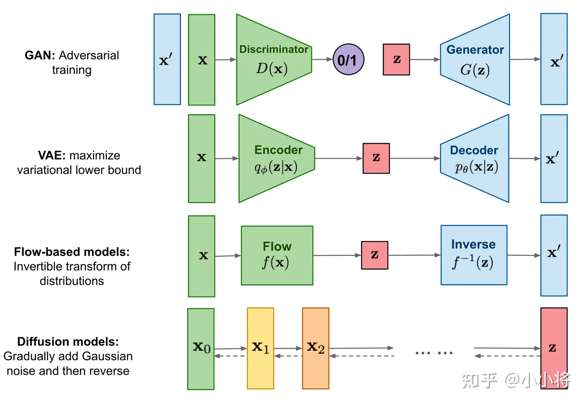
虽然扩散模型背后的推导比较复杂，但是我们最终得到的优化目标非常简单，就是让网络预测的噪音和真实的噪音一致。DDPM的训练过程也非常简单，如下图所示：随机选择一个训练样本->从1-T随机抽样一个t->随机产生噪音-计算当前所产生的带噪音数据（红色框所示）->输入网络预测噪音->计算产生的噪音和预测的噪音的L2损失->计算梯度并更新网络。

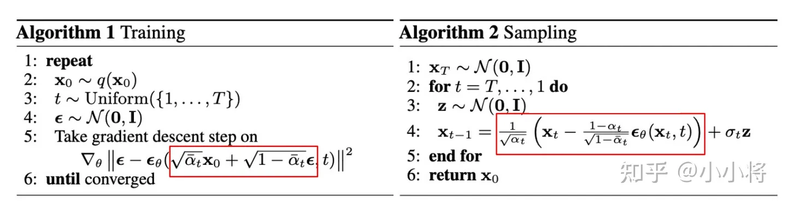
一旦训练完成，其采样过程也非常简单，如上所示：我们从一个随机噪音开始，并用训练好的网络预测噪音，然后计算条件分布的均值（红色框部分），然后用均值加标准差乘以一个随机噪音，直至t=0完成新样本的生成（最后一步不加噪音）。不过[实际的代码](https://github.com/hojonathanho/diffusion/issues/5)实现和上述过程略有区别：先基于预测的噪音生成$x_0$
，并进行了clip处理（范围[-1, 1]，原始数据归一化到这个范围），然后再计算均值。我个人的理解这应该算是一种约束，既然模型预测的是噪音，那么我们也希望用预测噪音重构处理的原始数据也应该满足范围要求。

前面我们介绍了扩散模型的原理以及优化目标，那么扩散模型的核心就在于训练噪音预测模型，由于噪音和原始数据是同维度的，所以我们可以选择采用AutoEncoder架构来作为噪音预测模型。DDPM所采用的模型是一个基于residual block和attention block的U-Net模型。如下所示：

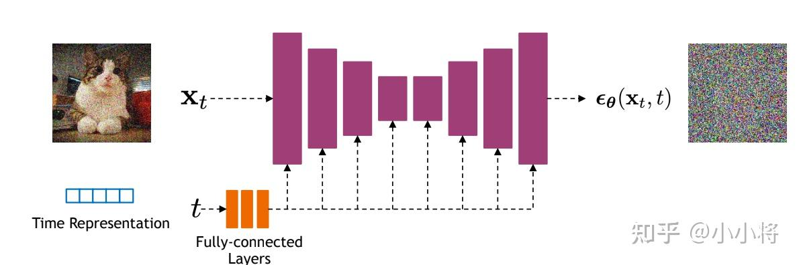
U-Net属于encoder-decoder架构，其中encoder分成不同的stages，每个stage都包含下采样模块来降低特征的空间大小（H和W），然后decoder和encoder相反，是将encoder压缩的特征逐渐恢复。U-Net在decoder模块中还引入了skip connection，即concat了encoder中间得到的同维度特征，这有利于网络优化。DDPM所采用的U-Net每个stage包含2个residual block，而且部分stage还加入了self-attention模块增加网络的全局建模能力。 另外，扩散模型其实需要的是
个噪音预测模型，实际处理时，我们可以增加一个time embedding（类似transformer中的position embedding）来将timestep编码到网络中，从而只需要训练一个共享的U-Net模型。具体地，DDPM在各个residual block都引入了time embedding，如上图所示。

首先，是time embeding，这里是采用Attention Is All You Need中所设计的sinusoidal position embedding，只不过是用来编码timestep：
```python
# use sinusoidal position embedding to encode time step (https://arxiv.org/abs/1706.03762)   
def timestep_embedding(timesteps, dim, max_period=10000):
    """
    Create sinusoidal timestep embeddings.
    :param timesteps: a 1-D Tensor of N indices, one per batch element.
                      These may be fractional.
    :param dim: the dimension of the output.
    :param max_period: controls the minimum frequency of the embeddings.
    :return: an [N x dim] Tensor of positional embeddings.
    """
    half = dim // 2
    freqs = torch.exp(
        -math.log(max_period) * torch.arange(start=0, end=half, dtype=torch.float32) / half
    ).to(device=timesteps.device)
    args = timesteps[:, None].float() * freqs[None]
    embedding = torch.cat([torch.cos(args), torch.sin(args)], dim=-1)
    if dim % 2:
        embedding = torch.cat([embedding, torch.zeros_like(embedding[:, :1])], dim=-1)
    return embedding
```
由于只有residual block才引入time embedding，所以可以定义一些辅助模块来自动处理，如下所示：
```python
# define TimestepEmbedSequential to support `time_emb` as extra input
class TimestepBlock(nn.Module):
    """
    Any module where forward() takes timestep embeddings as a second argument.
    """

    @abstractmethod
    def forward(self, x, emb):
        """
        Apply the module to `x` given `emb` timestep embeddings.
        """


class TimestepEmbedSequential(nn.Sequential, TimestepBlock):
    """
    A sequential module that passes timestep embeddings to the children that
    support it as an extra input.
    """

    def forward(self, x, emb):
        for layer in self:
            if isinstance(layer, TimestepBlock):
                x = layer(x, emb)
            else:
                x = layer(x)
        return x
```
这里所采用的U-Net采用GroupNorm进行归一化，所以这里也简单定义了一个norm layer以方便使用：
```python
# use GN for norm layer
def norm_layer(channels):
    return nn.GroupNorm(32, channels)
```
U-Net的核心模块是residual block，它包含两个卷积层以及shortcut，同时也要引入time embedding，这里额外定义了一个linear层来将time embedding变换为和特征维度一致，第一conv之后通过加上time embedding来编码time：
```python
# Residual block
class ResidualBlock(TimestepBlock):
    def __init__(self, in_channels, out_channels, time_channels, dropout):
        super().__init__()
        self.conv1 = nn.Sequential(
            norm_layer(in_channels),
            nn.SiLU(),
            nn.Conv2d(in_channels, out_channels, kernel_size=3, padding=1)
        )
        
        # pojection for time step embedding
        self.time_emb = nn.Sequential(
            nn.SiLU(),
            nn.Linear(time_channels, out_channels)
        )
        
        self.conv2 = nn.Sequential(
            norm_layer(out_channels),
            nn.SiLU(),
            nn.Dropout(p=dropout),
            nn.Conv2d(out_channels, out_channels, kernel_size=3, padding=1)
        )

        if in_channels != out_channels:
            self.shortcut = nn.Conv2d(in_channels, out_channels, kernel_size=1)
        else:
            self.shortcut = nn.Identity()


    def forward(self, x, t):
        """
        `x` has shape `[batch_size, in_dim, height, width]`
        `t` has shape `[batch_size, time_dim]`
        """
        h = self.conv1(x)
        # Add time step embeddings
        h += self.time_emb(t)[:, :, None, None]
        h = self.conv2(h)
        return h + self.shortcut(x)
```
这里还在部分residual block引入了attention，这里的attention和transformer的self-attention是一致的：
```python
# Attention block with shortcut
class AttentionBlock(nn.Module):
    def __init__(self, channels, num_heads=1):
        super().__init__()
        self.num_heads = num_heads
        assert channels % num_heads == 0
        
        self.norm = norm_layer(channels)
        self.qkv = nn.Conv2d(channels, channels * 3, kernel_size=1, bias=False)
        self.proj = nn.Conv2d(channels, channels, kernel_size=1)

    def forward(self, x):
        B, C, H, W = x.shape
        qkv = self.qkv(self.norm(x))
        q, k, v = qkv.reshape(B*self.num_heads, -1, H*W).chunk(3, dim=1)
        scale = 1. / math.sqrt(math.sqrt(C // self.num_heads))
        attn = torch.einsum("bct,bcs->bts", q * scale, k * scale)
        attn = attn.softmax(dim=-1)
        h = torch.einsum("bts,bcs->bct", attn, v)
        h = h.reshape(B, -1, H, W)
        h = self.proj(h)
        return h + x
```
对于上采样模块和下采样模块，其分别可以采用插值和stride=2的conv或者pooling来实现：
```python
# upsample
class Upsample(nn.Module):
    def __init__(self, channels, use_conv):
        super().__init__()
        self.use_conv = use_conv
        if use_conv:
            self.conv = nn.Conv2d(channels, channels, kernel_size=3, padding=1)

    def forward(self, x):
        x = F.interpolate(x, scale_factor=2, mode="nearest")
        if self.use_conv:
            x = self.conv(x)
        return x

# downsample
class Downsample(nn.Module):
    def __init__(self, channels, use_conv):
        super().__init__()
        self.use_conv = use_conv
        if use_conv:
            self.op = nn.Conv2d(channels, channels, kernel_size=3, stride=2, padding=1)
        else:
            self.op = nn.AvgPool2d(stride=2)

    def forward(self, x):
        return self.op(x)
```
上面我们实现了U-Net的所有组件，就可以进行组合来实现U-Net了：
```python
# The full UNet model with attention and timestep embedding
class UNetModel(nn.Module):
    def __init__(
        self,
        in_channels=3,
        model_channels=128,
        out_channels=3,
        num_res_blocks=2,
        attention_resolutions=(8, 16),
        dropout=0,
        channel_mult=(1, 2, 2, 2),
        conv_resample=True,
        num_heads=4
    ):
        super().__init__()

        self.in_channels = in_channels
        self.model_channels = model_channels
        self.out_channels = out_channels
        self.num_res_blocks = num_res_blocks
        self.attention_resolutions = attention_resolutions
        self.dropout = dropout
        self.channel_mult = channel_mult
        self.conv_resample = conv_resample
        self.num_heads = num_heads
        
        # time embedding
        time_embed_dim = model_channels * 4
        self.time_embed = nn.Sequential(
            nn.Linear(model_channels, time_embed_dim),
            nn.SiLU(),
            nn.Linear(time_embed_dim, time_embed_dim),
        )
        
        # down blocks
        self.down_blocks = nn.ModuleList([
            TimestepEmbedSequential(nn.Conv2d(in_channels, model_channels, kernel_size=3, padding=1))
        ])
        down_block_chans = [model_channels]
        ch = model_channels
        ds = 1
        for level, mult in enumerate(channel_mult):
            for _ in range(num_res_blocks):
                layers = [
                    ResidualBlock(ch, mult * model_channels, time_embed_dim, dropout)
                ]
                ch = mult * model_channels
                if ds in attention_resolutions:
                    layers.append(AttentionBlock(ch, num_heads=num_heads))
                self.down_blocks.append(TimestepEmbedSequential(*layers))
                down_block_chans.append(ch)
            if level != len(channel_mult) - 1: # don't use downsample for the last stage
                self.down_blocks.append(TimestepEmbedSequential(Downsample(ch, conv_resample)))
                down_block_chans.append(ch)
                ds *= 2
        
        # middle block
        self.middle_block = TimestepEmbedSequential(
            ResidualBlock(ch, ch, time_embed_dim, dropout),
            AttentionBlock(ch, num_heads=num_heads),
            ResidualBlock(ch, ch, time_embed_dim, dropout)
        )
        
        # up blocks
        self.up_blocks = nn.ModuleList([])
        for level, mult in list(enumerate(channel_mult))[::-1]:
            for i in range(num_res_blocks + 1):
                layers = [
                    ResidualBlock(
                        ch + down_block_chans.pop(),
                        model_channels * mult,
                        time_embed_dim,
                        dropout
                    )
                ]
                ch = model_channels * mult
                if ds in attention_resolutions:
                    layers.append(AttentionBlock(ch, num_heads=num_heads))
                if level and i == num_res_blocks:
                    layers.append(Upsample(ch, conv_resample))
                    ds //= 2
                self.up_blocks.append(TimestepEmbedSequential(*layers))

        self.out = nn.Sequential(
            norm_layer(ch),
            nn.SiLU(),
            nn.Conv2d(model_channels, out_channels, kernel_size=3, padding=1),
        )

    def forward(self, x, timesteps):
        """
        Apply the model to an input batch.
        :param x: an [N x C x H x W] Tensor of inputs.
        :param timesteps: a 1-D batch of timesteps.
        :return: an [N x C x ...] Tensor of outputs.
        """
        hs = []
        # time step embedding
        emb = self.time_embed(timestep_embedding(timesteps, self.model_channels))
        
        # down stage
        h = x
        for module in self.down_blocks:
            h = module(h, emb)
            hs.append(h)
        # middle stage
        h = self.middle_block(h, emb)
        # up stage
        for module in self.up_blocks:
            cat_in = torch.cat([h, hs.pop()], dim=1)
            h = module(cat_in, emb)
        return self.out(h)
```
对于扩散过程，其主要的参数就是timesteps和noise schedule，DDPM采用范围为[0.0001, 0.02]的线性noise schedule，其默认采用的总扩散步数为1000。
```python
# beta schedule
def linear_beta_schedule(timesteps):
    scale = 1000 / timesteps
    beta_start = scale * 0.0001
    beta_end = scale * 0.02
    return torch.linspace(beta_start, beta_end, timesteps, dtype=torch.float64)
```
我们定义个扩散模型，它主要要提前根据设计的noise schedule来计算一些系数，并实现一些扩散过程和生成过程：
```python
class GaussianDiffusion:
    def __init__(
        self,
        timesteps=1000,
        beta_schedule='linear'
    ):
        self.timesteps = timesteps
        
        if beta_schedule == 'linear':
            betas = linear_beta_schedule(timesteps)
        elif beta_schedule == 'cosine':
            betas = cosine_beta_schedule(timesteps)
        else:
            raise ValueError(f'unknown beta schedule {beta_schedule}')
        self.betas = betas
            
        self.alphas = 1. - self.betas
        self.alphas_cumprod = torch.cumprod(self.alphas, axis=0)
        self.alphas_cumprod_prev = F.pad(self.alphas_cumprod[:-1], (1, 0), value=1.)
        
        # calculations for diffusion q(x_t | x_{t-1}) and others
        self.sqrt_alphas_cumprod = torch.sqrt(self.alphas_cumprod)
        self.sqrt_one_minus_alphas_cumprod = torch.sqrt(1.0 - self.alphas_cumprod)
        self.log_one_minus_alphas_cumprod = torch.log(1.0 - self.alphas_cumprod)
        self.sqrt_recip_alphas_cumprod = torch.sqrt(1.0 / self.alphas_cumprod)
        self.sqrt_recipm1_alphas_cumprod = torch.sqrt(1.0 / self.alphas_cumprod - 1)
        
        # calculations for posterior q(x_{t-1} | x_t, x_0)
        self.posterior_variance = (
            self.betas * (1.0 - self.alphas_cumprod_prev) / (1.0 - self.alphas_cumprod)
        )
        # below: log calculation clipped because the posterior variance is 0 at the beginning
        # of the diffusion chain
        self.posterior_log_variance_clipped = torch.log(self.posterior_variance.clamp(min =1e-20))
        
        self.posterior_mean_coef1 = (
            self.betas * torch.sqrt(self.alphas_cumprod_prev) / (1.0 - self.alphas_cumprod)
        )
        self.posterior_mean_coef2 = (
            (1.0 - self.alphas_cumprod_prev)
            * torch.sqrt(self.alphas)
            / (1.0 - self.alphas_cumprod)
        )
    
    # get the param of given timestep t
    def _extract(self, a, t, x_shape):
        batch_size = t.shape[0]
        out = a.to(t.device).gather(0, t).float()
        out = out.reshape(batch_size, *((1,) * (len(x_shape) - 1)))
        return out
    
    # forward diffusion (using the nice property): q(x_t | x_0)
    def q_sample(self, x_start, t, noise=None):
        if noise is None:
            noise = torch.randn_like(x_start)

        sqrt_alphas_cumprod_t = self._extract(self.sqrt_alphas_cumprod, t, x_start.shape)
        sqrt_one_minus_alphas_cumprod_t = self._extract(self.sqrt_one_minus_alphas_cumprod, t, x_start.shape)

        return sqrt_alphas_cumprod_t * x_start + sqrt_one_minus_alphas_cumprod_t * noise
    
    # Get the mean and variance of q(x_t | x_0).
    def q_mean_variance(self, x_start, t):
        mean = self._extract(self.sqrt_alphas_cumprod, t, x_start.shape) * x_start
        variance = self._extract(1.0 - self.alphas_cumprod, t, x_start.shape)
        log_variance = self._extract(self.log_one_minus_alphas_cumprod, t, x_start.shape)
        return mean, variance, log_variance
    
    # Compute the mean and variance of the diffusion posterior: q(x_{t-1} | x_t, x_0)
    def q_posterior_mean_variance(self, x_start, x_t, t):
        posterior_mean = (
            self._extract(self.posterior_mean_coef1, t, x_t.shape) * x_start
            + self._extract(self.posterior_mean_coef2, t, x_t.shape) * x_t
        )
        posterior_variance = self._extract(self.posterior_variance, t, x_t.shape)
        posterior_log_variance_clipped = self._extract(self.posterior_log_variance_clipped, t, x_t.shape)
        return posterior_mean, posterior_variance, posterior_log_variance_clipped
    
    # compute x_0 from x_t and pred noise: the reverse of `q_sample`
    def predict_start_from_noise(self, x_t, t, noise):
        return (
            self._extract(self.sqrt_recip_alphas_cumprod, t, x_t.shape) * x_t -
            self._extract(self.sqrt_recipm1_alphas_cumprod, t, x_t.shape) * noise
        )
    
    # compute predicted mean and variance of p(x_{t-1} | x_t)
    def p_mean_variance(self, model, x_t, t, clip_denoised=True):
        # predict noise using model
        pred_noise = model(x_t, t)
        # get the predicted x_0: different from the algorithm2 in the paper
        x_recon = self.predict_start_from_noise(x_t, t, pred_noise)
        if clip_denoised:
            x_recon = torch.clamp(x_recon, min=-1., max=1.)
        model_mean, posterior_variance, posterior_log_variance = \
                    self.q_posterior_mean_variance(x_recon, x_t, t)
        return model_mean, posterior_variance, posterior_log_variance
        
    # denoise_step: sample x_{t-1} from x_t and pred_noise
    @torch.no_grad()
    def p_sample(self, model, x_t, t, clip_denoised=True):
        # predict mean and variance
        model_mean, _, model_log_variance = self.p_mean_variance(model, x_t, t,
                                                    clip_denoised=clip_denoised)
        noise = torch.randn_like(x_t)
        # no noise when t == 0
        nonzero_mask = ((t != 0).float().view(-1, *([1] * (len(x_t.shape) - 1))))
        # compute x_{t-1}
        pred_img = model_mean + nonzero_mask * (0.5 * model_log_variance).exp() * noise
        return pred_img
    
    # denoise: reverse diffusion
    @torch.no_grad()
    def p_sample_loop(self, model, shape):
        batch_size = shape[0]
        device = next(model.parameters()).device
        # start from pure noise (for each example in the batch)
        img = torch.randn(shape, device=device)
        imgs = []
        for i in tqdm(reversed(range(0, timesteps)), desc='sampling loop time step', total=timesteps):
            img = self.p_sample(model, img, torch.full((batch_size,), i, device=device, dtype=torch.long))
            imgs.append(img.cpu().numpy())
        return imgs
    
    # sample new images
    @torch.no_grad()
    def sample(self, model, image_size, batch_size=8, channels=3):
        return self.p_sample_loop(model, shape=(batch_size, channels, image_size, image_size))
    
    # compute train losses
    def train_losses(self, model, x_start, t):
        # generate random noise
        noise = torch.randn_like(x_start)
        # get x_t
        x_noisy = self.q_sample(x_start, t, noise=noise)
        predicted_noise = model(x_noisy, t)
        loss = F.mse_loss(noise, predicted_noise)
        return loss
```
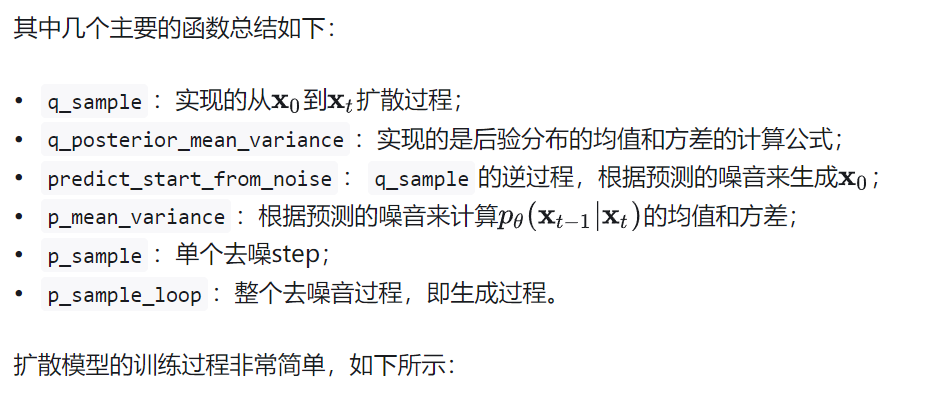
```python
# train
epochs = 10

for epoch in range(epochs):
    for step, (images, labels) in enumerate(train_loader):
        optimizer.zero_grad()
        
        batch_size = images.shape[0]
        images = images.to(device)
        
        # sample t uniformally for every example in the batch
        t = torch.randint(0, timesteps, (batch_size,), device=device).long()
        
        loss = gaussian_diffusion.train_losses(model, images, t)
        
        if step % 200 == 0:
            print("Loss:", loss.item())
            
        loss.backward()
        optimizer.step()
```
