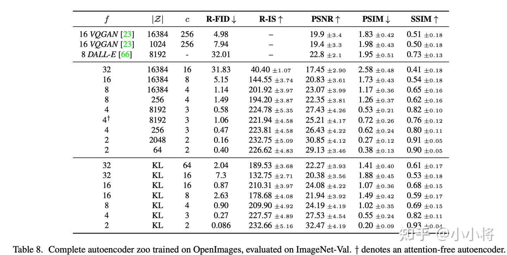
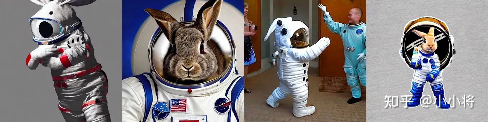

# [Stable Diffusion](https://zhuanlan.zhihu.com/p/617134893)
SD是一个基于latent的扩散模型，它在UNet中引入text condition来实现基于文本生成图像。SD的核心来源于Latent Diffusion这个工作，常规的扩散模型是基于pixel的生成模型，而Latent Diffusion是基于latent的生成模型，它先采用一个autoencoder将图像压缩到latent空间，然后用扩散模型来生成图像的latents，最后送入autoencoder的decoder模块就可以得到生成的图像。


基于latent的扩散模型的优势在于计算效率更高效，因为图像的latent空间要比图像pixel空间要小，这也是SD的核心优势。文生图模型往往参数量比较大，基于pixel的方法往往限于算力只生成64x64大小的图像，比如OpenAI的DALL-E2和谷歌的Imagen，然后再通过超分辨模型将图像分辨率提升至256x256和1024x1024；而基于latent的SD是在latent空间操作的，它可以直接生成256x256和512x512甚至更高分辨率的图像。

SD模型的主体结构如下图所示，主要包括三个模型：
- autoencoder：encoder将图像压缩到latent空间，而decoder将latent解码为图像；
- CLIP text encoder：提取输入text的text embeddings，通过cross attention方式送入扩散模型的UNet中作为condition；
- UNet：扩散模型的主体，用来实现文本引导下的latent生成。


对于SD模型，其autoencoder模型参数大小为84M，CLIP text encoder模型大小为123M，而UNet参数大小为860M，所以SD模型的总参数量约为1B。

## autoencoder
autoencoder是一个基于encoder-decoder架构的图像压缩模型，对于一个大小为$H\times W\times3$的输入图像，encoder模块将其编码为一个大小为$h\times w\times c$的latent，其中$f=H/h=W/w$为下采样率（downsampling factor）。在训练autoencoder过程中，除了采用L1重建损失外，还增加了感知损失（perceptual loss，即LPIPS，具体见论文The Unreasonable Effectiveness of Deep Features as a Perceptual Metric）以及基于patch的对抗训练。辅助loss主要是为了确保重建的图像局部真实性以及避免模糊，具体损失函数见latent diffusion的loss部分。同时为了防止得到的latent的标准差过大，采用了两种正则化方法：第一种是KL-reg，类似VAE增加一个latent和标准正态分布的KL loss，不过这里为了保证重建效果，采用比较小的权重（～10e-6）；第二种是VQ-reg，引入一个VQ （vector quantization）layer，此时的模型可以看成是一个VQ-GAN，不过VQ层是在decoder模块中，这里VQ的codebook采样较高的维度（8192）来降低正则化对重建效果的影响。 latent diffusion论文中实验了不同参数下的autoencoder模型，如下表所示，可以看到当$f$较小和$c$较大时，重建效果越好（PSNR越大），这也比较符合预期，毕竟此时压缩率小。


当$f$在4～16时，可以取得相对好的效果。SD采用基于KL-reg的autoencoder，其中下采样率$f=8$，特征维度为$c=4$，当输入图像为512x512大小时将得到64x64x4大小的latent。 autoencoder模型时在OpenImages数据集上基于256x256大小训练的，但是由于autoencoder的模型是全卷积结构的（基于ResnetBlock，只有模型的中间存在两个self attention层），所以它可以扩展应用在尺寸>256的图像上。下面我们给出使用diffusers库来加载autoencoder模型，并使用autoencoder来实现图像的压缩和重建，代码如下所示：
```python
import torch
from diffusers import AutoencoderKL
import numpy as np
from PIL import Image

#加载模型: autoencoder可以通过SD权重指定subfolder来单独加载
autoencoder = AutoencoderKL.from_pretrained("runwayml/stable-diffusion-v1-5", subfolder="vae")
autoencoder.to("cuda", dtype=torch.float16)

# 读取图像并预处理
raw_image = Image.open("boy.png").convert("RGB").resize((256, 256))
image = np.array(raw_image).astype(np.float32) / 127.5 - 1.0
image = image[None].transpose(0, 3, 1, 2)
image = torch.from_numpy(image)

# 压缩图像为latent并重建
with torch.inference_mode():
    latent = autoencoder.encode(image.to("cuda", dtype=torch.float16)).latent_dist.sample()
    rec_image = autoencoder.decode(latent).sample
    rec_image = (rec_image / 2 + 0.5).clamp(0, 1)
    rec_image = rec_image.cpu().permute(0, 2, 3, 1).numpy()
    rec_image = (rec_image * 255).round().astype("uint8")
    rec_image = Image.fromarray(rec_image[0])
rec_image
```
这里我们给出了两张图片在256x256和512x512下的重建效果对比，如下所示，第一列为原始图片，第二列为512x512尺寸下的重建图，第三列为256x256尺寸下的重建图。对比可以看出，autoencoder将图片压缩到latent后再重建其实是有损的，比如会出现文字和人脸的畸变，在256x256分辨率下是比较明显的，512x512下效果会好很多。


这种有损压缩肯定是对SD的生成图像质量是有一定影响的，不过好在SD模型基本上是在512x512以上分辨率下使用的。为了改善这种畸变，stabilityai在发布SD 2.0时同时发布了两个在LAION子数据集上精调的autoencoder，注意这里只精调autoencoder的decoder部分，SD的UNet在训练过程只需要encoder部分，所以这样精调后的autoencoder可以直接用在先前训练好的UNet上（这种技巧还是比较通用的，比如谷歌的Parti也是在训练好后自回归生成模型后，扩大并精调ViT-VQGAN的decoder模块来提升生成质量）。我们也可以直接在diffusers中使用这些autoencoder，比如mse版本（采用mse损失来finetune的模型）：
```python
autoencoder = AutoencoderKL.from_pretrained("stabilityai/sd-vae-ft-mse/")
```
对于同样的两张图，这个mse版本的重建效果如下所示，可以看到相比原始版本的autoencoder，畸变是有一定改善的。


## CLIP text encoder
SD采用CLIP text encoder来对输入text提取text embeddings，具体的是采用目前OpenAI所开源的最大CLIP模型：clip-vit-large-patch14，这个CLIP的text encoder是一个transformer模型（只有encoder模块）：层数为12，特征维度为768，模型参数大小是123M。对于输入text，送入CLIP text encoder后得到最后的hidden states（即最后一个transformer block得到的特征），其特征维度大小为77x768（77是token的数量），这个细粒度的text embeddings将以cross attention的方式送入UNet中。在transofmers库中，可以如下使用CLIP text encoder：
```python
from transformers import CLIPTextModel, CLIPTokenizer

text_encoder = CLIPTextModel.from_pretrained("runwayml/stable-diffusion-v1-5", subfolder="text_encoder").to("cuda")
# text_encoder = CLIPTextModel.from_pretrained("openai/clip-vit-large-patch14").to("cuda")
tokenizer = CLIPTokenizer.from_pretrained("runwayml/stable-diffusion-v1-5", subfolder="tokenizer")
# tokenizer = CLIPTokenizer.from_pretrained("openai/clip-vit-large-patch14")

# 对输入的text进行tokenize，得到对应的token ids
prompt = "a photograph of an astronaut riding a horse"
text_input_ids = text_tokenizer(
    prompt,
    padding="max_length",
    max_length=tokenizer.model_max_length,
    truncation=True,
    return_tensors="pt"
).input_ids

# 将token ids送入text model得到77x768的特征
text_embeddings = text_encoder(text_input_ids.to("cuda"))[0]
```
值得注意的是，这里的tokenizer最大长度为77（CLIP训练时所采用的设置），当输入text的tokens数量超过77后，将进行截断，如果不足则进行paddings，这样将保证无论输入任何长度的文本（甚至是空文本）都得到77x768大小的特征。 在训练SD的过程中，CLIP text encoder模型是冻结的。在早期的工作中，比如OpenAI的GLIDE和latent diffusion中的LDM均采用一个随机初始化的tranformer模型来提取text的特征，但是最新的工作都是采用预训练好的text model。比如谷歌的Imagen采用纯文本模型T5 encoder来提出文本特征，而SD则采用CLIP text encoder，预训练好的模型往往已经在大规模数据集上进行了训练，它们要比直接采用一个从零训练好的模型要好。
## UNet
SD的扩散模型是一个860M的UNet，其主要结构如下图所示（这里以输入的latent为64x64x4维度为例），其中encoder部分包括3个CrossAttnDownBlock2D模块和1个DownBlock2D模块，而decoder部分包括1个UpBlock2D模块和3个CrossAttnUpBlock2D模块，中间还有一个UNetMidBlock2DCrossAttn模块。encoder和decoder两个部分是完全对应的，中间存在skip connection。注意3个CrossAttnDownBlock2D模块最后均有一个2x的downsample操作，而DownBlock2D模块是不包含下采样的。


其中CrossAttnDownBlock2D模块的主要结构如下图所示，text condition将通过CrossAttention模块嵌入进来，此时Attention的query是UNet的中间特征，而key和value则是text embeddings。 CrossAttnUpBlock2D模块和CrossAttnDownBlock2D模块是一致的，但是就是总层数为3。


```python
import torch
from diffusers import AutoencoderKL, UNet2DConditionModel, DDPMScheduler
from transformers import CLIPTextModel, CLIPTokenizer
import torch.nn.functional as F

# 加载autoencoder
vae = AutoencoderKL.from_pretrained("runwayml/stable-diffusion-v1-5", subfolder="vae")
# 加载text encoder
text_encoder = CLIPTextModel.from_pretrained("runwayml/stable-diffusion-v1-5", subfolder="text_encoder")
tokenizer = CLIPTokenizer.from_pretrained("runwayml/stable-diffusion-v1-5", subfolder="tokenizer")
# 初始化UNet
unet = UNet2DConditionModel(**model_config) # model_config为模型参数配置
# 定义scheduler
noise_scheduler = DDPMScheduler(
    beta_start=0.00085, beta_end=0.012, beta_schedule="scaled_linear", num_train_timesteps=1000
)

# 冻结vae和text_encoder
vae.requires_grad_(False)
text_encoder.requires_grad_(False)

opt = torch.optim.AdamW(unet.parameters(), lr=1e-4)

for step, batch in enumerate(train_dataloader):
    with torch.no_grad():
        # 将image转到latent空间
        latents = vae.encode(batch["image"]).latent_dist.sample()
        latents = latents * vae.config.scaling_factor # rescaling latents
        # 提取text embeddings
        text_input_ids = text_tokenizer(
            batch["text"],
            padding="max_length",
            max_length=tokenizer.model_max_length,
            truncation=True,
            return_tensors="pt"
  ).input_ids
  text_embeddings = text_encoder(text_input_ids)[0]
    
    # 随机采样噪音
    noise = torch.randn_like(latents)
    bsz = latents.shape[0]
    # 随机采样timestep
    timesteps = torch.randint(0, noise_scheduler.num_train_timesteps, (bsz,), device=latents.device)
    timesteps = timesteps.long()

    # 将noise添加到latent上，即扩散过程
    noisy_latents = noise_scheduler.add_noise(latents, noise, timesteps)

    # 预测noise并计算loss
    model_pred = unet(noisy_latents, timesteps, encoder_hidden_states=text_embeddings).sample
    loss = F.mse_loss(model_pred.float(), noise.float(), reduction="mean")

 opt.step()
    opt.zero_grad()
```
注意的是SD的noise scheduler虽然也是采用一个1000步长的scheduler，但是不是linear的，而是scaled linear，具体的计算如下所示：
```python
betas = torch.linspace(beta_start**0.5, beta_end**0.5, num_train_timesteps, dtype=torch.float32) ** 2
```
在训练条件扩散模型时，往往会采用Classifier-Free Guidance（这里简称为CFG），所谓的CFG简单来说就是在训练条件扩散模型的同时也训练一个无条件的扩散模型，同时在采样阶段将条件控制下预测的噪音和无条件下的预测噪音组合在一起来确定最终的噪音，具体的计算公式如下所示：


这里的$w$为guidance scale，当$w$越大时，condition起的作用越大，即生成的图像其更和输入文本一致。CFG的具体实现非常简单，在训练过程中，我们只需要以一定的概率（比如10%）随机drop掉text即可，这里我们可以将text置为空字符串（前面说过此时依然能够提取text embeddings）。这里并没有介绍CLF背后的技术原理，感兴趣的可以阅读CFG的论文Classifier-Free Diffusion Guidance以及guided diffusion的论文Diffusion Models Beat GANs on Image Synthesis。CFG对于提升条件扩散模型的图像生成效果是至关重要的。
## SD的主要应用
下面来介绍SD的主要应用，这包括文生图，图生图以及图像inpainting。其中文生图是SD的基础功能：根据输入文本生成相应的图像，而图生图和图像inpainting是在文生图的基础上延伸出来的两个功能。
### 文生图
根据文本生成图像这是文生图的最核心的功能，下图为SD的文生图的推理流程图：首先根据输入text用text encoder提取text embeddings，同时初始化一个随机噪音noise（latent上的，512x512图像对应的noise维度为64x64x4），然后将text embeddings和noise送入扩散模型UNet中生成去噪后的latent，最后送入autoencoder的decoder模块得到生成的图像。


使用diffusers库，我们可以直接调用StableDiffusionPipeline来实现文生图，具体代码如下所示：
```python
import torch
from diffusers import StableDiffusionPipeline
from PIL import Image

# 组合图像，生成grid
def image_grid(imgs, rows, cols):
    assert len(imgs) == rows*cols

    w, h = imgs[0].size
    grid = Image.new('RGB', size=(cols*w, rows*h))
    grid_w, grid_h = grid.size
    
    for i, img in enumerate(imgs):
        grid.paste(img, box=(i%cols*w, i//cols*h))
    return grid

# 加载文生图pipeline
pipe = StableDiffusionPipeline.from_pretrained(
    "runwayml/stable-diffusion-v1-5", # 或者使用 SD v1.4: "CompVis/stable-diffusion-v1-4"
    torch_dtype=torch.float16
).to("cuda")

# 输入text，这里text又称为prompt
prompts = [
    "a photograph of an astronaut riding a horse",
    "A cute otter in a rainbow whirlpool holding shells, watercolor",
    "An avocado armchair",
    "A white dog wearing sunglasses"
]

generator = torch.Generator("cuda").manual_seed(42) # 定义随机seed，保证可重复性

# 执行推理
images = pipe(
    prompts,
    height=512,
    width=512,
    num_inference_steps=50,
    guidance_scale=7.5,
    negative_prompt=None,
    num_images_per_prompt=1,
    generator=generator
).images

grid = image_grid(images, rows=1, cols=4)
grid
```
这里可以通过指定width和height来决定生成图像的大小，前面说过SD最后是在512x512尺度上训练的，所以生成512x512尺寸效果是最好的，但是实际上SD可以生成任意尺寸的图片：一方面autoencoder支持任意尺寸的图片的编码和解码，另外一方面扩散模型UNet也是支持任意尺寸的latents生成的（UNet是卷积+attention的混合结构）。然而，生成512x512以外的图片会存在一些问题，比如生成低分辨率图像时，图像的质量大幅度下降，下图为同样的文本在256x256尺寸下的生成效果：


如果是生成512x512以上分辨率的图像，图像质量虽然没问题，但是可能会出现重复物体以及物体被拉长的情况，下图为分别为768x512和512x768尺寸下的生成效果，可以看到部分图像存在一定的问题：


所以虽然SD的架构上支持任意尺寸的图像生成，但训练是在固定尺寸上（512x512），生成其它尺寸图像还是会存在一定的问题。解决这个问题的办法就相对比较简单，就是采用多尺度策略训练，比如NovelAI提出采用Aspect Ratio Bucketing策略来在二次元数据集上精调模型，这样得到的模型就很大程度上避免SD的这个问题，目前大部分开源的基于SD的精调模型往往都采用类似的多尺度策略来精调。比如我们采用开源的dreamlike-diffusion-1.0模型（基于SD v1.5精调的），其生成的图像效果在变尺寸上就好很多：


另外一个参数是num_inference_steps，它是指推理过程中的去噪步数或者采样步数。SD在训练过程采用的是步数为1000的noise scheduler，但是在推理时往往采用速度更快的scheduler：只需要少量的采样步数就能生成不错的图像，比如SD默认采用PNDM scheduler，它只需要采样50步就可以出图。当然我们也可以换用其它类型的scheduler，比如DDIM scheduler和DPM-Solver scheduler。我们可以在diffusers中直接替换scheduler，比如我们想使用DDIM：
```python
from diffusers import DDIMScheduler

# 注意这里的clip_sample要关闭，否则生成图像存在问题，因为不能对latent进行clip
pipe.scheduler = DDIMScheduler.from_config(pipe.scheduler.config, clip_sample=False)
```
换成DDIM后，同样的采样步数生成的图像如下所示，在部分细节上和PNDM有差异：


当然采样步数越大，生成的图像质量越好，但是相应的推理时间也更久。这里我们可以试验一下不同采样步数下的生成效果，以宇航员骑马为例，下图展示了采样步数为10，20，30，50，70和100时的生成图像，可以看到采样步数增加后，图像生成质量是有一定的提升的，当采样步数为30时就能生成相对稳定的图像。


我们要讨论的第三个参数是guidance_scale，前面说过当CFG的guidance_scale越大时，生成的图像应该会和输入文本更一致，这里我们同样以宇航员骑马为例来测试不同guidance_scale下的图像生成效果。下图为guidance_scale为1，3，5，7，9和11下生成的图像对比，可以看到当guidance_scale较低时生成的图像效果是比较差的，当guidance_scale在7～9时，生成的图像效果是可以的，当采用更大的guidance_scale比如11，图像的色彩过饱和而看起来不自然，所以SD默认采用的guidance_scale为7.5。


过大的guidance_scale之所以出现问题，主要是由于训练和测试的不一致，过大的guidance_scale会导致生成的样本超出范围。谷歌的Imagen论文提出一种dynamic thresholding策略来解决这个问题，所谓的dynamic thresholding是相对于原来的static thresholding，static thresholding策略是直接将生成的样本clip到[-1, 1]范围内（Imagen是基于pixel的扩散模型，这里是将图像像素值归一化到-1到1之间），但是会在过大的guidance_scale时产生很多的饱含像素点。而dynamic thresholding策略是先计算样本在某个百分位下（比如99%）的像素绝对值$s$，然后如果它超过1时就采用$s$来进行clip，这样就可以大大减少过饱和的像素。两种策略的具体实现代码如下所示：


另外一个比较容易忽略的参数是negative_prompt，这个参数和CFG有关，前面说过，SD采用了CFG来提升生成图像的质量。使用CFG，去噪过程的噪音预测不仅仅依赖条件扩散模型，也依赖无条件扩散模型：


这里的negative_prompt便是无条件扩散模型的text输入，前面说过训练过程中我们将text置为空字符串来实现无条件扩散模型，所以这里：negative_prompt = None = ""。但是有时候我们可以使用不为空的negative_prompt来避免模型生成的图像包含不想要的东西，因为从上述公式可以看到这里的无条件扩散模型是我们想远离的部分。下面我们来举几个具体的例子，首先来看生成人物图像的一个例子，这里的输入文本为"a portrait of a beautiful blonde woman"，其生成的图像如下所示：


可以看到生成的图像效果并不好，比如出现一些脸部的畸变，但是我们可以设置negative_prompt来提升生成效果，这里我们将negative_prompt设置为"cropped, lowres, poorly drawn face, out of frame, poorly drawn hands, blurry"，这些描述都是负面的。改变negative_prompt后，生成的图像效果有一个明显的提升：


可以看到合理使用negative prompt能够帮助我们去除不想要的东西来提升图像生成效果。 一般情况下，输入的text或者prompt我们称之为“正向提示词”，而negative prompt称之为“反向提示词”，想要生成的好的图像，不仅要选择好的正向提示词，也需要好的反向提示词，这和文本生成模型也比较类似：都需要好的prompt。这里也举一个对正向prompt优化的例子（这个例子来源于微软的工作Optimizing Prompts for Text-to-Image Generation），这里的原始prompt为"A rabbit is wearing a space suit"，可以看到直接生成的效果其实是不尽人意的：


但是如果我们将prompt改为"A rabbit is wearing a space suit, digital Art, Greg rutkowski, Trending cinematographic artstation"，其生成的效果就大大提升：


这里我们其实只是在原有的prompt基础加上了一些描述词，有时候我们称之为“魔咒”，不同的模型可能会有不同的魔咒。 上述我们讨论了SD的文生图的主要参数，这里简单总结一下：
- SD默认生成512x512大小的图像，但实际上可以生成其它分辨率的图像，但是可能会出现不协调，如果采用多尺度策略训练，会改善这种情况；
- 采用快速的noise scheduler，SD在去噪步数为30～50步时就能生成稳定的图像；
- SD的guidance_scale设置为7～9是比较稳定的，过小和过大都会出现图像质量下降，实际使用中可以根据具体情况灵活调节；
- 可以使用negative prompt来去除不想要的东西来改善图像生成效果；
- 好的prompt对图像生成效果是至关重要的。
上边我们介绍了如何使用SD进行文生图以及一些主要参数，在最后我们也给出文生图这个pipeline的内部流程代码，如下所示：
```python
import torch
from diffusers import AutoencoderKL, UNet2DConditionModel, DDIMScheduler
from transformers import CLIPTextModel, CLIPTokenizer
from tqdm.auto import tqdm


model_id = "runwayml/stable-diffusion-v1-5"
# 1. 加载autoencoder
vae = AutoencoderKL.from_pretrained(model_id, subfolder="vae")
# 2. 加载tokenizer和text encoder 
tokenizer = CLIPTokenizer.from_pretrained(model_id, subfolder="tokenizer")
text_encoder = CLIPTextModel.from_pretrained(model_id, subfolder="text_encoder")
# 3. 加载扩散模型UNet
unet = UNet2DConditionModel.from_pretrained(model_id, subfolder="unet")
# 4. 定义noise scheduler
noise_scheduler = DDIMScheduler(
    num_train_timesteps=1000,
    beta_start=0.00085,
    beta_end=0.012,
    beta_schedule="scaled_linear",
    clip_sample=False, # don't clip sample, the x0 in stable diffusion not in range [-1, 1]
    set_alpha_to_one=False,
)

# 将模型复制到GPU上
device = "cuda"
vae.to(device, dtype=torch.float16)
text_encoder.to(device, dtype=torch.float16)
unet = unet.to(device, dtype=torch.float16)

# 定义参数
prompt = [
    "A dragon fruit wearing karate belt in the snow",
    "A small cactus wearing a straw hat and neon sunglasses in the Sahara desert",
    "A photo of a raccoon wearing an astronaut helmet, looking out of the window at night",
    "A cute otter in a rainbow whirlpool holding shells, watercolor"
]
height = 512
width = 512
num_inference_steps = 50
guidance_scale = 7.5
negative_prompt = ""
batch_size = len(prompt)
# 随机种子
generator = torch.Generator(device).manual_seed(2023)


with torch.no_grad():
 # 获取text_embeddings
 text_input = tokenizer(prompt, padding="max_length", max_length=tokenizer.model_max_length, truncation=True, return_tensors="pt")
    text_embeddings = text_encoder(text_input.input_ids.to(device))[0]
 # 获取unconditional text embeddings
 max_length = text_input.input_ids.shape[-1]
 uncond_input = tokenizer(
     [negative_prompt] * batch_size, padding="max_length", max_length=max_length, return_tensors="pt"
 )
      uncond_embeddings = text_encoder(uncond_input.input_ids.to(device))[0]
 # 拼接为batch，方便并行计算
 text_embeddings = torch.cat([uncond_embeddings, text_embeddings])

 # 生成latents的初始噪音
 latents = torch.randn(
     (batch_size, unet.in_channels, height // 8, width // 8),
     generator=generator, device=device
 )
 latents = latents.to(device, dtype=torch.float16)

 # 设置采样步数
 noise_scheduler.set_timesteps(num_inference_steps, device=device)

 # scale the initial noise by the standard deviation required by the scheduler
 latents = latents * noise_scheduler.init_noise_sigma # for DDIM, init_noise_sigma = 1.0

 timesteps_tensor = noise_scheduler.timesteps

 # Do denoise steps
 for t in tqdm(timesteps_tensor):
     # 这里latens扩展2份，是为了同时计算unconditional prediction
     latent_model_input = torch.cat([latents] * 2)
     latent_model_input = noise_scheduler.scale_model_input(latent_model_input, t) # for DDIM, do nothing

     # 使用UNet预测噪音
        noise_pred = unet(latent_model_input, t, encoder_hidden_states=text_embeddings).sample

     # 执行CFG
     noise_pred_uncond, noise_pred_text = noise_pred.chunk(2)
     noise_pred = noise_pred_uncond + guidance_scale * (noise_pred_text - noise_pred_uncond)

     # 计算上一步的noisy latents：x_t -> x_t-1
     latents = noise_scheduler.step(noise_pred, t, latents).prev_sample
    
 # 注意要对latents进行scale
 latents = 1 / 0.18215 * latents
 # 使用vae解码得到图像
    image = vae.decode(latents).sample
```
### 图生图
图生图（image2image）是对文生图功能的一个扩展，这个功能来源于SDEdit这个工作，其核心思路也非常简单：给定一个笔画的色块图像，可以先给它加一定的高斯噪音（执行扩散过程）得到噪音图像，然后基于扩散模型对这个噪音图像进行去噪，就可以生成新的图像，但是这个图像在结构和布局和输入图像基本一致。
对于SD来说，图生图的流程图如下所示，相比文生图流程来说，这里的初始latent不再是一个随机噪音，而是由初始图像经过autoencoder编码之后的latent加高斯噪音得到，这里的加噪过程就是扩散过程。要注意的是，去噪过程的步数要和加噪过程的步数一致，就是说你加了多少噪音，就应该去掉多少噪音，这样才能生成想要的无噪音图像。


在diffusers中，我们可以使用StableDiffusionImg2ImgPipeline来实现文生图，具体代码如下所示：
```python
import torch
from diffusers import StableDiffusionImg2ImgPipeline
from PIL import Image

# 加载图生图pipeline
model_id = "runwayml/stable-diffusion-v1-5"
pipe = StableDiffusionImg2ImgPipeline.from_pretrained(model_id, torch_dtype=torch.float16).to("cuda")

# 读取初始图片
init_image = Image.open("init_image.png").convert("RGB")

# 推理
prompt = "A fantasy landscape, trending on artstation"
generator = torch.Generator(device="cuda").manual_seed(2023)

image = pipe(
    prompt=prompt,
    image=init_image,
    strength=0.8,
    guidance_scale=7.5,
    generator=generator
).images[0]
image
```
相比文生图的pipeline，图生图的pipeline还多了一个参数strength，这个参数介于0-1之间，表示对输入图片加噪音的程度，这个值越大加的噪音越多，对原始图片的破坏也就越大，当strength=1时，其实就变成了一个随机噪音，此时就相当于纯粹的文生图pipeline了。下面展示了一个具体的实例，这里的第一张图为输入的初始图片，它是一个笔画的色块，我们可以通过图生图将它生成一幅具体的图像，其中第2张图和第3张图的strength分别是0.5和0.8，可以看到当strength=0.5时，生成的图像和原图比较一致，但是就比较简单了，当strength=0.8时，生成的图像偏离原图更多，但是图像的质感有一个明显的提升。


图生图这个功能一个更广泛的应用是在风格转换上，比如给定一张人像，想生成动漫风格的图像。这里我们可以使用动漫风格的开源模型anything-v4.0，它是基于SD v1.5在动漫风格数据集上finetune的，使用它可以更好地利用图生图将人物动漫化。下面的第1张为输入人物图像，采用的prompt为"masterpiece, best quality, 1girl, red hair, medium hair, green eyes"，后面的图像是strength分别为0.3-0.9下生成的图像。可以看到在不同的strength下图像有不同的生成效果，其中strength=0.6时我觉得效果是最好的。


总结来看，图生图其实核心也是依赖了文生图的能力，其中strength这个参数需要灵活调节来得到满意的图像。在最后，我们也给出图生图pipeline的内部主要代码，如下所示：
```python
import PIL
import numpy as np
import torch
from diffusers import AutoencoderKL, UNet2DConditionModel, DDIMScheduler
from transformers import CLIPTextModel, CLIPTokenizer
from tqdm.auto import tqdm


model_id = "runwayml/stable-diffusion-v1-5"
# 1. 加载autoencoder
vae = AutoencoderKL.from_pretrained(model_id, subfolder="vae")
# 2. 加载tokenizer和text encoder 
tokenizer = CLIPTokenizer.from_pretrained(model_id, subfolder="tokenizer")
text_encoder = CLIPTextModel.from_pretrained(model_id, subfolder="text_encoder")
# 3. 加载扩散模型UNet
unet = UNet2DConditionModel.from_pretrained(model_id, subfolder="unet")
# 4. 定义noise scheduler
noise_scheduler = DDIMScheduler(
    num_train_timesteps=1000,
    beta_start=0.00085,
    beta_end=0.012,
    beta_schedule="scaled_linear",
    clip_sample=False, # don't clip sample, the x0 in stable diffusion not in range [-1, 1]
    set_alpha_to_one=False,
)

# 将模型复制到GPU上
device = "cuda"
vae.to(device, dtype=torch.float16)
text_encoder.to(device, dtype=torch.float16)
unet = unet.to(device, dtype=torch.float16)

# 预处理init_image
def preprocess(image):
    w, h = image.size
    w, h = map(lambda x: x - x % 32, (w, h))  # resize to integer multiple of 32
    image = image.resize((w, h), resample=PIL.Image.LANCZOS)
    image = np.array(image).astype(np.float32) / 255.0
    image = image[None].transpose(0, 3, 1, 2)
    image = torch.from_numpy(image)
    return 2.0 * image - 1.0

# 参数设置
prompt = ["A fantasy landscape, trending on artstation"]
num_inference_steps = 50
guidance_scale = 7.5
strength = 0.8
batch_size = 1
negative_prompt = ""
generator = torch.Generator(device).manual_seed(2023)

init_image = PIL.Image.open("init_image.png").convert("RGB")

with torch.no_grad():
 # 获取prompt的text_embeddings
 text_input = tokenizer(prompt, padding="max_length", max_length=tokenizer.model_max_length, truncation=True, return_tensors="pt")
    text_embeddings = text_encoder(text_input.input_ids.to(device))[0]
 # 获取unconditional text embeddings
 max_length = text_input.input_ids.shape[-1]
 uncond_input = tokenizer(
     [negative_prompt] * batch_size, padding="max_length", max_length=max_length, return_tensors="pt"
 )
      uncond_embeddings = text_encoder(uncond_input.input_ids.to(device))[0]
 # 拼接batch
 text_embeddings = torch.cat([uncond_embeddings, text_embeddings])

 # 设置采样步数
 noise_scheduler.set_timesteps(num_inference_steps, device=device)
 # 根据strength计算timesteps
 init_timestep = min(int(num_inference_steps * strength), num_inference_steps)
 t_start = max(num_inference_steps - init_timestep, 0)
 timesteps = noise_scheduler.timesteps[t_start:]


 # 预处理init_image
 init_input = preprocess(init_image)
    init_latents = vae.encode(init_input.to(device, dtype=torch.float16)).latent_dist.sample(generator)
    init_latents = 0.18215 * init_latents

 # 给init_latents加噪音
 noise = torch.randn(init_latents.shape, generator=generator, device=device, dtype=init_latents.dtype)
 init_latents = noise_scheduler.add_noise(init_latents, noise, timesteps[:1])
 latents = init_latents # 作为初始latents


 # Do denoise steps
 for t in tqdm(timesteps):
     # 这里latens扩展2份，是为了同时计算unconditional prediction
     latent_model_input = torch.cat([latents] * 2)
     latent_model_input = noise_scheduler.scale_model_input(latent_model_input, t) # for DDIM, do nothing

     # 预测噪音
        noise_pred = unet(latent_model_input, t, encoder_hidden_states=text_embeddings).sample

     # CFG
     noise_pred_uncond, noise_pred_text = noise_pred.chunk(2)
     noise_pred = noise_pred_uncond + guidance_scale * (noise_pred_text - noise_pred_uncond)

     # 计算上一步的noisy latents：x_t -> x_t-1
     latents = noise_scheduler.step(noise_pred, t, latents).prev_sample
    
 # 注意要对latents进行scale
 latents = 1 / 0.18215 * latents
    # 解码
    image = vae.decode(latents).sample
```