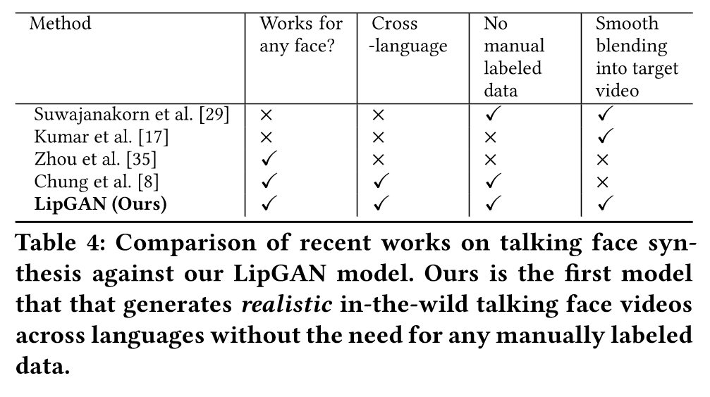
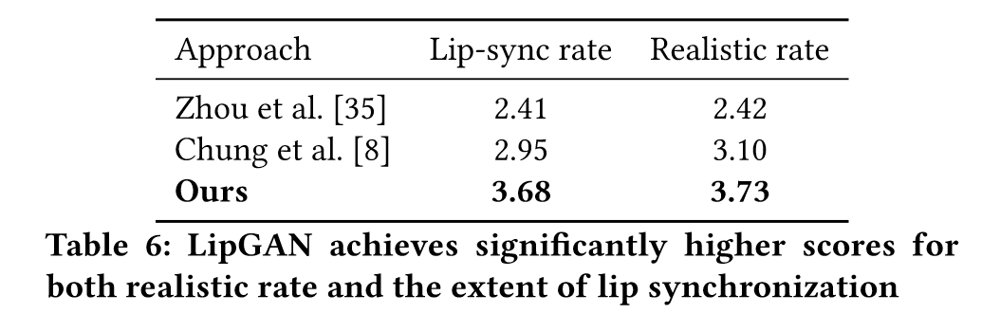

# 会说话的面孔生成

给定一个包含主体身份的人脸图像 I 和一个分为一系列语音片段 ${A_1, A_2, ...A_k }$ 的语音 A，我们希望设计一个模型 $G$，它生成一系列帧 ${S_1, S_2 , ...S_k }$ 包含以正确的唇形同步说出音频 $A$ 的面部。此外，该模型必须适用于推理过程中看不见的语言和面孔。由于收集各种语言的注释数据非常繁琐，因此模型还必须能够以自我监督的方式学习。表 4 将我们的模型与最近最先进的说话面部生成方法进行了比较。

## 模型制定

我们将说话的脸部合成问题表述为“通过测试同步来学习合成”。具体来说，我们的设置包含两个网络，一个是通过调节音频输入来生成脸部的生成器 $G$，另一个是测试生成的脸部和输入是否一致的鉴别器 $D$。通过以对抗方式一起训练这些网络，生成器 $G$ 学会创建与给定输入音频精确同步的逼真面孔。设置如图 3 所示。

图 3：我们在直观的 GAN 设置中训练 LipGAN 网络。生成器根据音频输入生成面部图像。鉴别器检查生成的帧和输入音频是否同步。请注意，在训练鉴别器时，我们还提供额外的地面实况同步/不同步样本，以确保鉴别器学会专门检查卓越的唇形同步，而不仅仅是图像质量。

## Generator网络

生成器网络是 Chung 等人的修改。 [8]并包含三个分支：（i）人脸编码器，（ii）音频编码器和（iii）人脸解码器。

**人脸编码器**。我们设计的面部编码器与 Chung 等人的设计有点不同。 [8]。我们观察到，在[8]中生成器的训练过程中，给出了随机姿势的面部图像及其相应的音频片段作为输入，并且生成器预计会改变嘴唇形状。然而，用于计算重建损失的真实人脸图像具有完全不同的姿势，因此，生成器期望在没有任何先验信息的情况下改变输入图像的姿势。为了缓解这个问题，除了随机身份人脸图像 $I$ 之外，我们还提供所需的真实姿势信息作为人脸编码器的输入。我们掩盖了真实人脸图像的下半部分，并将其与 $I$ 通道连接。屏蔽的地面实况图像为网络提供有关目标姿势的信息，同时确保网络永远不会获得有关地面实况嘴唇形状的任何信息。因此，我们对面部编码器的最终输入是一个 $H\times H\times 6$ 图像。编码器由一系列具有中间下采样层的残差块组成，它将给定的输入图像嵌入到大小为 $h$ 的人脸嵌入中。

**音频编码器**。音频编码器是一个标准 CNN，它采用大小为 $M\times T\times 1$ 的梅尔频率倒谱系数 (MFCC) 热图并创建大小为 $h$ 的音频嵌入。音频嵌入与人脸嵌入相连接，产生大小为 $2\times h$ 的联合视听嵌入。

**人脸解码器**。该分支通过用适当的嘴形修复输入图像的屏蔽区域，从联合视听嵌入中生成唇同步面部。它包含一系列残差块以及一些对特征图进行上采样的中间反卷积层。人脸解码器的输出层是一个带有 3 个滤波器的 sigmoid 激活 1x1 卷积层，产生 $H\times H\times 3$ 的人脸图像。而钟等人。 [8]在人脸编码器和解码器之间仅使用 2 个跳跃连接，我们使用 6 个跳跃连接，每个上采样操作后一个，以确保解码器在生成人脸时保留细粒度的输入面部特征。当我们在训练期间将所需的姿势作为输入时，模型会生成与给定姿势相匹配的变形嘴形。事实上，在我们的结果中，可以看出我们比 Chung 等人更好地保留了面部姿势和表情。 [8]并且仅改变嘴部形状。这使我们能够将生成的脸部裁剪无缝粘贴到给定的视频中，而不会产生任何伪影，而这是 Chung 等人无法做到的。 [8]由于随机的、无法控制的姿态变化。

## 鉴别器网络

虽然生成器仅使用 L2 重建损失就可以生成令人满意的说话面孔 [8]，但采用强大的附加监督可以帮助生成器学习稳健、准确的音素映射，并使面部运动更加自然。周等人。 [35]采用视听语音识别作为关联声学和视觉信息的探测任务。然而，这使得安装程序特定于语言，并且仅提供间接监督。我们认为，直接测试生成的人脸是否与音频同步可以为生成器网络提供更强的监控信号。因此，我们创建了一个网络，将输入的人脸和音频编码为固定表示，并计算它们之间的 L2 距离 d。面部编码器和音频编码器与生成器网络中使用的相同。

## GAN框架联合训练
我们的训练流程如下。我们从输入视频样本中随机选择一个 $T$ 毫秒窗口，并提取其相应的音频片段 $A$，以频率 $F$ Hz 重新采样。我们选择该窗口中的中间视频帧 $S$ 作为所需的地面实况。我们在真实框架中掩盖一个人的嘴部区域（假设是图像的下半部分）以获得 $S_m$。我们还对负帧 $S'$ 进行采样，即该窗口之外的帧，预计与所选音频片段 $A$ 不同步。

在生成器的每个训练批次中，将未同步的人脸 $S'$ 与屏蔽的地面实况人脸 $S_m$ 和目标音频片段 $A$ 通道级联作为输入。生成器预计会生成同步人脸 $G([S^′; Sm], A) ≈ S$。判别器的每个训练批次包含三种类型的样本： (i) 来自生成器的合成样本 $(G(S^′, A)),A;y_i=1$, (ii) 与音频同步的实际帧 $(S, A)；y_i = 0$ 且 (iii) 实际帧与音频不同步 $(S^′, A)；y_i = 1$。第三种样本类型对于强制鉴别器在将给定输入对分类为真实/合成时考虑唇同步因子特别重要。如果没有第三种类型的样本，鉴别器将只能忽略音频输入并仅根据图像的质量做出决定。鉴别器通过最小化以下对比损失来学习检测同步：

其中 m 是边距，我们将其设置为 2。生成器通过最小化 L1 重建损失来学习重建面部图像：

我们使用以下 GAN 目标函数训练生成器 G 和判别器 D：

其中 $z ∈ \{S, S^′\}$。在这里，$G$ 尝试最小化 $L_a$ 和 $L_{Re}$，$D$ 尝试最大化 $L_a$ 。因此，最终的目标函数为：

## 实施细节
我们使用 LRS 2 数据集 [1]，其中包含数据集中提供的列车分割中超过 29 小时的说话面孔。我们在四个 NVIDIA TITAN X GPU 上进行训练，批量大小为 512。我们从每个音频片段（T = 350，F = 100）中提取 13 个 MFCC 特征，并丢弃与 Chung 等人类似的第一个特征。 [8]。我们使用 dlib [15] 检测输入帧中的面部，并将面部裁剪的大小调整为 96x96x3。我们使用 Adam [16] 优化器，初始学习率为 1e−3，并训练大约 20 个 epoch。
## 结果与评价
我们定量评估我们新颖的 LipGAN 架构，并通过主观的人类评估。在推理过程中，模型逐帧生成目标说话人的说话脸部视频。视觉输入是当前帧与下半部分被屏蔽的相同当前帧连接起来。也就是说，在推理过程中，我们期望模型改变输入形状并保留姿势和表情等其他方面。除了每个视觉输入之外，我们还提供一个 T = 350ms 的音频片段。在图 4 中，我们比较了 3 个模型在纳伦德拉·莫迪 (Narendra Modi) 和埃隆·马斯克 (Elon Musk) 实际所说的音频片段上生成的说话面孔。

图 4：当不同模型尝试说出最后一行中显示的单词的特定片段时，不同模型生成的面孔的视觉比较。从引导视频中提取与这些单词片段相对应的音频片段，并将其输入到上面比较的每个模型中。从上到下行：(a) Zhou 等人。 [35] (b) Chung 等人。 [8] 和我们的 LipGAN 模型。虽然 (a) 跨语言的口型同步效果很差，(b) 产生不自然的嘴唇运动，但我们的 LipGAN 模型可以跨语言产生一致、准确、自然的说话面孔。
**定量评价**。为了定量评估我们的嘴唇合成，我们使用 LRW 测试集 [9]。我们遵循上述相同的推理方法，但有一点改变。我们没有像上面提到的那样将当前帧作为输入提供，而是提供说话者的随机输入帧，与先验姿势的屏蔽当前帧连接。这样做是为了确保我们在计算定量指标时不会向模型泄露任何唇形信息。在表 5 中，我们报告了使用标准指标获得的分数：PSNR、SSIM [32] 和 Landmark 距离 [7]。从表 5 中可以看出，我们的模型在所有定量指标上都显着优于现有模型。这些结果凸显了我们生成的面部的卓越质量（通过 PSNR 判断）以及高度准确的嘴唇合成（LMD、SSIM）。 SSIM 的显着增加和 LMD 的减少可归因于鉴别器提供的直接唇同步监督，这在之前的工作中是不存在的。

**唇形同步鉴别器的重要性**。为了说明在 LipGAN 网络中使用鉴别器来测试生成器面部是否同步的效果，我们进行了以下实验。我们在 LRS 2 的同一列车分割上单独训练说话脸部生成器网络，而不更改任何其他超参数。我们将图 5 中所示的看不见的测试图像以及看不见的音频片段作为输入提供给我们的 LipGAN 网络和在没有鉴别器的情况下训练的普通生成器网络。我们绘制了这两种情况下生成器倒数第二层的激活。从图 5 中的热图可以明显看出，与未经口型同步鉴别器训练的网络相比，我们的 LipGAN 网络学会了强烈关注嘴唇和嘴巴区域。这些发现也与定量指标的显着增加以及生成的面部中嘴唇区域的自然运动相一致。

**人类评价**。会说话的面孔生成主要是为了人类的直接消费。因此，除了定量指标之外，我们还对其进行人工评估。我们选择 10 个音频样本，其中英语和印地语语音视频的数量相同。对于每个音频样本，我们使用三种不同的模型为 5 个流行身份生成说话的面孔，总共产生 150 个样本。我们比较了三种不同模型生成的面部：（i）Chung 等人。 [8], (ii) Zhou 等人。 [35] 和 (iii) 我们的 LipGAN 模型。我们在 20 名参与者的帮助下进行了一项用户研究，要求参与者根据口型同步和真实性的程度对每个视频进行 1 到 5 的评分。如表 6 所示，与现有作品相比，我们的模型获得了明显更高的分数。

图 5：两个生成器网络倒数第二层的激活热图，其中一个没有使用唇形同步鉴别器 (A)，而 LipGAN 网络（我们的）则使用鉴别器 (B)。我们与鉴别器的网络高度关注嘴唇和嘴巴区域。

## 评估完整的管道
最后，我们的面对面翻译管道将所有组件放在一起，并根据其对最终用户体验的影响进行评估。我们选择 5 个著名身份，并使用我们完整的管道生成吴恩达、奥巴马、莫迪、埃隆·马斯克和克里斯·安德森的印地语面部说话视频。我们通过选择上述每位演讲者用英语讲话的短片来做到这一点。我们使用 ASR 和 NMT 模块来识别英语语音并将其翻译为印地语。我们使用印地语 TTS 模型来获取印地语语音。我们使用 CycleGAN 模型将此语音转换为上述每个说话者的声音。使用这些最终声音，我们使用 LipGAN 网络生成会说话的面部视频。我们将这些视频与具有（i）英语语音和自动翻译字幕（ii）自动配音到印地语（iii）带有语音传输的自动配音和（iv）带有语音传输+唇形同步的自动配音的视频进行比较。此外，我们还对语音到语音翻译的人类表现进行基准测试：(v) 手动配音和 (vi) 手动配音 + 自动口型同步。我们要求用户对视频的两个属性进行 1-5 的评分。第一个属性是“语义一致性”，用于检查自动管道是否保留原始语音的含义，第二个属性是“整体用户体验”，其中用户考虑说话面孔的真实性和他/她的真实性等因素。舒适度。本研究的结果如表 7 所示。

结果呈现出三个主要结论。首先，我们观察到自动语音到语音翻译系统的每个模块都有很大的改进空间。每个语音和文本翻译系统的未来改进将提高用户研究分数。其次，人工配音后使用唇形同步的用户评分的提高再次验证了LipGAN模型的有效性。最后，请注意，添加每个自动模块都会增加用户体验得分，强调每个模块的需求。与传统的基于文本和基于语音的翻译系统相比，我们提出的完整系统显着提高了整体用户体验。
# Wav2Lip
**SyncNet 概述**。 SyncNet [9] 输入一个由 $T_v$ 个连续面部帧组成的窗口 $V$（仅下半部分）和一个大小为 $T_a \times D$ 的语音片段 $S$，其中 $T_v$ 和 $T_a$ 分别是视频和音频时间步长。它经过训练，通过随机采样音频窗口 $T_a \times D$ 来区分音频和视频之间的同步，该音频窗口要么与视频对齐（同步），要么来自不同的时间步长（不同步）。它包含一个面部编码器和一个音频编码器，两者都包含一堆 2D 卷积。 L2 距离是在这些编码器生成的嵌入之间计算的，并且使用最大裕度损失来训练模型，以最小化（或最大化）同步（或不同步）对之间的距离。

**我们的专业口型同步鉴别器**。我们对 SyncNet [9] 进行了以下更改，以训练适合我们唇形生成任务的专家唇形同步鉴别器。首先，我们提供彩色图像，而不是像原始模型那样提供按通道连接的灰度图像。其次，我们的模型明显更深，具有残余跳跃连接[15]。第三，受此公开实现的启发，我们使用了不同的损失函数：带有二元交叉熵损失的余弦相似度。也就是说，我们计算 ReLU 激活的视频和语音嵌入 v、s 之间的点积，为每个样本生成 [0, 1] 之间的单个值，该值指示输入音频-视频对同步的概率：

我们在 LRS2 列车分割（约 29 小时）上训练我们的专家唇形同步鉴别器，批量大小为 64，使用 Adam 优化器 [12]，Tv = 5 帧，初始学习率为 1e−3。我们的专业唇形同步鉴别器在 LRS2 测试集上的准确率约为 91%，而 LipGAN 中使用的鉴别器在同一测试集上的准确率仅为 56%。
## 向唇形同步专家学习，生成准确的唇形同步
现在我们有了一个准确的唇形同步鉴别器，我们现在可以用它来惩罚生成器（图 2）在训练期间生成不准确的情况。我们首先描述生成器架构。

图 2：我们的方法通过向“训练有素的唇形同步专家”学习来生成准确的唇形同步。与之前仅采用重建损失 [17] 或在 GAN 设置中训练鉴别器 [18] 的作品不同，我们使用预先训练的鉴别器，该鉴别器在检测唇形同步错误方面已经相当准确，我们表明，在生成的噪声面孔上进一步对其进行微调会妨碍鉴别器测量唇形同步的能力，从而还会影响生成的唇形。 ，我们还采用了视觉质量鉴别器来提高视觉质量和同步精度。

**生成器架构详细信息**。我们使用与 LipGAN [18] 相似的生成器架构。我们的主要贡献在于与专家鉴别器一起进行训练。生成器 G 包含三个块：(i) 身份编码器、(ii) 语音编码器和 (iii) 人脸解码器。 Identity Encoder 是一堆残差卷积层，对随机参考帧 R 进行编码，并沿通道轴与姿势先验 P（下半部分被遮蔽的目标脸）连接。语音编码器也是一堆 2D 卷积，用于对输入语音段 S 进行编码，然后将其与面部表示连接起来。解码器也是一堆卷积层，以及用于上采样的转置卷积。训练生成器以最小化生成的帧 $L_g$ 和地面实况帧 $L_G$ 之间的 L1 重建损失：

因此，生成器与之前的作品类似，是一个独立生成每一帧的 2D-CNN 编码器-解码器网络。然后，我们如何使用需要 $T_v = 5$ 帧的时间窗口作为输入的预先训练的专家唇形同步鉴别器？

**惩罚不准确的嘴唇生成**。在训练过程中，由于第 3.3 节中训练的专家鉴别器一次处理 $T_v = 5$ 个连续帧，因此我们还需要生成器 G 来生成所有 $T_v = 5$ 帧。我们对参考帧的随机连续窗口进行采样，以确保整个电视窗口中姿势等的时间一致性。当我们的生成器独立处理每个帧时，我们沿着批量维度堆叠时间步长，同时输入参考帧以获得 $(N · T_v , H ,W , 3)$ 的输入形状，其中 $N, H, W$ 是批量- 分别是尺寸、高度和宽度。在将生成的帧馈送到专家鉴别器时，时间步长沿着通道维度串联起来，就像在鉴别器训练期间所做的那样。专家判别器的最终输入形状为$(N , H/2,W , 3·T_v )$，其中仅使用生成的脸部的下半部分进行判别。生成器还经过训练，可以最大限度地减少来自专家鉴别器的“专家同步损失”$E_{sync}$：

其中 $P^{i}_{sync}$ 根据公式 1 计算。请注意，专家判别器的权重在生成器训练期间保持冻结。这种纯粹基于从真实视频中学习到的唇形同步概念的强烈辨别力迫使生成器也实现逼真的唇形同步，以最大限度地减少唇形同步损失$E_{sync}$。

## 生成逼真的面孔
在我们的实验中，我们观察到使用强大的唇形同步鉴别器会迫使生成器产生准确的唇形。然而，它有时会导致变形区域稍微模糊或包含轻微的伪影。为了减轻这种轻微的质量损失，我们在 GAN 设置中与生成器一起训练一个简单的视觉质量鉴别器。因此，我们有两个鉴别器，一个用于同步准确性，另一个用于更好的视觉质量。由于 3.2 中解释的原因，口型同步鉴别器未在 GAN 设置中进行训练。另一方面，由于视觉质量鉴别器不对口型同步执行任何检查，并且仅惩罚不切实际的面部生成，因此它是在生成的面部上进行训练的。

鉴别器 D 由一堆卷积块组成。每个块由一个卷积层和一个 Leaky ReLU 激活组成 [20]。训练判别器以最大化目标函数 $L_disc$（等式 5）：

其中 $L_g$ 对应于来自生成器 G 的图像，$L_G$ 对应于真实图像。生成器最小化公式 6，它是重建损失（公式 2）、同步损失（公式 3）和对抗损失 $L_gen$（公式 4）的加权和：

其中 $s_w$ 是同步惩罚权重，$s_g$ 是对抗性损失，在我们所有的实验中根据经验设置为 0.03 和 0.07。因此，我们的整个网络使用两个不相交的鉴别器进行了优化，以实现卓越的同步精度和质量。

我们仅在 LRS2 训练集 [1] 上训练模型，批量大小为 80。我们使用 Adam 优化器 [12]，初始学习率为 1e−4，且 beta β1 = 0.5、β2 = 0.999生成器和视觉质量鉴别器 D。请注意，唇形同步鉴别器没有进一步微调，因此其权重被冻结。我们通过解释我们提出的架构在真实视频推理过程中的工作原理来总结对我们提出的架构的描述。与 LipGAN [18] 类似，该模型逐帧生成说话的脸部视频。每个时间步的视觉输入是当前面部裁剪（来自源帧），与相同的当前面部裁剪连接，下半部分被遮蔽以用作先验姿势。因此，在推理过程中，模型不需要改变姿势，从而显着减少了伪影。相应的音频片段也作为语音子网络的输入给出，并且网络生成输入面部裁剪，但嘴部区域发生变形。

我们所有的代码和模型都将公开发布。我们现在将根据以前的模型定量评估我们的新方法。
# SyncNet
## 表示和架构
本节描述音频和视频输入的表示和网络架构。网络摄取每种数据类型的 0.2 秒剪辑。在数据集中（第 3 节），没有为音频-视频数据给出明确的注释（例如音素标签或精确的时间偏移），但是我们假设在电视广播中，音频和视频通常是同步的。

该网络由两个不对称的音频和视频流组成，每个流的描述如下。
### 音频流
输入音频数据是MFCC值。这是非线性梅尔频率上声音的短期功率谱的表示。每个时间步使用 13 个梅尔频带。这些特征以 100Hz 的采样率计算，为 0.2 秒的输入信号提供 20 个时间步长。

图 1. 输入表示。左：音频热图的时间表示。音频图像中的 13 行（A 到 M）对代表不同频率仓功率的 13 个 MFCC 特征中的每一个进行编码。右：嘴部区域的灰度图像。

**表示**。音频被编码为热图图像，表示每个时间步长和每个梅尔频带的 MFCC 值（参见图 1）。图像的顶部和底部三行被反射以减少边界效应。之前的工作 [9] 也尝试针对类似的输入训练图像式 ConvNet。

**架构**。我们使用的卷积神经网络受到图像识别设计的启发。我们的层架构（图 2）基于 VGGM [5]，但修改了过滤器大小以摄取不寻常维度的输入。 VGG-M 采用大小为 224×224 像素的方形图像，而我们的输入大小在时间方向上为 20 像素（时间步数），而在另一个方向上只有 13 像素（因此输入图像为 13 × 20 像素）。

### 视觉流
**表示**。视觉网络的输入格式是一系列嘴部区域的灰度图像，如图 1 所示。5 帧的输入尺寸为 111×111×5 ($W\times H\times T$)，对应于 0.2 秒25Hz 帧速率。

**架构**。我们的架构基于[7]的架构，该架构是为视觉语音识别任务而设计的。特别是，该架构基于 Early Fusion 模型，结构紧凑且训练速度快。 conv1 过滤器已修改为摄取 5 通道输入。

图 2. 双流 ConvNet 架构。两个流同时训练。

### 损失函数
训练目标是音频和视频网络的输出对于真实对来说是相似的，对于虚假对来说是不同的。具体来说，网络输出之间的欧几里德距离被最小化或最大化。我们建议使用对比损失（等式 1），最初是为训练 Siamese 网络而提出的 [6]。 $v$ 和 $a$ 分别是视频和音频流的 $fc_7$ 向量。 $y ∈ [0, 1]$ 是音频和视频输入之间的二元相似性度量。

另一种方法是将问题作为分类之一来处理（同步/非同步，或使用合成数据进入不同的偏移箱），但是我们无法使用这种方法实现收敛。
### 训练
训练过程是对单流 ConvNet [14, 24] 常规过程的改编，并受到 [6, 23] 的启发。然而，我们的网络的不同之处在于它由不同的流、两组独立的参数和来自两个不同域的输入组成。网络权重是使用动量随机梯度下降来学习的。网络两个流的参数是同时学习的。

**数据增强**。应用数据增强通常可以提高验证性能并减少 ConvNet 图像分类任务中的过度拟合[14]。对于音频，音量在±10%的范围内随机改变。我们不会更改音频播放速度，因为这可能会影响重要的计时信息。仅针对错误示例，我们及时进行随机裁剪。对于视频，我们应用[14, 24]在 ImageNet 分类任务中使用的标准增强方法（例如随机裁剪、翻转、颜色偏移）。单个变换应用于单个剪辑中的所有视频帧。

**细节**。我们的实现基于 MATLAB 工具箱 MatConvNet [26]，并在具有 12GB 内存的 NVIDIA Titan X GPU 上进行训练。该网络通过批量归一化进行训练[10]。使用 10−2 到 10−4 的学习速率，这比通常用于训练具有批量归一化的 ConvNet 的学习速率要慢。训练在 20 个 epoch 后停止，或者当验证错误在 3 个 epoch 内没有改善时停止，以较早者为准。