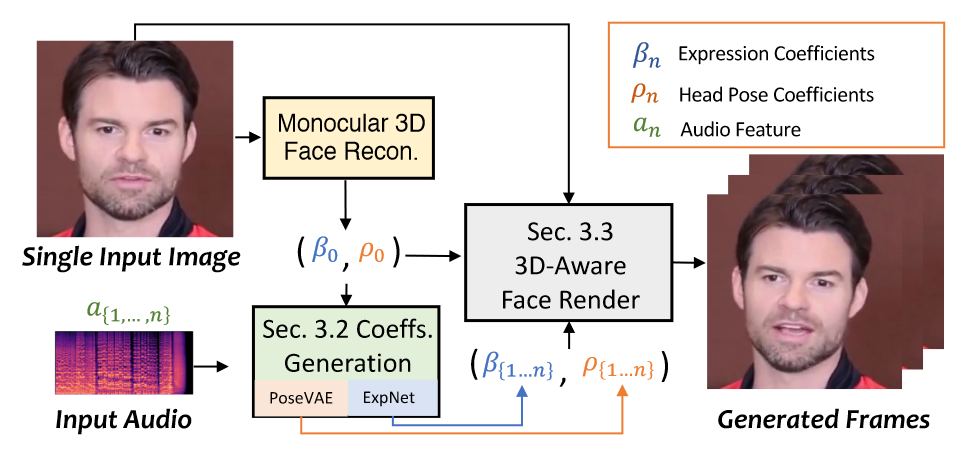
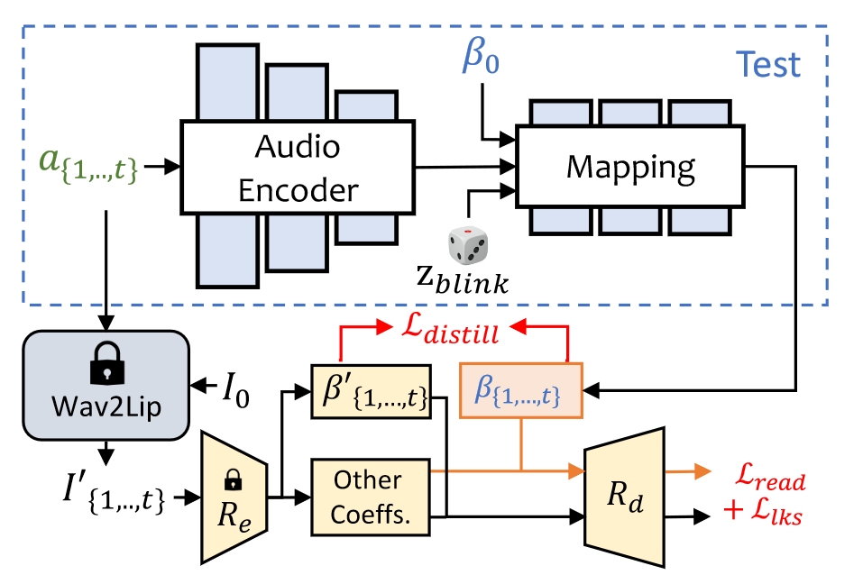
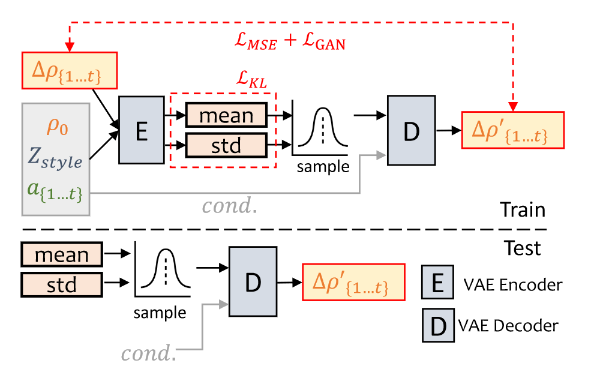

# SadTalker：学习逼真的 3D 运动系数，用于风格化音频驱动的单图像说话人脸动画

图 2.主要流水线我们的方法使用 3DMM 的系数作为中间运动表示。为此，我们首先从音频中生成逼真的 3D 运动系数（面部表情 β、头部姿势 ρ），然后使用这些系数对 3D 感知面部渲染进行隐式调制，以生成最终视频。
## 方法
如图 2 所示，我们的系统使用三维运动系数作为生成对话头像的中间表示。我们首先从原始图像中提取系数。然后，由 ExpNet 和 PoseVAE 分别生成逼真的 3DMM 运动系数。最后，我们提出了一种 3D 感知人脸渲染技术来生成对话头像视频。下面，我们将在第 3.1 节中简要介绍三维人脸模型，在第 3.2 节和第 3.3 节中分别介绍音频驱动的运动系数生成和系数驱动的图像动画器。
### 3D 人脸模型的初步设计
由于真实视频是在三维环境中拍摄的，因此三维信息对于提高生成视频的真实度至关重要。然而，以往的研究 [28, 49, 50] 很少考虑三维空间，因为很难从单幅图像中获得精确的三维系数，而且高质量的人脸渲染图也很难设计。受最近的单图像深度三维重建方法[5]的启发，我们将预测的三维可变形模型（3DMM）空间作为我们的中间表示。在 3DMM 中，三维人脸形状 $S$ 可以解耦为$$S = \bar{S} + αU_{id} + βU_{exp},(1)$$ 
其中，$\bar{S}$ 是三维人脸的平均形状，$U_{id}$ 和 $U_{exp}$ 是 LSFM 可变形模型的身份和表情正交基[1]。系数 $α∈\mathbb{R}^{80}$ 和 $β∈\mathbb{R}^{64}$ 分别描述人物的身份和表情。为了保持姿态方差，系数 $r ∈ SO(3)$ 和 $t ∈ \mathbb{R}^3$ 表示头部旋转和平移。为实现身份无关系数生成[31]，我们只将运动参数建模为 ${β、r、t}$。如前所述，我们分别从驱动音频中学习头部姿势 $ρ = [r, t]$ 和表情系数 $β$。然后，这些运动系数将用于隐式调制我们的面部渲染，以进行最终的视频合成。
### 通过音频生成运动系数
如上所述，三维运动系数包含头部姿势和表情，其中头部姿势是全局运动，而表情则相对局部。由于头部姿势与音频的关系相对较弱，而嘴唇运动与音频的关联度较高，因此完全学习所有内容会给网络带来巨大的不确定性。我们分别使用下文介绍的 PoseVAE 和 ExpNet 生成头部姿势和表情的运动。

**ExpNet**基于以下两个原因，学习一个能从音频中生成准确表情系数的通用模型极其困难：
1. 对于不同的身份，音频到表情并不是一对一的映射任务。
2. 表情系数中存在一些与音频相关的运动，这会影响预测的准确性。
 
我们的 ExpNet 就是为了减少这些不确定性而设计的。至于身份问题，我们通过第一帧的表情系数 $β_0$ 将表情动作与特定的人联系起来，这也控制了生成视频的面部情绪。为了减少真实表情系数中其他面部成分的干扰，我们通过 Wav2Lip [28] 和深度三维重建 [5] 的预训练网络，仅使用嘴唇运动系数作为系数目标。然后，其他细微的面部运动（如眨眼）可以通过渲染图像上的额外地标损失加以利用。

如图 3 所示，我们从音频窗口 $a_{\{1,...t\}}$ 生成 t 帧表达式系数，其中每帧的音频特征为 0.2 秒的 mel 光谱图。训练时，我们首先设计一个基于 ResNet 的音频编码器 $Φ_A$ [12, 28]，将音频特征嵌入潜空间。然后，添加一个线性层作为映射网络 $Φ_M$ 来解码表情系数。在这里，我们还添加了来自参考图像的参考表情 $β_0$，以支持情感并减少身份的不确定性（如上所述）。由于我们在训练中使用纯唇系数作为地面实况，因此我们明确添加了眨眼控制信号 $z_{blink} ∈ [0, 1]$和相应的眼球地标损失，以生成可控的眼球眨眼。从形式上看，该网络可以写成$$β_{\{1,...,t\}} = Φ_M (Φ_A(a_{\{1,...,t\}}), z_{blink}, β_0) (2)$$

图 3.ExpNet 的结构。我们使用单目三维人脸重建模型 [5] （$R_e$ 和 $R_d$）来学习现实表情系数。其中，$R_e$ 是一个经过预训练的 3DMM 系数估计器，$R_d$ 是一个没有可学习参数的可微分 3D 人脸呈现器。我们使用参考表情 $β_0$ 来减少身份的不确定性，并使用预训练的 Wav2Lip [28] 生成的帧和第一帧作为目标表情系数，因为它只包含与嘴唇相关的动作。

至于损失函数，我们首先使用 $L_{distill}$ 来评估仅唇部表情系数 $R_e(Wav2Lip(I_0,a_{\{1,...,t\}}))$与生成的 $β_{\{1,...t\}}$ 之间的差异。请注意，我们只使用 wav2lip 的第一帧 $I_0$ 来生成唇部同步视频，这就减少了姿势变化和唇部运动以外的其他面部表情的影响。此外，我们还使用了可微分三维人脸渲染 $R_d$ 来计算显式面部动作空间中的额外感知损失。如图 3 所示，我们通过计算地标损失 $L_{lks}$ 来衡量眨眼的范围和整体表情的准确性。预训练的读唇网络 $Φ_{reader}$ 也被用作时间读唇损失 $L_{read}$，以保持感知唇部质量[9, 28]。我们在补充材料中提供了更多训练细节。

**PoseVAE**如图 4 所示，设计了一个基于 VAE [20] 的模型来学习真实说话视频中逼真的、具有身份识别功能的风格化头部运动 $ρ∈ \mathbb{R}^{6}$。在训练过程中，姿势 VAE 采用基于编码器和解码器的结构，在固定的 $n$ 个帧上进行训练。编码器和解码器都是双层 MLP，输入包含连续的 $t$ 帧头部姿势，我们将其嵌入高斯分布。在解码器中，网络通过学习从采样分布中生成 $t$ 帧姿势。我们的 PoseVAE 不直接生成姿势，而是学习第一帧的条件姿势 $ρ_0$ 的残差，这使得我们的方法能在第一帧的条件下，在测试中生成更长、更稳定、更连续的头部运动。此外，根据 CVAE [6]，我们添加了相应的音频特征 $a_{\{1,...t\}}$ 和风格标识 $Z_{style}$ 作为节奏意识和标识风格的条件。我们使用 KL-发散 $L_{KL}$ 来测量生成动作的分布。均方损失 $L_{MSE}$ 和对抗损失 $L_{GAN}$ 用于确保生成质量。我们将在补充材料中提供有关损失函数的更多细节。

图 4.拟议的 PoseVAE 流程。我们通过条件 VAE 结构学习输入头部姿势 $ρ_0$ 的残差。给定条件：第一帧 $ρ_0$、风格标识 $Z_{style}$ 和音频片段 $a{\{1,...,t\}}$，我们的方法将学习残差头部姿势分布 $∆ρ_{\{1,...,t\}} = ρ_{\{1,...,t\}} - ρ_0$.训练完成后，我们只需通过姿势解码器和条件（cond.）
### 3D-aware Face Render
生成逼真的三维运动系数后，我们通过精心设计的三维感知图像动画器渲染最终视频。我们从最近的图像动画方法 Face-vid2vid [40] 中获得了灵感，因为它能从单张图像中隐含地学习三维信息。不过，在他们的方法中，需要一个真实的视频作为动作驱动信号。而我们的人脸渲染技术则是通过 3DMM 系数实现的。如图 5 所示，我们建议使用 mappingNet 来学习显式 3DMM 运动系数（头部姿势和表情）与隐式未渗透 3D 关键点之间的关系。我们的 mappingNet 是通过几个一维卷积层构建的。与 PIRenderer[31]一样，我们使用来自时间窗口的时间系数进行平滑处理。不同的是，我们发现 PIRenderer 中的人脸对齐运动系数会极大地影响音频驱动视频生成的运动自然度，并在第 4.4 节中进行了实验。我们只使用了表情和头部姿势的系数。

至于训练，我们的方法包含两个步骤。首先，我们按照原论文中的方法，以自我监督的方式训练 face-vid2vid [40]。第二步，我们冻结外观编码器、典型关键点估计器和图像生成器的所有参数，以便进行调整。然后，我们以重构方式在地面真实视频的 3DMM 系数上训练映射网。我们使用 L1 损失给出了无监督关键点领域中的监督结果，并按照其原始实现方法给出了最终生成的视频。更多详情请参见补充材料。