# Aniportrait学习经历
代码仓库中提到的几个功能我都跑过，都没什么问题，论文也看了，依然感觉十分抽象，于是便想从代码入手，首先接触的模块是下图中的Lmk2Video，主要功能是输入一张人物图片以及一段landmarks视频（有声音的那种），就会输出对应的人物视频（角色与图片一致，动作与声音与视频一致）

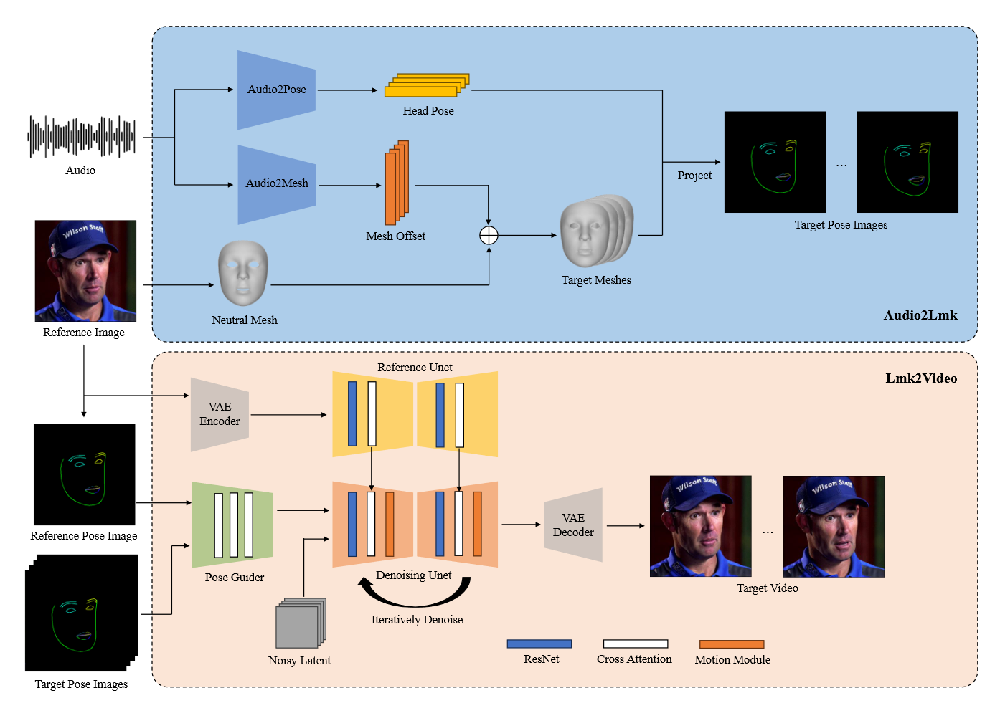
## 预训练的模型
### [VAE](https://zhuanlan.zhihu.com/p/452743042)
代码如下：
```python
    vae = AutoencoderKL.from_pretrained(
        config.pretrained_vae_path,
    ).to(cuda, dtype=weight_dtype) #即变分自编码器，把图像编码到特征，进行生成过程后再把特征解码到图像。
```
之前只是通过李沐精讲论文系列视频了解过AE、DAE、VAE、VQVAE，知道它们都是所谓编码器-解码器结构，大致思想就是输入一张图片$x$，训练一个编码器将图片编码为更低维的特征表示，然后再训练一个解码器将低维特征解码为一张图片$x'$，目标是尽可能地让$x'$与$x$更相似，当时视频里介绍说`这样的架构只能用来做辨别式任务，无法用于生成式任务，后来人们在低维特征表示中加入噪声的方式，从而通过解码器生成不同图片进行生成式任务`

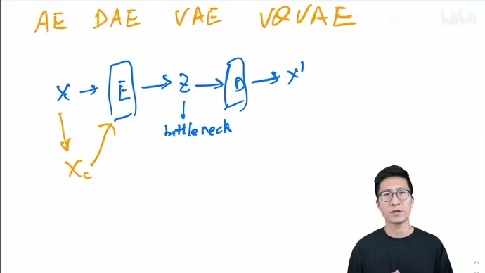

后来又学习了[这篇文章]((https://zhuanlan.zhihu.com/p/452743042))，了解到了VAE是一种基于变分推断的生成式模型，它生成图片的基本过程就是首先从高斯分布中采样一个噪声$z$，然后根据条件分布$P_\theta(x|z)$生成$x$。但是由于条件分布$P_\theta(x|z)$难以学习，于是便转而学习后验分布$P_\theta(z|x)$，根据公式$P_\theta(z|x) =\frac{P_\theta(x|z)\times z}{x}$得到条件分布$P_\theta(x|z)$，其中编码器学习到的就是后验分布，解码器学习到的就是条件分布，因此便可以通过训练好的解码器来对任意噪声生成图像。

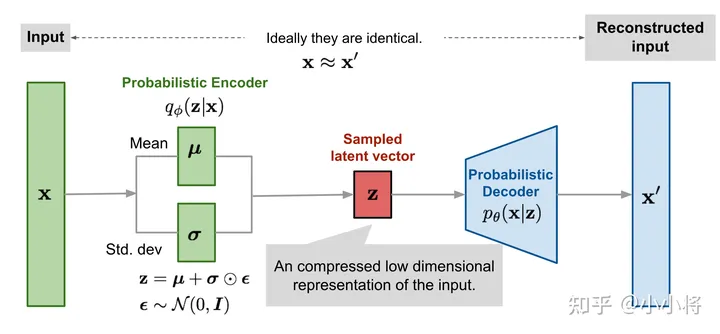

总的来说，在Anipotrait中，VAE的编码器可以对图像特征进行压缩处理，解码器可以根据噪声进行图片生成。

### [CLIP](https://blog.csdn.net/qq_56591814/article/details/127421979?spm=1001.2014.3001.5502)
代码如下：
```python
    image_enc = CLIPVisionModelWithProjection.from_pretrained(
        config.image_encoder_path
    ).to(dtype=weight_dtype, device=cuda) #CLIP模型视频编码器
```
对于CLIP的学习仅限于李沐的论文精讲视频，它的主要思想就是通过文本编码器（基于TransFormer的）从文本中提取文本特征，再通过图像编码器（基于VIT或者Resnet的）从图像中提取图像特征，最后再通过计算文本特征与图像特征之间的相似度（采用余弦相似性）来判断文本与图片是否对应，所以CLIP是辨别式模型，主要用来辨别图像更贴近哪个标签。它的特点有zero-shot、prompt-engineering、prompt-ensemble。

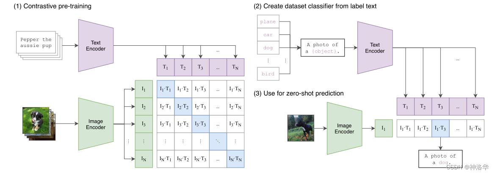

在Anipotrait中，CLIP的编码器可以用来提取图像特征。

### U-Net
代码如下：
```python
    reference_unet = UNet2DConditionModel.from_pretrained(
        config.pretrained_base_model_path,
        subfolder="unet",
    ).to(dtype=weight_dtype, device=cuda) #扩散模型的部分 2D?
    denoising_unet = UNet3DConditionModel.from_pretrained_2d(
        config.pretrained_base_model_path,
        config.motion_module_path,
        subfolder="unet",
        unet_additional_kwargs=infer_config.unet_additional_kwargs,
    ).to(dtype=weight_dtype, device=cuda) #扩散模型的部分 3D?
```
[论文](https://arxiv.org/abs/1505.04597v1)原话：
`网络架构如图1所示。它由收缩路径（左侧）和扩展路径（右侧）组成。收缩路径遵循卷积网络的典型架构。它由两个 3x3 卷积（未填充卷积）的重复应用组成，每个卷积后跟一个修正线性单元 (ReLU) 和一个步长为 2 的 2x2 最大池化操作，用于下采样。在每个下采样步骤中，我们将特征通道的数量加倍。扩展路径中的每一步都包含对特征图进行上采样，然后进行 2x2 卷积（“上卷积”），将特征通道数量减半，与收缩路径中相应裁剪的特征图进行串联，以及两个 3x3卷积，每个卷积后跟一个 ReLU。由于每次卷积都会丢失边界像素，因此需要进行裁剪。在最后一层，使用 1x1 卷积将每个 64 分量特征向量映射到所需数量的类。该网络总共有 23 个卷积层。`

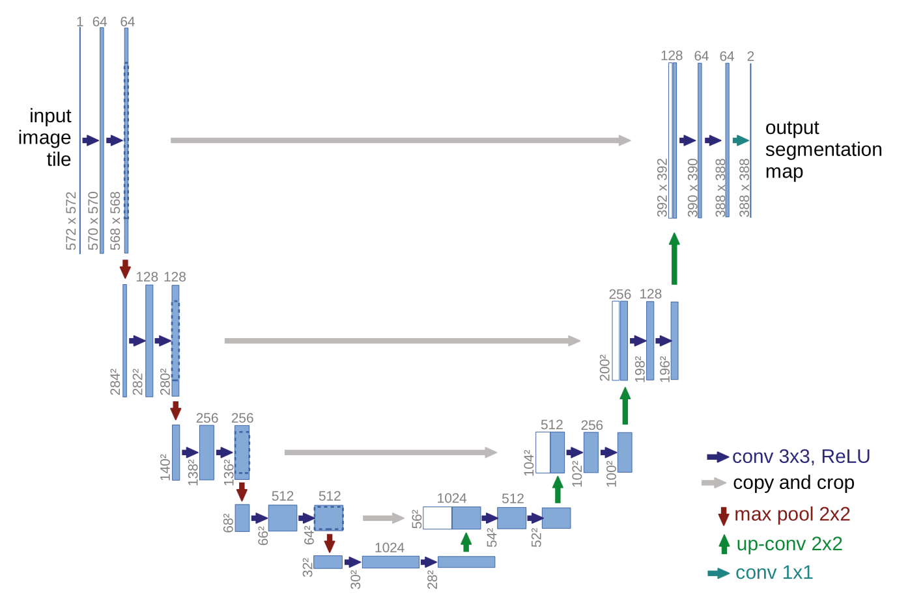图 1. U-net 架构（最低分辨率下 32x32 像素的示例）。每个蓝色框对应一个多通道特征图。通道数显示在框的顶部。 x-y-尺寸位于框的左下边缘。白框代表复制的特征图。箭头表示不同的操作。

### PoseGuider
原文代码如下：
```python
pose_guider = PoseGuider(noise_latent_channels=320, use_ca=True).to(device=cuda, dtype=weight_dtype) # not use cross attention
```
[Animate Anyone](https://arxiv.org/abs/2311.17117)原文如下：
`ControlNet展示了超越文本的高度鲁棒的条件生成能力。与这些方法不同的是，由于去噪UNet需要微调，我们选择不加入额外的控制网络，以防止计算复杂度的显著增加。相反，我们使用了一个轻量级的Pose Guider。该Pose Guider利用4个卷积层(4×4核,2×2步,使用16,32,64,128通道,类似于中的条件编码器)对齐与噪声潜在分辨率相同的位姿图像。随后，将处理后的姿态图像在输入去噪UNet之前加入噪声潜在项。Pose Guider使用高斯权重初始化，在最后的投影层，我们使用零卷积。`

Aniportrait原文如下:
`与 AnimateAnyone 不同的是，我们增强了 PoseGuider 设计的复杂性。原始版本仅包含几个卷积层，之后标志性特征与主干输入层的潜在特征合并。我们发现这种基本设计无法捕捉嘴唇复杂的运动。因此，我们采用ControlNet的[15]多尺度策略，将相应尺度的标志性特征合并到主干的不同块中。尽管有这些增强，我们仍然成功地将参数数量保持在相对较低的水平。`
`我们还引入了一项额外的改进：将参考图像的地标作为额外的输入。 PoseGuider 的交叉注意力模块促进参考地标和每帧目标地标之间的交互。这个过程为网络提供了额外的线索来理解面部标志和外观之间的相关性，从而有助于生成具有更精确运动的肖像动画。`


PoseGuider的主要代码如下：
```python
self.conv_layers = nn.Sequential(
            nn.Conv2d(in_channels=3, out_channels=3, kernel_size=3, padding=1),
            nn.BatchNorm2d(3),
            nn.ReLU(),
            nn.Conv2d(in_channels=3, out_channels=16, kernel_size=4, stride=2, padding=1),
            nn.BatchNorm2d(16),
            nn.ReLU(),

            nn.Conv2d(in_channels=16, out_channels=16, kernel_size=3, padding=1),
            nn.BatchNorm2d(16),
            nn.ReLU(),
            nn.Conv2d(in_channels=16, out_channels=32, kernel_size=4, stride=2, padding=1),
            nn.BatchNorm2d(32),
            nn.ReLU(),

            nn.Conv2d(in_channels=32, out_channels=32, kernel_size=3, padding=1),
            nn.BatchNorm2d(32),
            nn.ReLU(),
            nn.Conv2d(in_channels=32, out_channels=64, kernel_size=4, stride=2, padding=1),
            nn.BatchNorm2d(64),
            nn.ReLU(),

            nn.Conv2d(in_channels=64, out_channels=64, kernel_size=3, padding=1),
            nn.BatchNorm2d(64),
            nn.ReLU(),
            nn.Conv2d(in_channels=64, out_channels=128, kernel_size=3, stride=1, padding=1),
            nn.BatchNorm2d(128),
            nn.ReLU()
        )

        # Final projection layer
        self.final_proj = nn.Conv2d(in_channels=128, out_channels=noise_latent_channels, kernel_size=1)
        
        self.conv_layers_1 = nn.Sequential(
            nn.Conv2d(in_channels=noise_latent_channels, out_channels=noise_latent_channels, kernel_size=3, padding=1),
            nn.BatchNorm2d(noise_latent_channels),
            nn.ReLU(),
            nn.Conv2d(in_channels=noise_latent_channels, out_channels=noise_latent_channels, kernel_size=3, stride=2, padding=1),
            nn.BatchNorm2d(noise_latent_channels),
            nn.ReLU(),
        )
        
        self.conv_layers_2 = nn.Sequential(
            nn.Conv2d(in_channels=noise_latent_channels, out_channels=noise_latent_channels, kernel_size=3, padding=1),
            nn.BatchNorm2d(noise_latent_channels),
            nn.ReLU(),
            nn.Conv2d(in_channels=noise_latent_channels, out_channels=noise_latent_channels*2, kernel_size=3, stride=2, padding=1),
            nn.BatchNorm2d(noise_latent_channels*2),
            nn.ReLU(),
        )

        self.conv_layers_3 = nn.Sequential(
            nn.Conv2d(in_channels=noise_latent_channels*2, out_channels=noise_latent_channels*2, kernel_size=3, padding=1),
            nn.BatchNorm2d(noise_latent_channels*2),
            nn.ReLU(),
            nn.Conv2d(in_channels=noise_latent_channels*2, out_channels=noise_latent_channels*4, kernel_size=3, stride=2, padding=1),
            nn.BatchNorm2d(noise_latent_channels*4),
            nn.ReLU(),
        )
        
        self.conv_layers_4 = nn.Sequential(
            nn.Conv2d(in_channels=noise_latent_channels*4, out_channels=noise_latent_channels*4, kernel_size=3, padding=1),
            nn.BatchNorm2d(noise_latent_channels*4),
            nn.ReLU(),
        )
        
        if self.use_ca:
            self.cross_attn1 = Transformer2DModel(in_channels=noise_latent_channels)
            self.cross_attn2 = Transformer2DModel(in_channels=noise_latent_channels*2)
            self.cross_attn3 = Transformer2DModel(in_channels=noise_latent_channels*4)
            self.cross_attn4 = Transformer2DModel(in_channels=noise_latent_channels*4)
```
可以看到PoseGuider就是一堆卷积块和Transformer块的集合。


## Pose2VideoPipeline
在导入了模型权重之后，以这些模型为参数，创建了一个Pose2VideoPipeline对象。
```python
#参考diffusers库的StableDiffusionPipeline类的构造方法以及应用 https://zhuanlan.zhihu.com/p/672586130
    pipe = Pose2VideoPipeline(
        vae=vae,
        image_encoder=image_enc,
        reference_unet=reference_unet,
        denoising_unet=denoising_unet,
        pose_guider=pose_guider,
        scheduler=scheduler,
    )
```

可以看到后续是直接调用这个对象生成视频。
```python
video = pipe(
    ref_image_pil, #人脸图片
    pose_list, #动态landmarks列表，元素是landmarks图片
    ref_pose, #人脸图片对应的landmarks 被连线
    width, # 512
    height, # 512
    video_length,  # pose_list的len
    args.steps, #default 25
    args.cfg, #default 3.5
    generator=generator, #generator = torch.manual_seed(args.seed)
).videos
```
通过查看Pose2VideoPipeline的`__call__`函数，发现生成视频的流程与[StabeDiffusion文生图](https://zhuanlan.zhihu.com/p/617134893)的方式流程相似，于是便通过对比的方法来学习具体流程。

下图为SD的文生图的推理流程图：首先根据输入text用text encoder提取text embeddings，同时初始化一个随机噪音noise（latent上的，512x512图像对应的noise维度为64x64x4），然后将text embeddings和noise送入扩散模型UNet中生成去噪后的latent，最后送入autoencoder的decoder模块得到生成的图像。

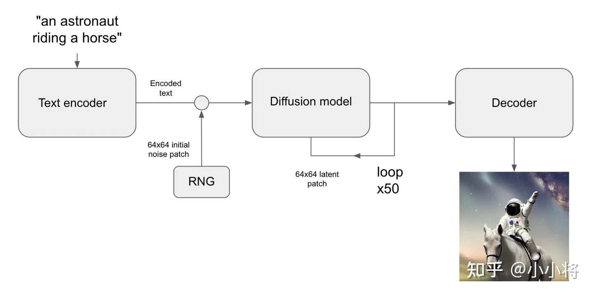

### 输入预处理
首先是使用一个lmk_extractor对象从人脸图片中提取一些信息，该对象通过调用[mediapipe库](https://ai.google.dev/edge/mediapipe/solutions/vision/face_detector/python?hl=zh-cn)来得到以下信息：
- [面部混合关键值](https://www.bilibili.com/read/cv11763241/)(bs)，描述了面部的表情信息，如微笑、皱眉等。
- [2D面部关键点](https://github.com/google-ai-edge/mediapipe/blob/7c28c5d58ffbcb72043cbe8c9cc32b40aaebac41/mediapipe/modules/face_geometry/data/canonical_face_model_uv_visualization.png)(lmks)，用于在平面图像中标记面部特征位置，如眼睛和嘴巴的位置，单位一般是像素，图像中左眼的坐标可能是(150,200)像素。
- [面部转换矩阵](https://zhuanlan.zhihu.com/p/654899428)(trans_mat)，用于将3D面部关键点从局部坐标系转换到全局坐标系，描述面部在3D空间中的位置和朝向，其中3D面部关键点是局部坐标系，原点是人脸中心，无论人脸如何转动都不会坐标都不会变化；而全局坐标系的原点是摄像头，当人脸转动时，眼睛、鼻子等坐标都会变化。
- 3D面部关键点(lmks3d)，用于在3D空间中标记面部特征的位置信息，提供深度信息。如面部模型中左眼的坐标可能是(0.5,1.0,−0.2)厘米。
- 面部三角形索引(faces)：定义了面部网格的连接方式，人脸有很多个2D面部关键点，将它们进行排序编号，得到的索引三个一组就能确定一个三角形，如[1,2,3]指的就是由第一、二、三个2D面部关键点连成的三角形。
```python
ref_image_pil = Image.open(ref_image_path).convert("RGB")#741x741 RGB是大多数图像处理和显示设备（如计算机显示器和数码相机）默认使用的颜色模式。
ref_image_np = cv2.cvtColor(np.array(ref_image_pil), cv2.COLOR_RGB2BGR)#741x741x3 BGR是OpenCV 库中默认使用的颜色模式。
ref_image_np = cv2.resize(ref_image_np, (args.H, args.W))#512x512x3
face_result = lmk_extractor(ref_image_np)
```
将人脸图片的landmarks中的一些关键点进行连线，得到ref_pose。
```python
ref_pose = vis.draw_landmarks((ref_image_np.shape[1], ref_image_np.shape[0]), lmks, normed=True) #为lmks中的一些点连线
```
读取landmarks视频中的帧数（示例视频是1794帧）和fps（示例视频是30fps），第一次遍历每一帧的landmark图片处理后得到pose_tensor_list，第二次遍历每一帧的landmark图片（如果加速了就会按照设置的步长跳过某些帧），处理后得到pose_list
```python
pose_list = []
pose_tensor_list = []
pose_images = read_frames(pose_video_path) #读取帧数 
src_fps = get_fps(pose_video_path) #读取fps 
print(f"pose video has {len(pose_images)} frames, with {src_fps} fps") #1794 30
#处理了两种格式的图像：一种是 PyTorch 张量格式（用于深度学习模型），另一种是 OpenCV 的 BGR 格式（通常用于计算机视觉任务）。
pose_transform = transforms.Compose(
    [transforms.Resize((height, width)), transforms.ToTensor()] #定义了一个图像变换流水线，首先将图像调整为指定的大小 (height, width)，然后将其转换为 PyTorch 张量。
)
args_L = len(pose_images) if args.L is None else args.L
for pose_image_pil in pose_images[: args_L]:
    pose_tensor_list.append(pose_transform(pose_image_pil))
sub_step = args.fi_step if args.accelerate else 1
for pose_image_pil in pose_images[: args.L: sub_step]:
    pose_image_np = cv2.cvtColor(np.array(pose_image_pil), cv2.COLOR_RGB2BGR)
    pose_image_np = cv2.resize(pose_image_np,  (width, height))
    pose_list.append(pose_image_np)
pose_list = np.array(pose_list) #598x512x512x3
```

### 获取embeddings
在使用diffusers库进行文生图的过程中，首先需要获取text_embeddings，主要就是通过CLIP模型的文字编码器对输入的prompt进行处理获得，用处是`通过cross attention方式送入扩散模型的UNet中作为condition`，博客原话是这样的，但是具体作用还是不太清楚。

文生图在训练条件扩散模型时，往往会采用Classifier-Free Guidance（这里简称为CFG），所谓的CFG简单来说就是在训练条件扩散模型的同时也训练一个无条件的扩散模型，同时在采样阶段将条件控制下预测的噪音和无条件下的预测噪音组合在一起来确定最终的噪音，具体的计算公式如下所示：
$$\begin{align}
\mathrm{pred\_noise} & = w·\mathrm{cond\_pred\_noise} +(1-w)·\mathrm{uncond\_pred\_noise }\\
& = w\epsilon_\theta(\mathbf{x} _t,t,\mathbf{c} )+(1-w)\epsilon_\theta(\mathbf{x} _t,t)
\end{align}
$$
这里的$w$为guidance scale，当$w$越大时，condition起的作用越大，即生成的图像其更和输入文本一致。CFG的具体实现非常简单，在训练过程中，我们只需要以一定的概率（比如10%）随机drop掉text即可，这里我们可以将text置为空字符串（前面说过此时依然能够提取text embeddings）。CFG对于提升条件扩散模型的图像生成效果是至关重要的。
```python
 # 获取text_embeddings
 text_input = tokenizer(prompt, padding="max_length", max_length=tokenizer.model_max_length, truncation=True, return_tensors="pt")
    text_embeddings = text_encoder(text_input.input_ids.to(device))[0]
 # 获取unconditional text embeddings
 max_length = text_input.input_ids.shape[-1]
 uncond_input = tokenizer(
     [negative_prompt] * batch_size, padding="max_length", max_length=max_length, return_tensors="pt"
 )
 uncond_embeddings = text_encoder(uncond_input.input_ids.to(device))[0]
 # 拼接为batch，方便并行计算
 text_embeddings = torch.cat([uncond_embeddings, text_embeddings])
```
可以在Pose2VideoPipeline的call方法中找到类似的代码，由于输入是人物图片以及landmarks视频，所以通过使用CLIP图像编码器的方式处理人物图片得到embeddings，同时为了进行[CFG](https://arxiv.org/abs/2207.12598)，还将embeddings扩容了一倍，从1x768变为了2x1x768，多出来的那部分为全零张量。
```python
# Prepare clip image embeds
#https://huggingface.co/docs/transformers/model_doc/clip
#区别总结：
#模型不同：clip_image_embeds 使用的是 CLIP 模型，ref_image_tensor 使用的是 VAE 模型。
#表示不同：clip_image_embeds 是高层语义嵌入，ref_image_tensor 是低层潜在表示。
#用途不同：clip_image_embeds 主要用于图像与文本的多模态任务，ref_image_tensor 主要用于图像生成和重构任务。
clip_image = self.clip_image_processor.preprocess(
    ref_image.resize((224, 224)), return_tensors="pt"
).pixel_values #1x3x224x224
clip_image_embeds = self.image_encoder( #CLIPVisionModelWithProjection
    clip_image.to(device, dtype=self.image_encoder.dtype)
).image_embeds #1x768
encoder_hidden_states = clip_image_embeds.unsqueeze(1) #1x1x768
uncond_encoder_hidden_states = torch.zeros_like(encoder_hidden_states)
if do_classifier_free_guidance:
    encoder_hidden_states = torch.cat(
        [uncond_encoder_hidden_states, encoder_hidden_states], dim=0
    ) #2x1x768
```
### 准备噪声
然后需要准备初始噪声，在文生图的过程中通常都是随机生成噪声，而在图生图的过程中通常都是由初始图像经过autoencoder编码之后的latent加高斯噪音得到，这里的加噪过程就是扩散过程。`要注意的是，去噪过程的步数要和加噪过程的步数一致，就是说你加了多少噪音，就应该去掉多少噪音，这样才能生成想要的无噪音图像。`
```python
#文生图 
#生成latents的初始噪音
 latents = torch.randn(
     (batch_size, unet.in_channels, height // 8, width // 8),
     generator=generator, device=device
 )
 latents = latents.to(device, dtype=torch.float16)

 # 设置采样步数
 noise_scheduler.set_timesteps(num_inference_steps, device=device)

 # scale the initial noise by the standard deviation required by the scheduler
 latents = latents * noise_scheduler.init_noise_sigma # for DDIM, init_noise_sigma = 1.0

timesteps_tensor = noise_scheduler.timesteps
```
```python
#图生图
# 预处理init_image
init_input = preprocess(init_image)
init_latents = vae.encode(init_input.to(device, dtype=torch.float16))latent_dist.sample(generator)
init_latents = 0.18215 * init_latents
 # 给init_latents加噪音
 noise = torch.randn(init_latents.shape, generator=generator, device=device, dtype=init_latents.dtype)
 init_latents = noise_scheduler.add_noise(init_latents, noise, timesteps[:1])
 latents = init_latents # 作为初始latents
 ```
可以在Pose2VideoPipeline的call方法中找到类似的代码，可以看到在准备噪声时的策略与文生图一样，都是采用随机产生噪声并在最后乘上init_noise_sigma得到latents。
```python
latents = self.prepare_latents(
    batch_size * num_images_per_prompt,  #1
    num_channels_latents, #4
    width, #512
    height, #512
    video_length, #598
    clip_image_embeds.dtype,
    device,
    generator,
) #1x4x598x64x64
shape = (
    batch_size,
    num_channels_latents,
    video_length,
    height // self.vae_scale_factor,
    width // self.vae_scale_factor,
)
if latents is None:
    latents = randn_tensor(
        shape, generator=generator, device=device, dtype=dtype
    )
else:
    latents = latents.to(device)

# scale the initial noise by the standard deviation required by thscheduler
latents = latents * self.scheduler.init_noise_sigma
return latents
```
后续还能看到Pose2VideoPipeline还使用与图生图一样的策略生成了另一种噪声，采用VAE图像编码器处理人物图片得到了ref_image_latents，区别是后续并没有添加随机的高斯噪声。

通过查看后续代码，发现无论是随机生成的latents还是编码生成的ref_image_latents都参与了降噪过程，具体有什么区别暂时还不清楚。
```python
 # Prepare ref image latents
ref_image_tensor = self.ref_image_processor.preprocess(#VaeImageProcessor https://huggingface.co/docs/diffusers/api/image_processor
    ref_image, height=height, width=width
)  # (bs, c, width, height) 1x3x512x512
ref_image_tensor = ref_image_tensor.to(
    dtype=self.vae.dtype, device=self.vae.device
)
ref_image_latents = self.vae.encode(ref_image_tensor).latent_dist.mean
ref_image_latents = ref_image_latents * 0.18215  # (b, 4, h, w) 1x4x64x64
```
### 去噪过程
然后就是使用扩散模型中的UNet对前面准备的噪声进行预测噪声，文生图的去噪过程首先是使用UNet模型预测噪音noise_pred，然后再对noise_pred进行CFG操作，最后再使用scheduler对latents进行去噪（常用的scheduler有[PNDM](https://arxiv.org/abs/2202.09778)、[DDIM](https://arxiv.org/abs/2010.02502)、[DPM-Solver](https://arxiv.org/abs/2206.00927)、[DDPM](https://arxiv.org/abs/2006.11239)）。目前已知的就是不同scheduler所需的去噪步数不同，实现效果也有所不同。
```python
 # Do denoise steps
 for t in tqdm(timesteps):
     # 这里latens扩展2份，是为了同时计算unconditional prediction
     latent_model_input = torch.cat([latents] * 2)
     latent_model_input = noise_scheduler.scale_model_input(latent_model_input, t) # for DDIM, do nothing

     # 预测噪音
     noise_pred = unet(latent_model_input, t, encoder_hidden_states=text_embeddings).sample

     # CFG
     noise_pred_uncond, noise_pred_text = noise_pred.chunk(2)
     noise_pred = noise_pred_uncond + guidance_scale * (noise_pred_text - noise_pred_uncond)

     # 计算上一步的noisy latents：x_t -> x_t-1
     latents = noise_scheduler.step(noise_pred, t, latents).prev_sample
```
可以在Pose2VideoPipeline的call方法中找到类似的代码，但是由于输入和输出都是视频，比图片多了时间这个维度，看起来也多了许多操作，于是便逐行进行分析。

首先是noise_pred变量，在文生图的去噪过程中也有同名变量，代表预测到的噪音值，而在此处则是初始化了一个(2,c,bs,h,w)的全零张量。

然后又初始化了一个(1,1,bs,1,1)的计数器变量counter，根据变量名称猜测可能是用于计数的。
```python
noise_pred = torch.zeros(
    (
        latents.shape[0] * (2 if do_classifier_free_guidance else 1),
        *latents.shape[1:],
    ),
    device=latents.device,
    dtype=latents.dtype,
) #2x4x598x64x64
counter = torch.zeros(
    (1, 1, latents.shape[2], 1, 1),
    device=latents.device,
    dtype=latents.dtype,
) #1x1x598x1x1
```
这里需要补充一下作者有关reference_control_reader和reference_control_writer的设置，不妨猜测作者在论文中提到的ReferenceNet在代码中由ReferenceAttentionControl实现。
```python
reference_control_writer = ReferenceAttentionControl(
    self.reference_unet, #UNet2DConditionModel
    do_classifier_free_guidance=do_classifier_free_guidance,
    mode="write",
    batch_size=batch_size, #1
    fusion_blocks="full",
)
reference_control_reader = ReferenceAttentionControl(
    self.denoising_unet, #UNet3DConditionModel
    do_classifier_free_guidance=do_classifier_free_guidance,
    mode="read",
    batch_size=batch_size,
    fusion_blocks="full",
)
```
对于ReferenceNet的详细定义在作者另一篇论文AnimateAnyone中给出，架构图如下所示，论文原话为`因此，我们设计了一个名为ReferenceNet的参考图像特征提取网络。我们对Reference Net采用与去噪UNet相同的框架，不包括时间层。与去噪UNet类似，ReferenceNet继承了原始SD的权重。`正如开头所言，仅凭论文和架构图，我根本无法想象出具体的过程，因此对于ReferenceNet的研究还是得落实到代码中，不过需要注意的是，AnimateAnyone图中展示的三个基本块为Spatial-Attention、Cross-Attention、Temporal-Attention，而Aniportrait图中展示的三个基本块为ResNet、Cross-Attention、Motion-Module，它们之间的区别可能需要注意一下。

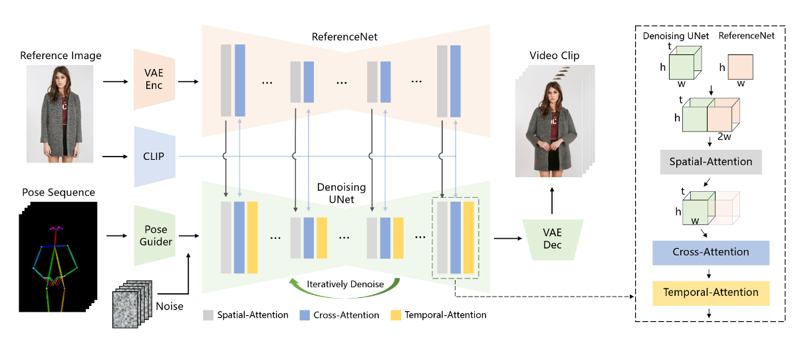

进入到ReferenceAttentionControl的init方法中可以看到主要是针对传入的UNet模型运行了一个钩子(hook)函数，这个函数会筛选出UNet模型中所有的BasicTransformerBlock和TemporalBasicTransformerBlock类，并为它们的forward方法修改（可能是添加？）为自定义的方法，并为它们添加属性bank和attn_weight，前者是用来记录hidden_state的变化，后者的用处不清楚，而自定义forward方法的具体作用也还不清楚，已知的是如果mode是write，则会保存当前norm_hidden_states的副本到bank中并计算自注意力；如果mode是read，则会从self.bank中读取特征并进行自注意力和CFG操作。
```python
if self.reference_attn: #default:True
    if self.fusion_blocks == "midup": # default
        attn_modules = [
            module
            for module in (
                torch_dfs(self.unet.mid_block) + torch_dfs(self.unet.up_blocks)
            )
            if isinstance(module, BasicTransformerBlock)
            or isinstance(module, TemporalBasicTransformerBlock)
        ]
    elif self.fusion_blocks == "full": 
        attn_modules = [
            module
            for module in torch_dfs(self.unet) #model.children()
            if isinstance(module, BasicTransformerBlock)
            or isinstance(module, TemporalBasicTransformerBlock) 
        ]
    attn_modules = sorted(
        attn_modules, key=lambda x: -x.norm1.normalized_shape[0]
    )

    for i, module in enumerate(attn_modules):
        module._original_inner_forward = module.forward
        if isinstance(module, BasicTransformerBlock):
            module.forward = hacked_basic_transformer_inner_forward.__get__(
                module, BasicTransformerBlock
            )
        if isinstance(module, TemporalBasicTransformerBlock):
            module.forward = hacked_basic_transformer_inner_forward.__get__(
                module, TemporalBasicTransformerBlock
            )

        module.bank = [] #使用bank来记录hidden_state的变化
        module.attn_weight = float(i) / float(len(attn_modules))
```
接下来对去噪次序进行判断，如果是第一次去噪，则需要进行额外操作：
- 使用reference_unet模型对ref_image_latents进行噪声预测，这里的reference_unet模型是作者对diffusers库中的UNet2d模型的修改版，与原版的区别如下图所示，似乎只是将原来的conv_out操作去掉了，具体有什么用目前不清楚。根据前文的描述可以知道，reference_unet中所有的注意力块的forward方法都已被修改，在进行噪声预测时每次注意力块的norm_hidden_states都会被存储到bank中。
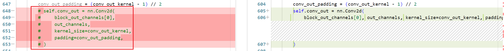
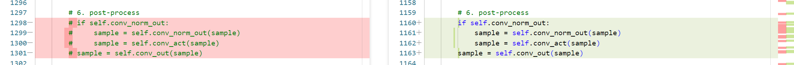
-  调用reader的update方法，将writer中所有BasicTransformerBlock的bank中的值按照次序复制到reader中TemporalBasicTransformerBlock的bank中。

对于以上步骤，还存在两处疑问：
1. 根据前文的描述，ref_image_latents似乎只是人物图片经过VAE图片解码器后得到的特征张量，后续也没有加入随机高斯噪声，那么为何要使用reference_unet对这种特征张量进行噪声预测，并记录预测过程注意力块得到的norm_hidden_states值？记录的值又有什么用？
2. 为何要将writer中BasicTransformerBlock块记录的值复制给reader中的TemporalBasicTransformerBlock，这样有什么用？而且为何两种不同的UNet模型的两种不同注意力块数量会一致？

```python
# 1. Forward reference image
if i == 0:
    self.reference_unet(
        ref_image_latents.repeat(
            (2 if do_classifier_free_guidance else 1), 1, 1, 1
        ),
        torch.zeros_like(t),
        # t,
        encoder_hidden_states=encoder_hidden_states,
        return_dict=False,
    ) #使用unet2d处理一次latents，此时reference_control_writer中的banks会保存各层的hidden_states变化
    reference_control_reader.update(reference_control_writer) #将reference_control_writer中的BasicTransformerBlock的banks添加到reference_control_reader中的TemporalBasicTransformerBlock的banks
```
先前就提到过由于输入输出都是视频，所以比文生图的图片多了一个维度，体现在代码中就是噪声latents的形状是1x4x598x64x64，这个598就是指一个视频有598张图片，因此为了加快去噪的过程，作者使用global_context变量来指定对于每张图片对应的噪声预测顺序，对于598张图片，采用批次为16，步长为1，覆盖数量为4的方式生成预测顺序为[[0, 1, 2, 3, 4, 5, 6, 7, 8, 9, 10, 11, 12, 13, 14, 15],[12, 13, 14, 15, 16, 17, 18, 19, 20, 21, 22, 23, 24, 25, 26, 27],...]
```python
context_queue = list(
    context_scheduler(
        0,
        num_inference_steps,
        latents.shape[2],
        context_frames,
        context_stride,
        context_overlap, #4
    )
) #50x16 0:[0, 1, 2, 3, 4, 5, 6, 7, 8, 9, 10, 11, 12, 13, 14, 15] 1:[12, 13, 14, 15, 16, 17, 18, 19, 20, 21, 22, 23, 24, 25, 26, 27]

num_context_batches = math.ceil(len(context_queue) / context_batch_size) #50
global_context = []
for i in range(num_context_batches):
    global_context.append(
        context_queue[
            i * context_batch_size : (i + 1) * context_batch_size
        ]
    )
```
接下来就是按照预测顺序批量预测噪声，预测噪声包含以下操作：
- 从latents收集这一批的latent_model_input
- 从pose_cond_tensor中收集这一批的pose_cond_input
- 将pose_cond_input送入pose_guider中进行处理，得到pose_fea
- 将必要的参数送入denoising_unet中进行噪声预测，得到这一批预测到的噪声pred
- 将这一批的噪声添加到总的噪声列表noise_pred中，并为相应的counter加一
```python
for context in global_context:# 50x1x16
    # 3.1 expand the latents if we are doing classifier free guidance
    latent_model_input = ( # latents:1x4x598x64x64 latents[:,:,c]:1x4x64x64 latent_model_input:2x4x16x64x64
        torch.cat([latents[:, :, c] for c in context])
        .to(device)
        .repeat(2 if do_classifier_free_guidance else 1, 1, 1, 1, 1)
    )
    latent_model_input = self.scheduler.scale_model_input(
        latent_model_input, t
    )
    b, c, f, h, w = latent_model_input.shape #2 4 16 64 64
    
    pose_cond_input = ( #pose_cond_tensor:1x3x598x512x512 pose_cond_input:2x3x16x512x512
        torch.cat([pose_cond_tensor[:, :, c] for c in context])
        .to(device)
        .repeat(2 if do_classifier_free_guidance else 1, 1, 1, 1, 1)
    )
    pose_fea = self.pose_guider(pose_cond_input, ref_pose_tensor) #5 torch.Size([2, 320, 16, 64, 64])

    pred = self.denoising_unet(
        latent_model_input,
        t,
        encoder_hidden_states=encoder_hidden_states[:b],
        pose_cond_fea=pose_fea,
        return_dict=False,
    )[0] #2x4x16x64x64

    for j, c in enumerate(context):
        noise_pred[:, :, c] = noise_pred[:, :, c] + pred
        counter[:, :, c] = counter[:, :, c] + 1
```
最后就是进行CFG操作以及将noise_pred和latents送入scheduler中进行去噪
```python
# perform guidance
if do_classifier_free_guidance:
    noise_pred_uncond, noise_pred_text = (noise_pred / counter).chunk(2)
    noise_pred = noise_pred_uncond + guidance_scale * (
        noise_pred_text - noise_pred_uncond
    )#torch.Size([1, 4, 598, 64, 64])

latents = self.scheduler.step(
    noise_pred, t, latents, **extra_step_kwargs
).prev_sample
```
### 解码过程
文生图的解码过程十分简单，就是通过VAE解码器对去噪之后的latents进行解码便可以得到最终的图片。
```python
# 解码
image = vae.decode(latents).sample
```
可以在Pose2VideoPipeline的call方法中找到类似的代码，作者也设计了一个用于解码的方法decode_latents，里面也是用到了VAE解码器对去噪之后的latents按照照片的维度逐个进行解码，最后再汇总成images返回
```python
# Post-processing
images = self.decode_latents(latents)  # (b, c, f, h, w)

# Convert to tensor
if output_type == "tensor":
    images = torch.from_numpy(images)

if not return_dict:
    return images

return Pose2VideoPipelineOutput(videos=images)
```

### UNet2D与UNet3D的区别
在导入UNet模型时，作者不仅导入了UNet2D模型当作reference_unet，还导入了UNet3D模型当作denoising_unet，之前我从[这篇博客](https://zhuanlan.zhihu.com/p/672586130)中学习了diffusers库的代码细节，其中就包括了UNet2D模型下各层网络的结构，但是很可惜这篇博客已经被下架了，并且也没有对UNet3D模型进行介绍。

按照那篇博客的说法，将ResnetBlock2D简称为R，将Transformer2DModel简称为T，将Downsample2D简称为D，那么UNet2D模型各层网络的结构如图所示。其中block_out_channels还指定了下采样过程中各层的通道数变化（上采样过程就刚好相反），

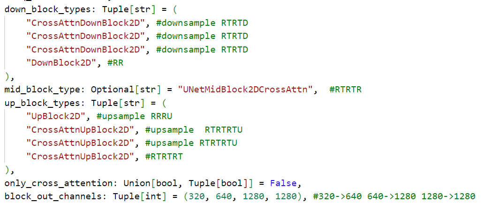

采用类比的方法查看UNet3D模型各层网络结构，发现UNet3D模型中涉及到的大部分基本块都是UNet2D模型中基本块的3D版，如ResnetBlock2D变为了ResnetBlock3D等，具体变化还需以后再详细查看，需要注意的是新增的那些基本块：
- VanillaTemporalModule（motion_module），里面实际上是一个TemporalTransformer3DModel，每个TemporalTransformer3DModel中又包含两个TemporalTransformerBlock，具体内容没有详细查看

将VanillaTemporalModule简称为M，那么UNet3D模型各层网络的结构就如图所示。

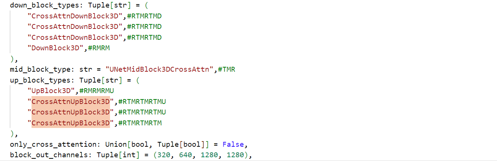

后来又学习了[这个博客](https://blog.csdn.net/xd_wjc/article/details/134441396)，里面详细介绍了UNet2D各个网络结构的详细设计，其中整体架构如图所示。结合这个博客的内容，我又重新debug了一遍reference_unet预测噪声的流程，对整个UNet2D网络有了更加系统的认识。

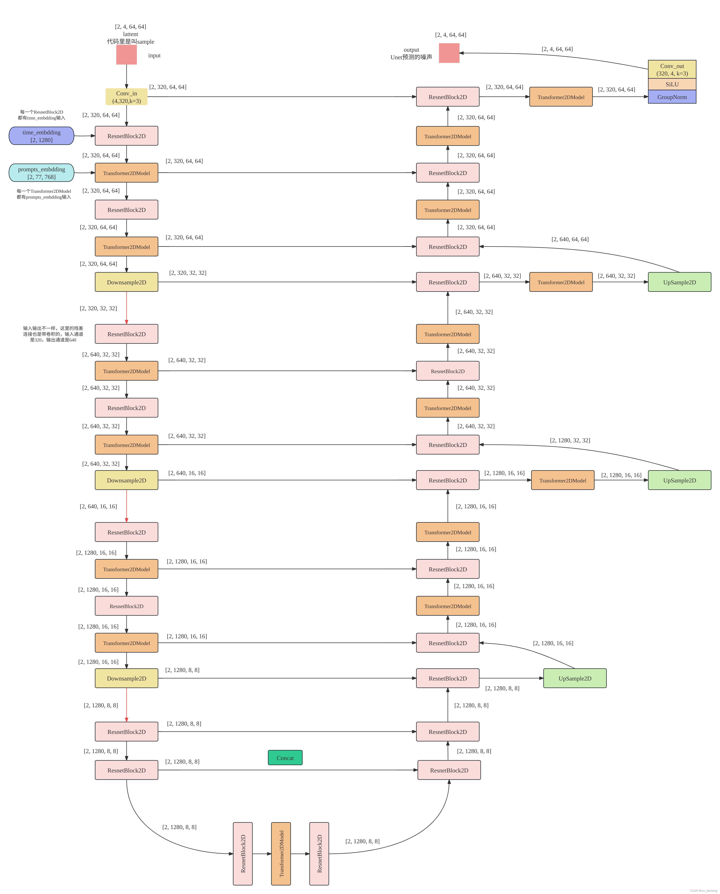

于是我又debug了一遍denoising_unet预测噪声的流程，发现大多数情况都与UNet2D相似，只不过所有的2D操作前后都需要添加一个Inflated操作，将输入的5维张量如(2,320,16,64,64)降维成4维张量如(32,320,64,64)，操作结束之后再按照(b,c,f,h,w)的顺序恢复维度；然后就是将UNet2D中的BasicTransformerBlock都替换成了TemporalBasicTransformerBlock，这也解答了在refenceNet的update方法时提出的第二个疑问；最后就是新增了一个VanillaTemporalModule，里面包含了TemporalTransformerBlock，实际上就是为特征向量增加了位置信息，具体方法可以看[这个视频](https://www.bilibili.com/video/BV19o4y1m7mo/?spm_id_from=333.337.search-card.all.click)。

Batch Normalization：在特征d/通道维度做归一化，即归一化不同样本的同一特征。缺点是：
- 计算变长序列时，变长序列后面会pad 0，这些pad部分是没有意义的，这样进行特征维度做归一化缺少实际意义。
- 序列长度变化大时，计算出来的均值和方差抖动很大。
- 预测时使用训练时记录下来的全局均值和方差。如果预测时新样本特别长，超过训练时的长度，那么超过部分是没有记录的均值和方差的，预测会出现问题。

Layer Normalization：在样本b维度进行归一化，即归一化一个样本所有特征。
- NLP任务中一个序列的所有token都是同一语义空间，进行LN归一化有实际意义
- 因为实是在每个样本内做的，序列变长时相比BN，计算的数值更稳定。
- 不需要存一个全局的均值和方差，预测样本长度不影响最终结果。

BN，LN，IN，GN从学术化上解释差异：
- BatchNorm：batch方向做归一化，算N*H*W的均值
- LayerNorm：channel方向做归一化，算C*H*W的均值
- InstanceNorm：一个channel内做归一化，算H*W的均值
- GroupNorm：将channel方向分group，然后每个group内做归一化，算(C//G)*H*W的均值
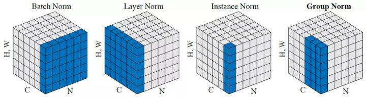
### 总结
在对reference_unet和denoising_unet都debug一遍了之后，我认为有关Pose2VideoPipeline的整个流程都已经较为清晰了，此时再返回去，尝试按照自己的理解去解释原论文中的一些描述：
- 首先是对于整个Lmk2Video架构的解释，作者将人脸照片使用VAE编码器进行编码得到人脸特征并将其降维成噪声(ref_vae_latent)，将人脸照片使用CLIP编码器进行编码得到landmarks特征，并将其当作encoder_hidden_states，再使用reference_unet以encoder_hidden_states为控制条件对ref_vae_latent进行噪声预测，在预测过程中，reference_unet中所有的BasicTransformerBlock都会保存当时的特征值，预测结束之后，再将保存的特征值一一对应复制到denoising_unet的TemporalBasicTransformerBlock中（就是下图中从Reference Unet指向Denoising Unet的黑线），上述过程只发生在第一次降噪开始前（对应AnimateAnyone论文原话`While ReferenceNet introduces a comparable number of parameters to the denoising UNet, in diffusion-based video generation, all video frames undergo denoising multiple times, whereas ReferenceNet only needs to extract features once throughout the entire process.`），然后将人脸landmarks图片和视频中的landmarks图片使用同一个VAE编码器处理（与前文的编码器不同）之后送入Pose Guider进行处理（5步），将每一步的结果都收集下来得到pose_fea，将pose_fea和随机噪声latents送入denoising_unet中进行噪声预测，中间在经过TemporalBasicTransformerBlock时会读取原来保存的特征值与现有的特征值相加，再进行后续操作。降噪完之后用VAE进行解码得到视频。
  
- reference_unet与denoising_unet之间特征传递的细节。AnimateAnyone论文原话`we replace the self-attention layer with spatial-attention layer. Given a feature map `$x_1\in\mathbb{R}^{t\times h\times w\times c}$` from denoising UNet and `$x_2\in\mathbb{R}^{h\times w\times c}$` from ReferenceNet, we first copy `$x_2$` by `$t$` times and concatenate it with `$x_1$` along `$w$` dimension. Then we perform self-attention and extract the first half of the feature map as the output.`在代码中如图所示，将原来3维的特征(2,4096,320)按照16帧的规格扩充到了4维(2,16,4096,320)，再与当前的特征进行拼接。
  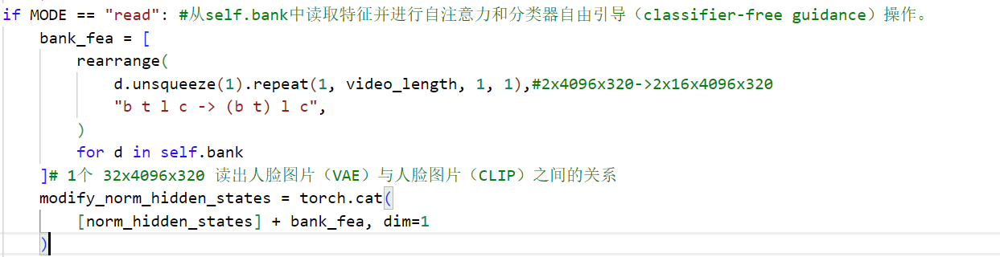
- pose_fea在denoising_unet预测噪声时的细节。在代码中如图所示，之前就说过Pose Guider会5步处理，每一步的结果都存储在了pose_fea，而这5步的结果主要在下采样层（4个block）进行添加，在每一个block开始前以及每一个block结束后都会与sample进行拼接。这个细节是属于diffusers库的设计而非论文的设计，感觉Pose Guider的设计或许更值得学习，但里面都是一堆卷积操作，我也看不出思路是啥，只是单纯的研究了其中的维度变化。
  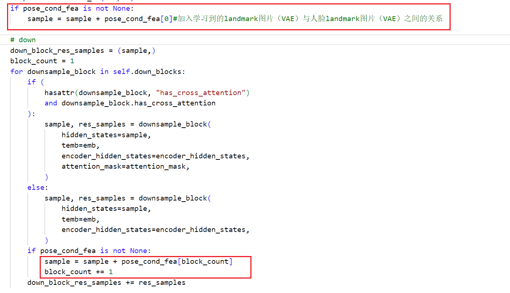
- 尝试用大白话总结作者的思路：首先使用了reference_unet学习了人脸图片（VAE解码）与人脸图片（CLIP解码）之间的关系（此处应该是学会如何提取由VAE解码人脸图片所学习到的底层特征），再使用Pose Guider学习了人脸landmarks图片（VAE解码）与视频中的landmarks图片（VAE解码）之间的关系（此处应该是学会如何从视频landmarks图片中提取对应的位置信息并附加到人脸landmarks图片中），最后再使用denoising_unet以人脸图片（CLIP解码）为控制条件，在结合前面学习到的两种关系的基础上对随机噪声进行降噪，得到最后的视频。AnimateAnyone论文原话`The pose sequence is initially encoded using Pose Guider and fused with multi-frame noise, followed by the Denoising UNet conducting the denoising process for video generation. The computational block of the Denoising UNet consists of Spatial-Attention, Cross-Attention, and Temporal-Attention, as illustrated in the dashed box on the right. The integration of reference image involves two aspects. Firstly, detailed features are extracted through ReferenceNet and utilized for Spatial-Attention. Secondly, semantic features are extracted through the CLIP image encoder for Cross-Attention. Temporal-Attention operates in the temporal dimension. Finally, the VAE decoder decodes the result into a video clip.`（其中提到的Spatial-Attention、Cross-Attention以及Temporal-Attention其实就是UNet3D模型中基本块的操作，而Aniportrait中提到的ResNet、Cross-Attention、Motion-Module其实跟它们等价）

## Video2Pose
这个功能模块的输入是正常人物说话视频，输出是人物landmarks图像说话视频，做法就是使用ffmpeg将输入视频的音频提取出来，然后输入视频的每一帧图片使用mediapipe处理得到对应的landmarks图片，最后汇总成一段landmarks图像说话视频（无声音），将这段视频与提取出来的音频使用ffmpeg混合，得到最终结果。
## Video2Video
这个功能模块的输入是一张目标人物图片和一段源人物说话视频，输出是一段目标人物说话视频，做法就是使用ffmpeg将原人物说话音频提取出来，再对目标人物图片使用mediapipe处理得到3D人脸特征（ref_lmk3d）和变换矩阵（ref_matrix），再对源人物说话视频逐帧使用mediapipe处理得到3D人脸特征列表（pose_lmk3d_list）和变换矩阵列表（pose_matrix_list），针对两个列表依次采取不同的策略减去列表中的某个值再加上目标人物图片得到的值，再进行3D到2D的投影，便得到了目标人物landmarks说话视频，再调用Pose2VideoPipeline就能得到目标人物说话视频，与源人物说话音频混合输出。
## Audio2Video
这个功能模块的输入比较复杂，包含了一张目标人物图片、一段音频（示例中给的是目标人物说话的音频，应该是能够使用其他人物说话的音频，但我没尝试过）、一个用来表示人物姿态的numpy文件（这个文件是另一段人物说话视频用mediapipe处理过后得到的变换矩阵），输出是一段目标人物说话视频（音频来自输入音频，人物姿态来自numpy文件，人物身份来自目标人物图片），做法就是使用wav2vec2提取音频特征，再使用作者设计的Audio2Mesh模块（里面也同样用到了wav2vec2对音频特征进行encode得到hidden_states，然后hidden_states又通过两个全连接层得到最终结果，论文原话`By leveraging the acquired robust speech features, we can effectively employ a simple architecture consisting of two fc layers to convert these features into 3D facial meshes. We have observed that this straightforward design not only ensures accuracy but also enhances the efficiency of the inference process.`）预测音频特征对应的3D人脸特征列表，再结合numpy文件中的变换矩阵列表进行3D到2D的投影，便得到了目标人物landmarks说话视频，再调用Pose2VideoPipeline就能得到目标人物说话视频，与源人物说话音频混合输出。

由于对于[wav2vec2](https://arxiv.org/abs/2006.11477)这个模型的了解还不够，所以只能通过将Audio2Video模块与Video2Video模块进行对比，以此来猜测与wav2vec2模型相关代码的功能。[这个网站](https://blog.csdn.net/xmdxcsj/article/details/115787729)对它的原理进行了剖析，我还没来得及看。

