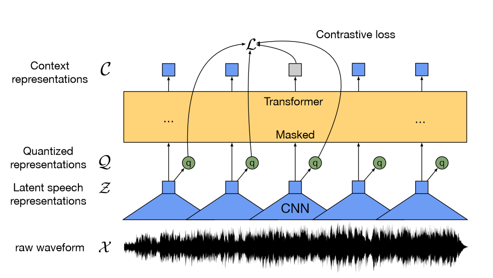

`Audio2Lmk:`让$A^{1:T}=(a^1,…,a^T)$表示一段语音片段序列，我们的目标是预测相应的3D人脸网格序列$M^{1:T}=(m^1,…,m^T)$,其中$m^T\in R^{N\times3}$,以及位姿序列$P^{1:T}=(p^1,…,p^T)$,其中$p^T$是一个表示旋转和平移的6维向量。

我们使用预训练的wav2vec[1]来提取音频特征。该模型具有较高的泛化能力，能够准确地从音频中识别语音和语调，在生成逼真的人脸动画中具有重要的作用。通过利用获得的鲁棒语音特征，我们可以有效地使用一个简单的由两个fc层组成的架构，将这些特征转换为3D人脸网格。我们观察到，这种直截了当的设计不仅保证了准确性，而且提高了推理过程的效率。

在将音频转换为姿态的任务中，我们使用相同的wav2vec网络作为骨干。然而，我们并没有与Audio-to-mesh模块共享权重。这是因为姿势与音频中存在的节奏和音调有更紧密的联系，这与音频到网格任务相比是一个不同的重点。为了考虑先前状态的影响，我们使用Transformer[11]解码器来解码位姿序列。在这个过程中，使用交叉注意力机制将音频特征集成到解码器中。对于上述两个模块，我们使用简单的L1损失进行训练。

在获得网格和姿态序列后，我们使用透视投影将其转化为面部特征点的2D序列。这些地标随后被用作下一阶段的输入信号。

`Lmk2Video`:
给定一个参考肖像图像，表示为 $I_ref$ ，以及表示为 $L^{1:T} = (l^1,...,l^T)$的一系列面部标志，其中每个$l^t ∈ \mathbb{R}^{N×2}$，我们提出的 Lmk2Video 模块创建时间一致的肖像动画。该动画将运动与地标序列对齐，并保持与参考图像一致的外观。我们将肖像动画表示为一系列肖像帧，表示为  $I^{1:T} = (I^1,...,T^T)$

Lmk2Video网络结构的设计灵感来自于AnimateAnyone。我们利用 SD1.5 作为骨干，结合一个时间运动模块，可以有效地将多帧噪声输入转换为视频帧序列。同时，采用镜像 SD1.5 结构的 ReferenceNet 从参考图像中提取外观信息并将其集成到主干中。这种战略设计可确保面部 ID 在整个输出视频中保持一致。与 AnimateAnyone 不同的是，我们增强了 PoseGuider 设计的复杂性。原始版本仅包含几个卷积层，之后标志性特征与主干输入层的潜在特征合并。我们发现这种基本设计无法捕捉嘴唇复杂的运动。因此，我们采用ControlNet的[15]多尺度策略，将相应尺度的标志性特征合并到主干的不同块中。尽管有这些增强，我们仍然成功地将参数数量保持在相对较低的水平。

我们还引入了一项额外的改进：将参考图像的地标作为额外的输入。 PoseGuider 的交叉注意力模块促进参考地标和每帧目标地标之间的交互。这个过程为网络提供了额外的线索来理解面部标志和外观之间的相关性，从而有助于生成具有更精确运动的肖像动画。
### 实施细节
在Audio2Lmk阶段，我们采用wav2vec2.0作为我们的骨干。我们利用 MediaPipe[7] 提取 3D 网格和 6D 姿势进行注释。 Audio2Mesh 的训练数据来自我们的内部数据集，其中包含来自单个说话者的近一个小时的高质量语音数据。为了确保 MediaPipe 提取的 3D 网格的稳定性，我们指示演员在整个录制过程中保持稳定的头部位置，面向摄像机。我们使用 HDTF[18] 训练 Audio2Pose。所有训练操作均在单个 A100 上执行，利用 Adam 优化器，学习率为 1e-5。

在 Lmk2Video 过程中，我们实现了两步训练方法。在初始步骤中，我们专注于训练主干网、ReferenceNet 和 PoseGuider 的 2D 组件，而忽略了运动模块。在接下来的步骤中，我们冻结所有其他组件并专注于运动模块的训练。我们利用两个大规模、高质量的面部视频数据集 VFHQ[12] 和 CelebV-HQ[19] 来训练模型。所有数据均通过 MediaPipe 进行处理，以提取 2D 面部标志。为了增强网络对嘴唇运动的敏感度，我们在从 2D 地标渲染姿势图像时用不同的颜色区分上唇和下唇。所有图像的尺寸均调整为 512x512 分辨率。我们使用 4 个 A100 GPU 进行模型训练，每个步骤花费两天时间。采用 AdamW 优化器，学习率为 1e-5。

`wav2vec`:
我们的模型由一个多层卷积特征编码器组成$\mathcal{f} :\mathcal{X} \mapsto \mathcal{Z}$，它输入原始音频$\mathcal{X}$，输出$T$个时间步长的潜在言语表征$\mathcal{z}_1,...,\mathcal{z}_T$。然后它们将被送入一个Transformer $\mathcal{g} :\mathcal{Z} \mapsto \mathcal{C}$，用来构建表征$\mathcal{c}_1,...,\mathcal{c}_T$，从而从整个序列中捕获信息。特征编码器的输出离散化为$q_t$以及一个量化模块$\mathcal{Z} \mapsto \mathcal{Q}$来表示自监督目标中的目标(图1),与vq - wav2vec [ 5 ]相比，我们的模型在连续的语音表示上构建上下文表示，并且自注意力端到端捕获整个潜在表示序列上的依赖关系。

`Feature encoder`。该编码器由若干个块组成，其中包含一个时序卷积和层归一化[1]以及一个GELU激活函数[ 21]。输入到编码器的原始波形归一化为零均值和单位方差。编码器的总步距决定了输入到Transformer ( §4.2)的时间步数$T$。

`Contextualized representations with Transformers.`特征编码器的输出反馈到遵循Transformer架构[ 55,9,33]的上下文网络中。与编码绝对位置信息的固定位置嵌入不同，我们使用类似于[ 37、4、57]的卷积层作为相对位置嵌入。我们将卷积后的输出加上一个GELU到输入，然后进行层归一化。

`Quantization module.`对于自监督训练，我们通过乘积量化将特征编码器$z$的输出离散化为有限的语音表示集合[ 25 ]。这种选择在先前的工作中取得了很好的结果，在第一步中学习离散单元，然后学习上下文表示[ 5 ]。乘积量化相当于从多个码本中选择量化表示并进行级联。给定$G$个码本或者组，以及$V$个条目$e\in \mathbb{R}^{V\times d\div G}$，我们从每个码本中选择一个条目，并将得到的向量进行拼接$\mathcal{e}_1,...,\mathcal{e}_G$并应用线性变换$\mathbb{R}^{d} \mapsto \mathbb{R}^{f}$以获得$q\in \mathbb{R}^{f}$

Gumbel softmax能够以完全可微的方式选择离散码本项[ 16、24、35]。采用直通估计量[ 26 ]，设置$G$个硬Gumbel softmax操作[ 24 ]。将特征编码器输出$z$映射到$l\in \mathbb{R}^{G\times V}$logits,并且群$g$选择第$v$个码本的概率为$$p_{g,v}=\frac{\exp (l_{g,v}+n_v)/\tau }{ {\textstyle \sum_{k=1}^{V}\exp (l_{g,k}+n_k)/\tau} }$$其中$\tau$是一个非负的温度，$n=-\log_{}{(-\log{}{u})}$并且$u$是均匀取样自$\mathcal{U}(0,1)$。在前传过程中，codeword $i$ 取自$argmax_jp_{g,j}$并且在后向通道中，使用了Gumbel softmax输出的真实梯度。
